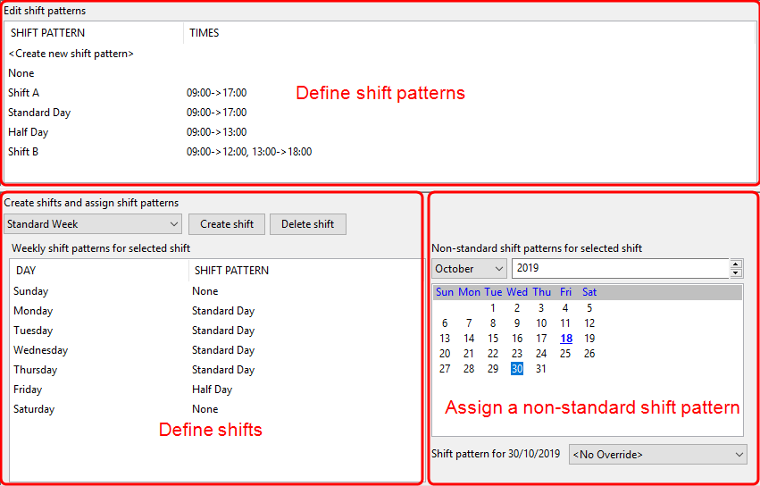
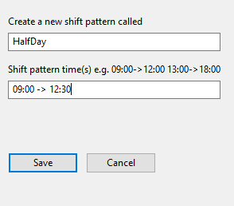

Skip To Main Content

  * placeholder

Filter:

  * All Files

Submit Search

   

You are here:

[Software
Version](../../ComponentandFeatureOverview/FrontMatters\(Online\)/features-
and-versions.htm): 3.2

# Shifts

Use the Shift patterns workspace to configure shift patterns to enable the
Business rules engine to define working times, and for use in Reporting. For a
fuller description of how shift patterns work, see
[Shifts](../../ComponentandFeatureOverview/TopLevelFeatures/Business
rules/shifts.htm).

If the Visibility component has been licensed, users can also view and modify
shift patterns in SmartSpace Web. See [Shifts in Operations web
interface](../Visibility/OpsWebInterface/shifts-configuration-operations-web-
interface.htm) for further information.

## The Shift patterns workspace

Click on SHIFT PATTERNS to display the Shift patterns workspace.

The workspace is divided into three main areas which are described in the
following sections.

DefineEdit shift patterns

A shift pattern defines the working times within a 24-hour time period. More
than one period of work can be input for each shift pattern, for example to
enable the scheduling of break periods.

  * Double-click <Create new shift pattern> to add a new shift pattern. See Creating Shift Patterns for more information.
  * You can delete a shift pattern that is not in use by selecting it and pressing Delete.

Create shifts and assign shift patterns

You can add shift patterns to days of the week by defining shifts. A Default
Shift template is provided.

  * To change a shift pattern for a day, slowly double-click on the current shift pattern and choose from a dropdown. The dropdown lists None (for a non-working day) and all shift patterns defined in the top part of the screen.
  * You can define additional shifts to cater for different work patterns. See Defining Shifts.

Non-standard shift patterns for
selected shift

You can also assign a specific shift pattern to a single date by selecting a
month, year and day number, and then choosing the shift pattern from the
dropdown. The dropdown lists <No Override> and all shift patterns defined in
the top part of the screen.

Any date that has been overridden is shown in blue and underlined on the
calendar display.

If you have the Visibility component, you can use the Shifts screen in
SmartSpace Web to import a number of overrides from a file. See [Importing
Shift Pattern Overrides](../Visibility/OpsWebInterface/shifts-configuration-
operations-web-interface.htm#h2_5) for further information.

## Creating Shift Patterns

In the Shift patterns workspace.

  1. Double-click <Create new shift pattern>.  

  2. In the Create new shift pattern dialog, give the shift pattern a name and define its working hours within a 24-hour period:
     * Enter time spans using the 24-hour clock 
     * Use -> to separate start and end times
     * There can be several time spans, for example to indicate scheduled breaks in the working day, separated by a space
     * Time spans cannot extend over midnight
  3. Click Save.

## Defining Shifts

To create a new shift and add shift patterns to it:

  1. Click Create shift.
  2. In the Create new shift dialog, enter a name and click Save.

To add shift patterns to the days of the week:

  1. Choose the shift from the dropdown.
  2. Set the shift pattern for a day, by slowly double-clicking on the current shift pattern and choosing from a dropdown. The dropdown lists None (for a non-working day) and all shift patterns defined in the top part of the screen.

## Overriding a Shift Pattern for a Single Day

You can assign a specific shift pattern to a single date to override its usual
pattern:

  1. Choose the shift from the dropdown.
  2. Select the month and year, and click on the date.
  3. Choose the shift pattern from the dropdown or choose <No override> to remove a previously-applied override.

Any date that has been overridden is shown in blue and underlined on the
calendar display.

If you have licensed the Visibility component, instead of entering overrides
one date at a time, you can import a number of overrides from a text file in a
single operation. See [Importing Shift Pattern
Overrides](../Visibility/OpsWebInterface/shifts-configuration-operations-web-
interface.htm#h2_5) for further information.

  * Shifts
    * The Shift patterns workspace
    * Creating Shift Patterns
    * Defining Shifts
    * Overriding a Shift Pattern for a Single Day

   

* * *

[www.ubisense.net](http://www.ubisense.net/)  
Copyright © 2020, Ubisense Limited 2014 - 2020. All Rights Reserved.

