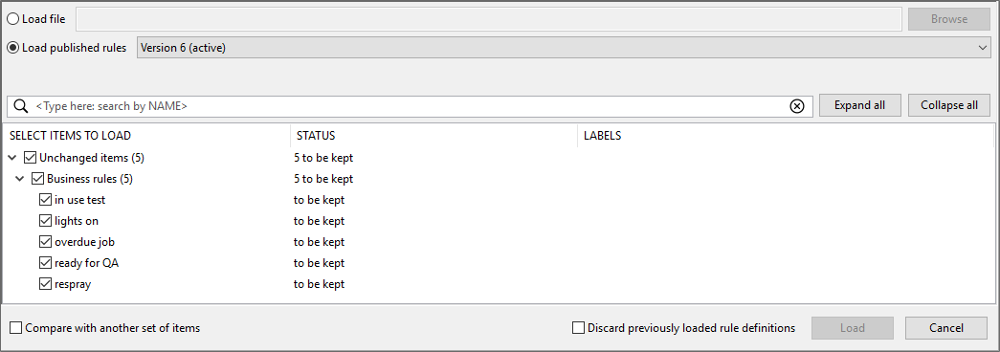

Skip To Main Content

  * placeholder

Filter:

  * All Files

Submit Search

   

You are here:

[Download as
PDF](../../../SmartSpaceDownloads/B7GZWZS4WX9F/SmartSpaceRulesEngineDeveloper.pdf
"link to PDF version of this content")

[Software
Version](../../ComponentandFeatureOverview/FrontMatters\(Online\)/features-
and-versions.htm): 3.4

#  Rules engine developer

SmartSpace Rules engine developer provides you with the graphical environment
to capture logic and relationships between objects in rules and event handlers
that reflect your business processes. These definitions are then used by the
[Business rules
engine](../../ComponentandFeatureOverview/TopLevelFeatures/Business
rules/business-rules-engine.htm).

The Business rules workspace in SmartSpace Config provides an editing
environment which aids the creation of rule and event definitions. Definitions
are constructed by dragging and dropping properties and keywords into
available slots in templates. Visual cues in the interface and real-time error
messages support the creation of valid definitions.

You can create the following kinds of definition:

  * Events   
Actions defined in an event definition run when a value or a fact about a
property changes. Events can be used to create or delete objects, set a
property, set or unset representations, or send notifications.  
More than one action can be included in an event, and further tests and
conditions can be specified within the definition.  
The template for an event definition is based around a statement that begins
with “when…”.

  * Timeouts   
A timeout is triggered when the time specified by a property (whose type must
be time) is reached. Timeouts can be used to create or delete objects, set a
property, set or unset representations, or send notifications.  
More than one action can be included in a timeout, and further tests and
conditions can be specified within the definition.  
The template for the definition of a timeout is based around a statement that
begins with “when…”.

  * Rules   
Rules are an invariant statement of fact.  
The template for the definition of a rule is based around a statement that
begins “property whenever…”.

## Workflow

The steps to create a business rule in SmartSpace are as follows:

  1. Create a new definition.  
See Adding a definition.

  2. Open the definition in the editor.  
The features of the editor are described in The Business rules workspace.

  3. Build the logic.  
Drag properties and keywords into the definition and select or enter values to
construct a logical expression.  
See Editing a definition.

Follow these steps to create the collection of rules you require and then
publish them to activate them in your system. See Publishing definitions.

You can also use the BUSINESS RULES workspace to load rule definitions (and
dependent items, such as types or representations) and also assets such as
searches or screens for web forms that have been developed in other SmartSpace
installations, and you can export rule definitions and other items you have
created, for use elsewhere. See Managing definitions.

After definitions have been published, you can trace the behavior of business
rules in real time in the Rules engine trace workspace in SmartSpace Config.
See Rules engine trace.

## Requirements for Rules engine developer

You will need SmartSpace version 3.4 or later with a license for Business
rules and Rules engine developer.

# The Business rules workspace

The Business rules workspace in SmartSpace Config provides tools to create and
edit business rules.

Click on BUSINESS RULES to display the workspace.

Features of the Business rules workspace are described in the following
sections.

List of definitions

  * The leftmost part of the workspace list definitions for you to work with. Double-click <Create new definition> to add a new definition—see Adding a definition. Open a definition for editing by double-clicking it or dragging it into the editor.
  * An icon to the left of a definition’s name identifies the kind of definition it is, if it is incomplete (a work in progress), or if it contains errors:

  * Unsaved definitions are marked with an asterisk (*****).
  * Filters allow you to limit the definitions listed to those that match one or more of: name; label; and which properties are used or set. Enter text at <Type here: filter by NAME> (case sensitive) or drag labels or properties into their respective fields. Click  to remove a filter.
  * You can rename a definition by slowly double-clicking its name and entering the new one.
  * You can remove selected definitions from the list by pressing Delete and confirming the deletion. Removing an active definition from the list does not immediately delete it from SmartSpace. To delete an active definition from your system, you must publish a new version of your definitions. See Publishing definitions.

Definition editor

The editor provides a multi-tabbed workspace in which you can edit
definitions. Choose a definition, by double-clicking it or dragging it into
the workspace, and it is opened in its own tab in the editor.

Each definition is based on a template which provides a framework that is
shown in the editor and into which you drag elements such as keywords and
properties. See Building definitions for an example of the process.

  * When you drag an element, valid slots are highlighted in the editor and you can only drop the element into an valid slot.
  * Color-coded prompts indicate what can be dragged or entered in a slot.
  * Error messages, described below, also provide help in creating correct definitions.
  * Some slots require you to enter a value; other slots provide you with a dropdown of possible entries.
  * You can drag elements out of a slot and into the area around a definition (the scratchpad). You can also open extra tabs to provide additional scratchpads.
  * You can copy between tabs by using CTRL+C and CTRL+V, and elements can be duplicated by holding down CTRL and dragging them.
  * Drag unwanted elements into the trash can to delete them.
  * Comments can be added to annotate a definition or keywords within it—see Adding comments to your definitions.
  * Apply label(s) to definitions to categorize them—see Organizing definitions.

When you have finished, you can close individual tabs by clicking the close
button beside their titles or use the Close all tabs button to clear the
editor. When you close a tab, anything in the scratchpad is lost. Changes to a
definition that you wish to keep must be saved before you close SmartSpace
Config (you will be warned if you have unsaved changes), and any new or
changed definitions you want to make active in SmartSpace must be published.
See Publishing definitions.

Error messages

While you are editing a definition, SmartSpace monitors it for completeness
and validity—and displays descriptive error messages in real time. Click an
error message and the error is highlighted in the definition:

You can save an incomplete definition (or one with errors) but you cannot
publish it.

Click Check all definitions to display a message indicating the status of the
definitions. If the definitions are not OK, the number of incomplete
definitions or definitions which contain errors is displayed.

Toolbox

The toolbox contains a list of keywords that you use along with properties to
construct definitions. When you drag a keyword into the editor the possible
slots into which it can be dropped are highlighted. Different keywords are
available for different definitions. See Keywords for definitions for
descriptions and availability.

Properties

The list of properties includes all simple and complex properties created in
the Types and objects workspace, and also any Ubisense types supplied with the
features you have licensed (see [Types and
objects](../Core/Typeandobject/types-and-objects-introduction.htm) for
Ubisense types).

When you drag a property into the editor, the valid slots into which the
property can be dropped are highlighted.

Filters allow you to limit the properties listed to those that match one or
more of: name, type, and argument. Enter text at <Type here: filter by NAME>
(case sensitive) or drag labels or properties into their respective fields.
Click  to remove a filter.

Labels

You can organize definitions and make them easier to locate by creating and
applying labels to them. See Organizing definitions. Labels are also used to
identify items for inclusion in modules for export as described in Managing
definitions.

# Building definitions

## Adding a definition

To create a definition, you first give it a name and choose the kind of
definition it is. Double-click <Create new definition>, enter a name, and
choose one of:

  * whenever to create a rule
  * when fact changes to create an event where a property of a Boolean type changes
  * when value changes to create an event where the value of a property changes
  * when timeout is triggered to create a timeout

Click Create and the definition is added to the list, where it is shown as an
unsaved work in progress.

## Editing a definition

Now when you drag the definition into the editor, the empty template for the
definition’s type opens and you can begin to build the logic of your
definition:

In this example, the property ‘Office’ contains ‘Person’ is dragged into the
Property slot in the template. Note the color used to display properties
matches the display color of the prompt.

The Action for this event is shown being built. The set property action (whose
color matches the Action slot in the template) has been dragged into the
scratchpad. Its Property slot is filled with a property with the integer type,
the occupancy of Office. The Value slot is filled with an expression built
from the + operator with one value provided by a property and a literal, in
this case the integer 1. This entire chunk of logic can be dragged to the
Action slot in the expression.

As you work the error messages change to reflect the state of the definition.
At this stage, the definition is still incomplete and clicking an error will
highlight a missing term:

Where a list of values is available, you can double-click to select one from a
dropdown:

When all the slots have been filled and configured correctly, there will be no
error messages, and the definition is no longer flagged with the work in
progress icon. At this point, you can publish it and it will become active.
(See Publishing definitions for how to do this.)

After publishing the definition, you can see the event in action. Go to the
Types and Objects workspace in SmartSpace Config and open a window showing the
properties of the object Office 2 and another window for the ‘Office’ contains
‘Person’ complex property.

Create a new property row in Office contains Person:

When you save this row, the occupancy of the office has been increased by 1.

## Keywords for definitions

The following are the keywords available in the toolbox.

### Actions

Available for events and timeouts

use new

Creates a new object of a selected object type for use in a subsequent action.

delete

Deletes an object.

and then

Creates an additional action slot to chain actions together.

for each

Performs an action for each instance where a specific fact is true.

Supports the definition of local variables in terms of properties or as the
result of computations. Declare variables by dragging properties, terms, or
term templates (+, -, * and /) into the (drag items here to declare variables)
slot.

Example of use of for each with local
variables

The following example is for use in a logistics scenario, where process areas
are ordered according to

  * How many items there are in the area
  * How long the process area has remained unchanged, where a change is defined as an increase in the number of items in the area

It sorts using the for each keyword and two local variables so a list of all
process areas is ordered with oldest and emptiest at the top, with emptiest
trumping oldest.

The example uses the Process type with a unique name, integer properties—count
and order—and a time property. Also, a complex property, 'Process' needs
demotion below 'Process' must be defined. These types and properties are shown
in the Types and objects workspace below:

Add Process objects "Pa", "Pb", "Pc", "Pd" and "lowest priority object" with
their associated properties:

Process object |  count |  time  
---|---|---  
Pa |  4 |  18/12/19 18:51:29  
Pb |  6 |  18/12/19 18:50:31  
Pc |  5 |  18/12/19 18:27:52  
Pd |  2 |  18/12/19 15:43:35  
lowest priority object |  1000000 |  01/01/2000 00:00:00  
  
**Note:** You can enter any values for count and time for objects Pa, Pb, Pc
and Pd. You must, however, use the values shown for lowest priority object for
the business rules to run correctly.

In the Business rules workspace, create the following definitions:

In the next definition, you set a local variable. Add the for each keyword and
then drag the + into the (drag items here to declare variables) slot:

Now double-click the int property and give it the variable name x:

Continue creating the definition, inserting other instances of the variable by
dragging it from its first slot:

The final definition uses a variable based on a property. Drag process into
the for each slot and rename it process'. Then drag this new variable into the
other slots that use it:

Save and publish all the rules.

In the Types and objects workspace, drag out the order property of Process:

The order is now given based on the sort criteria.

if then

Performs an action if a specific fact is true.

if then else

Performs an action if a specific fact is true, otherwise perform another
action.

set property

Sets the value of a property.

set representation

Sets the representation for a specified representation mode of an object.

unset representation

Unsets the representation for a specified representation mode of an object.

notify

Sends a notification to a role on the web map.

  * Requires roles to have been configured in the Users and roles workspace.

notify near

Sends a notification to a role on the web map including a specific object.

  * Requires roles to have been configured in the Users and roles workspace.
  * Requires the Visibility component to display the web map.

notify near using

Sends a notification to a role on the web map including an object located
using a search.

  * Requires roles to have been configured in the Users and roles workspace and a search to have been defined in Web searches.
  * Requires the Visibility component to display the web map.

### Operators

Available for rules, events and timeouts

and

This is true if all the slots are true.

or

This is true if any one of the slots is true.

not

This returns true if none of its contents are true.

=

The equals operator returns true if the two slots have the same value.

!=

Returns true if the two values do not have the same value.

<

Returns true if the first slot is strictly less than the second.

>

Returns true if the first slot is strictly less than the second.

is a

Tests the type of an object

there is a

Checks for the existence of an object that matches some condition.

contains

Tests spatial containment.

+

Adds the slots. For strings, concatenates the slots.

-

Subtracts the slots.

*

Multiplies the slots.

/

Divides the first slot by the second slot.

### Terms

as string

Converts a non-string value to a string.

now

Returns the current date/time.

null

Unsets a value.

hours between

Gets a difference in time based on a specified shift.

  * Requires shift patterns and shifts to have been configured in the Shift patterns workspace (or in the Shifts screen in SmartSpace web if you have licensed the Visibility component).

hours in the future

Gets a time in the future based on a specified shift.

  * Requires shift patterns and shifts to have been configured in the Shift patterns workspace (or in the Shifts screen in SmartSpace web if you have licensed the Visibility component).

shift

Returns the string which is the value of log duration in shift for an object,
or No Shift.

The object's type must be a descendant of the Ubisense Object type (see [Types
and objects](../Core/Typeandobject/types-and-objects-introduction.htm#top))

  * Requires shift patterns and shifts to have been configured in the Shift patterns workspace (or in the Shifts screen in SmartSpace web if you have licensed the Visibility component).

### Terms for String Manipulation

Terms introduced in the 3.5 release can be used to extract information from
string properties.

When using string manipulation terms the following should be noted:

  * Any expression with a null argument returns null 
  * The index of a substring that is not found is -1 
  * A substring expression with index equal to the string length returns the empty string 
  * A substring expression with index greater than the string length returns null 
  * If a substring length extends past the end of the string, the expression returns the rest of the string 
  * A negative substring length is implicitly converted to an unsigned value before applying the previous rule. This effectively means that a negative number is treated as a very large positive number that extends past the end of the string. For example:

the substring of "abcde" at 3 with length -1

returns "de".

Use this special case to get the remainder of a string from a specified
position to the end.

The following terms are available for string manipulation.

substring

Display only characters from position X and a length of Y.

replaced by

Search for occurrence of STRING X and replace it with STRING Y. Replacing the
empty string with anything has no effect.

index of

The index of the substring.

length of

The length of the substring.

trimmed

Trimmed substring.

uppercase

Convert the string to uppercase characters. Does not take the server locale
into account.

lowercase

Convert the string to lowercase characters. Does not take the server locale
into account.

## Adding comments to your definitions

You can add a comment to a definition by double-clicking the “when” or
“whenever” in its first line. This opens a dialog where you can enter
explanatory text. Click OK to save. You can add comments to actions in a
similar way.

Elements with comments are tagged with a triangular earmark. Click an earmark
to display the comment inline. Double-click to edit a comment. (You can delete
a comment by opening it, deleting all the text, and clicking OK.)

# Organizing definitions

As you build up your collection of business rules, the list of definitions can
become long and particular definitions hard to find. You can organize
definitions and make them easier to locate by creating and applying labels to
them. Definitions can be tagged with more than one label.

Labels are also used to organize definitions for saving. See Managing
definitions

Create a label by double-clicking <Create new label>, entering the name for
the label and clicking Save. Drag a label into a definition to tag it: the
label is shown at the top of the definition.

(You can edit a label’s name by double-clicking its current one. Enter a new
name and click Save.)

You can limit the contents of the list of definitions to those tagged with
particular labels by dragging the labels into <Drag here: filter by LABELS>.
Only those definitions tagged with matching labels will be shown.

# Publishing definitions

When you have finished creating definitions, or loading them from other
sources, and you want to make them active in SmartSpace, you publish them.

**Note:** Only definitions that are complete and contain valid logic can
become active in SmartSpace. However, incomplete or invalid definitions can be
kept alongside published definitions to be completed or corrected later.

If definitions have already been published, the new definitions will replace
them. Each collection of definitions that is published is identified by a
version number. Past versions are retained in SmartSpace, unless you
explicitly delete them.

To publish a new version of your definitions or to delete superseded versions
you no longer require:

  1. Click Publish. A list of versions is displayed and you can mark them for publication or deletion. No changes are saved until you commit them.

The status of each version is indicated. Status can be:

     * Unpublished: the definitions currently loaded in the Business rules workspace. There can be only one unpublished version

Double-click the unpublished version to give it a description and then select
the Publish check box if you are ready to make this the active version. The
number of valid definitions that can be published is indicated, along with the
number of invalid or incomplete definitions.

     * Active: the definitions currently in use in SmartSpace. There can be only one active version

Double-click the active version to give it a description. Select the active
version's details and press Delete if you want to delete it (its details will
be displayed in gray). When you commit your changes, the most recent
superseded version will become the active version.

     * Superseded: versions of definitions that were active in SmartSpace in the past. There can be multiple superseded versions

Double-click a superseded version to give it a description. Select a
superseded version's details and press Delete if you want to delete it (its
details will be displayed in gray). When you commit your changes, it will be
removed from your installation.

  2. Click Commit to confirm.

# Managing definitions

In addition to developing and maintaining the rules in your current SmartSpace
installation, you can load collections of rules called modules that have been
developed in another SmartSpace installation, and save your rules—along with
other items required by them—for use in other installations. The content of
modules can extend beyond rule definitions to include other assets you might
want to move, such as searches, screens for web forms, or report definitions.
Again, you can choose to save dependent items along with these assets. For a
full description, see [Module import and
export](../../ITResources/ITDocs/BusinessRulesExport/business-rules-
export.htm).

Use the Load and Save buttons in the Business rules workspace to manage your
rule definitions.

## Loading definitions

When you first open SmartSpace Config and go to the Business rules workspace,
the list of definitions is empty. You can start adding new definitions
immediately, or you can load and edit:

  * the definitions currently active in SmartSpace
  * superseded definitions stored in SmartSpace
  * a module containing definitions and other items saved from a Ubisense installation

You can load definitions from more than one source, for example to merge
definitions from different versions, and then publish a new combined version.
When loading, alongside the rule definitions you may also be offered types and
objects and other items required by the rules. When you load definitions, you
specify how any conflicts between different items are handled.

When you add new definitions, or make changes to active or superseded
definitions, these updates are not applied to your system until you publish a
new version. Similarly, when you load a module file with definitions,
searches, types, properties, etc, everything except the business rules
definitions is applied immediately. The definitions must be published after
they have been loaded.

You can load definitions along with any included dependent items from a file,
or currently active business rule definitions, or previously published
versions in your installation. When you choose a file or collection of rules,
you will be offered a list of items to load. By default, new and unchanged
items are selected. Items that are different to those which are current in
your installation (for rule definitions this means those that are available
for editing in the Business rules workspace), are not selected. This is to
avoid accidentally overwriting locally edited rule definitions. You can choose
changed items for loading to replace the current ones.

**Note:** It is important to remember that loading business rule definitions
does not make them active in SmartSpace. When you are ready to make them
active, you must publish them.

To load definitions, in the Business rules workspace:

  1. Click Load to open a dialog where you can choose the source of the definitions and select items to be loaded.

  2. Choose the file or rules to be loaded.

     * To load from an external file, select Load file and enter the path and filename for the saved definitions, or use the Browse button to navigate to a file
     * To load current or past rule definitions, select Load published rules and select the current rules—labeled active—or a previous set from the dropdown
  3. With the definition source selected, all available items are displayed in the categories: New Items, Changed Items, and Unchanged Items. By default, unchanged and new items are selected; changed items are not selected in order to avoid writing over locally edited rule definitions.

Select the items to load.

     * Use the Expand all button to display available items
     * Selecting a parent item selects all child items in that category
     * At <Type here: search by NAME> enter text (case sensitive) to search for items whose names match your input. Click  to remove the filter.

As you select items, information in the STATUS column indicates the result of
loading those items, and the number of items currently selected for loading is
shown in the Load _x_ item(s) from _source_ button.

If you already have definitions loaded, choose how any conflicts will be
handled during loading by:

     * Selecting any changed items where otherwise they would be skipped and the current version retained
     * Choosing Cancel to abandon the process completely

To help you identify which items to load, you can open a second source for
comparison. Choose Compare with another set of items and choose another file
or published version (as described in step 2). Items are displayed in
categories: Only in source, Only in source for comparison, Identical,
Different.

  4. If you want to have only the items you select loaded and any definitions currently available in the Business rules workspace to be cleared away, select Discard previously loaded rule definitions.
  5. When you have selected the items you require, click Load _x_ item(s) from _source_.

All selected items are loaded and rule definitions are available in the
Business rules editor. However, the definitions are not yet active in
SmartSpace until you publish them— see Publishing definitions.

## Saving definitions

Saving definitions allows you to keep a copy of the definitions currently
loaded in the Business rules workspace, for example if you want to merge them
into another SmartSpace installation. Saving definitions does not make them
active in your SmartSpace installation: to make definitions active, you must
publish them— see Publishing definitions.

When you save one or more definitions, you can also save other items they
reference, and you can use this functionality to create a collection of types,
objects, searches, rules and so on to encapsulate specific business processes
for use in other SmartSpace installations.

The recommended workflow for saving definitions is:

  1. Select a file to save the definitions to
  2. Create labels and apply them to assets
  3. Use the Add required labels button to apply labels to any additional items required by labeled assets
  4. Select the items you want to save
  5. Save the file

To save definitions, in the Business rules workspace:

  1. Click Save to open a dialog where you can specify the content and destination of a collection of saved definitions:

All items available for saving are listed with any previously-applied labels
shown in the LABELS column.

At any time in the you can:

     * Use the Expand all button to display available items
     * At <Type here: search by NAME> enter text (case sensitive) to limit the display to items whose names match your input. Click  to remove the filter.
  2. At Select a file to save enter the path and filename for the definitions, or use the Browse button to navigate to a location or file.
  3. Create and apply labels.

     * Create a label by double-clicking <Create new label>, entering the name for the label and clicking Save.
     * Drag labels from the AVAILABLE LABELS list onto assets. Other items required by a labeled asset are indicated by the relevant label appearing in the REQUIRED LABELS column. Items labeled as required are those which are necessary for the module to work and whose omission will cause a future import to fail.
     * Slowly double-click an asset's current labels to open a dropdown from which you can select a single label to replace the current ones, or the blank entry to delete all labels from the asset. 
     * Highlight one or more assets (using Shift+click or Ctrl+click) and labels associated with the highlighted items are listed under ADDED LABELS. If labels are attached to only some of the highlighted items, they are shown inside [square brackets]. Deleting a label from the ADDED LABELS list, removes it from any items with which it has been associated without deleting the label itself.
  4. While you are adding labels, you can click Add required labels if you want any dependent items to be labeled too. If no items require labeling, the button is unavailable.
  5. Select the items to be saved.

     * Drag labels to the filters at the top of the screen to limit the displayed items to those that match the criteria you define.

     * Use the Select all and Unselect all buttons to select all or none of the displayed items.
     * Selecting a top-level category, such as Roles or Types, selects all items in that category.

As you add to your selection, the number of items to be saved is shown in the
Save _x_ item(s) button.

Make sure all required items are selected to ensure successful import of the
module.

  6. When you have specified the destination and selected the items to be saved, click Save _x_ item(s).

### Saving modules examples

#### Saving without labeling

Whilst the recommended method for saving makes use of labels, you can save
selected assets without the use of labels. For example, to save just the
business rules and no other items you:

  1. Select the file to save to
  2. Check Business rules in the list of items to save and all listed rules are selected
  3. Click Save _x_ item(s)

In this case, no dependent items are saved, and there would be no guarantee
that the rules would function if loaded into a different SmartSpace
installation.

#### Saving all items

You can save all available items by:

  1. Selecting the file to save to
  2. Clicking Select All
  3. Clicking Save _x_ item(s)

#### Saving a web form and all dependent items by using a label

With the use of labels, as the following example shows, all dependencies can
be identified and (optionally) selected to build a meaningful collection of
items into a module. Here, a form that lists products ready for despatch to a
selected country is to be saved.

First a label is created and is dragged onto the name of the form:

The label is added to the REQUIRED LABELS column for the following related
assets:

  * The search on which the form is based 
  * The types and properties used in the search
  * The roles to which the screen and form have been assigned

Additionally, the objects used in the search filter, here a list of countries
for selection when the form displays are available for saving. This is because
the Country type has only a name property and inherit an enumeration type. See
[Items that can and cannot be included in a
module](../../ITResources/ITDocs/BusinessRulesExport/business-rules-
export.htm#Items)

Clicking Add required labels adds the label to all the identified items. Note
that nothing has as yet been selected for inclusion in the module. The most
reliable way to ensure all labeled items are selected is to use one of the
filters. Drag the despatch label into a filter:

The list of items now shows only those items with the corresponding label:

Clicking Select all and then Save 19 items adds all the required assets to the
module.

#### Saving a module with space properties

The following example shows how a module that includes types with space
properties and a containment relationship requires a little more work to
ensure all dependent items are identifed and included in a module.

In TYPES / OBJECTS, the Product and Workspace types each have an extent
property:

In SPATIAL PROPERTIES, specific spaces have been defined for the area of each
workspace, a default space has been created for the product type, and a
request to monitor their spatial relationship has been defined. (See [Spatial
properties](../BuildandCreate/SpatialRelations/spatial-properties-
configuration.htm) for further information.)

A complex property is defined for the spatial relationship between the two
types:

A business rule then makes use of the complex property:

To create a module containg this rule and all dependant items, in BUSINESS
RULES with the rule loaded, click Save. Creating a label and dragging it onto
the business rule and then clicking Add required labels results in dependant
items being identified. These are shown filtered by their label below:

Missing from the items identified for saving are extent of 'Product' and
extent of 'Workspace'. The easiset way to ensure these properties are also
identified is to drag the label onto the autogenerated Business rule for the
'Workspace' extent contains 'Product' extent complex property (remove the
filter first). Clicking Add required labels again adds the label to the two
properties:

Selecting all the labelled items and saving them will create a module with all
dependencies satisfied.

# Rules engine trace

The Rules engine trace workspace in SmartSpace Config allows you to monitor
the published business rule definitions in real time.

## The Rules engine trace workspace

Click on BUSINESS RULE TRACE to display the workspace.

Features of the Business rule trace workspace are described in the following
sections.

Definition viewer

Displays the logic of the current rule definition. As you step through the
trace, additional information is displayed explaining changes to be made.

You can click in the definition to set or unset a breakpoint.

Check Show variable values in the Options popup to display values of variables
instead of variable names in the rule definition.

Transaction viewer

Displays the current transaction and lists the actual events and any actions
performed on the data. Events are highlighted in green if the command executed
successfully or red if the command failed to execute. Right-click a command to
set or unset a breakpoint. Double-click a command to jump to its position in
the Definition viewer and Trace viewer.

Trace viewer

Lists transactions and the rules and events involved in each. The estimated
elapsed time taken to process a transaction is shown.

  * An icon to the left of a definition’s name identifies the kind of definition it is:

  * Definitions with breakpoints that will actually be hit in this trace are identified by an icon that also indicates whether it is enabled:

  * An arrow  indicates progress when stepping through the trace and identifies the current definition.
  * Check Show skipped events in the Options popup to display events that have not been hit by the trace.

If the Real-time rules engine has been licensed and you have loaded a geometry
cell in the Types and objects workspace, you can see cellular rule evaluations
and the cell is indicated beside the transaction. Site-level transactions are
labeled Site.

Other additional information includes: skipped for rule evaluations that
didn't result in any changes, and event handlers for 'X becomes true' when X
became false (and vice versa); recursive for an event that was handled within
the previous evaluation.

You can copy the contents of the trace viewer to the Clipboard by clicking in
it and pressing Ctrl+C. To clear the content of the trace viewer, click Clear.

Toggle breakpoints for properties

Displays a list of properties set by the published rule and event definitions.
By selecting a property, breakpoints are set wherever that property is set.

  * Enter text at <Type here: filter by NAME> (case sensitive) to limit the definitions listed to those whose names match the your input. Click  to remove the filter.

  * Double-click a property to toggle breakpoints. See Using Breakpoints.

Properties with breakpoints are identified by an icon indicating whether
breakpoints are enabled or not:

Set breakpoints

Displays a list of all published rule and event definitions.

  * Enter text at <Type here: filter by NAME> (case sensitive) to limit the definitions listed to those whose names match the your input. Click  to remove the filter.
  * Drag properties into <Drag here: filter by SETS PROPERTY> or <Drag here: filter by USES PROPERTY> to display only definitions that set or use those properties.
  * An icon to the left of a definition’s name identifies the kind of definition it is:

  * Double-click a definition to display it to set breakpoints. See Using Breakpoints.

Definitions with breakpoints are identified by an icon indicating whether
breakpoints are enabled or not:

Playback buttons

Use the playback buttons to step through the code. An arrow  indicates progress in each of the
viewers.

searches back through the
trace for breakpoints

steps back through the trace

steps through the trace

searches through the trace
for breakpoints

Trace options

Click Options to display a popup of options to configure the trace:

  * Choose Stop listening when a breakpoint is hit to stop the addition of events to the trace when a breakpoint is hit
  * Choose Automatically scroll to current trace to keep the display in the Trace viewer in sync whilst stepping through definitions
  * Choose Show variable values to display values instead of variable names in the Definition viewer
  * Choose Show skipped events for the trace to include rule evaluations that didn't result in any changes, and event handlers for 'X becomes true' when X became false (and vice versa)
  * By default, a maximum of 200 transactions is shown. You can enter a different value between 1 and 1000. Click Reset to return to the default setting

## Using Rules engine trace

Because tracing can have an adverse impact on the performance of the Business
rules engine, it is not enabled by default or when the server restarts. Before
you can see any trace results you must enable tracing. Click Start tracing on
the server and confirm the operation. You can halt tracing, by clicking Stop
tracing on the server. Also, when you close SmartSpace Config, if you still
have tracing enabled, you will be asked to choose whether to leave it running
or shut it down.

After you have enabled tracing, click Start listening. A green progress bar
indicates that you are listening to the trace, and transactions will begin to
populate the trace viewer.

Step forward and back through the trace using the playback buttons. A single
definition is displayed at any time in the viewer and the current definition's
position in the trace viewer is indicated by a green arrow.

You can also double-click a definition's name in the trace viewer to go
directly to its contents.

### Using Breakpoints

You can add breakpoints to an event by double-clicking its name in the set
breakpoints list and displaying the definition in the viewer. Click an action
(indicated by brown text) in the code to add a breakpoint. To remove a single
breakpoint, display the definition and click on the breakpoint icon or the
action. You can remove all breakpoints you have set by clicking Delete
breakpoints and confirming the deletion.

You can also double-click a property to add breakpoints wherever that property
is set.

To enable breakpoints, click Options and check Stop listening when a
breakpoint is hit.

Breakpoints are highlighted in definitions, and events with breakpoints are
identified, by one of the following symbols:

### Copying Trace Data

To copy trace data to the Clipboard, click Copy trace to clipboard and the
trace data for all tests currently listed is copied. Clear the contents of the
trace viewer by clicking Clear.

  * Rules engine developer
    * Workflow
    * Requirements for Rules engine developer
  * The Business rules workspace 
  * Building definitions
    * Adding a definition
    * Editing a definition
    * Keywords for definitions
      * Actions
      * Operators
      * Terms
      * Terms for String Manipulation
    * Adding comments to your definitions
  * Organizing definitions
  * Publishing definitions
  * Managing definitions
    * Loading definitions
    * Saving definitions
      * Saving modules examples
  * Rules engine trace
    * The Rules engine trace workspace
    * Using Rules engine trace
      * Using Breakpoints
      * Copying Trace Data

   

* * *

[www.ubisense.net](http://www.ubisense.net/)  
Copyright © 2020, Ubisense Limited 2014 - 2020. All Rights Reserved.

