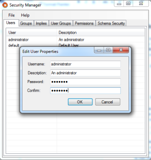
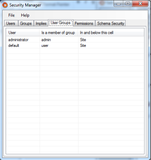
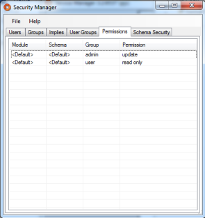
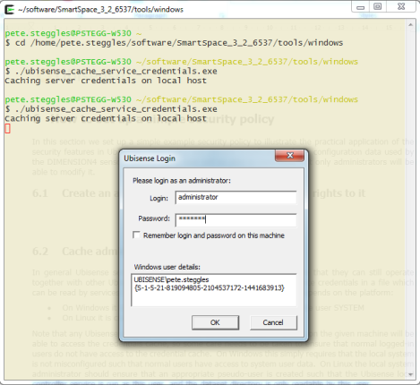
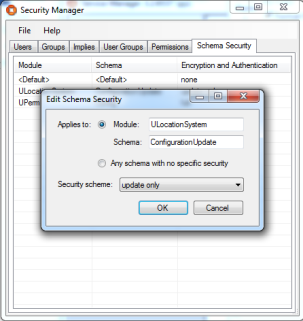
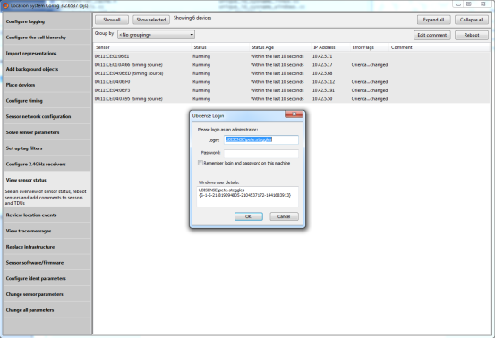
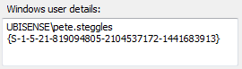

Skip To Main Content

  * placeholder

Filter:

  * All Files

Submit Search

   

You are here:

[Download as
PDF](../../../../SmartSpaceDownloads/B7GZWZS4WX9F/SmartSpaceSecurityManager.pdf
"link to PDF version of this content")

[Software
Version](../../../ComponentandFeatureOverview/FrontMatters\(Online\)/features-
and-versions.htm): 3.2

#  Ubisense Security Manager

This document describes the security techniques used to protect Ubisense
services from unauthorized data access and unauthorized modification.

The document introduces the protocols relevant to security in a Ubisense
system, and the protection levels that can be given to individual Ubisense
schemas; it then outlines how the Ubisense encryption and key exchange
protocols work to protect the Ubisense protocols.

The document then goes on to outline how the basic protection levels can be
combined with a conventional role-based security model to achieve a flexible
and configurable security schema for a complete system.

# Ubisense schema protocols

As described in [Ubisense Architecture and
Protocols](../../../ITResources/ITDocs/ArchiProtocols/architecture-and-
protocols.htm), the Ubisense architecture is homogeneous, being composed from
a number of individual schema services. There are two protocols relevant to
data security and integrity in any Ubisense system: these are the protocols
used to modify schema data, and to distribute schema data to clients.

## Remote Operations Protocol

The remote operations protocol provides a mechanism for a schema to expose an
interface to external clients. This interface is primarily used to modify data
managed by the schema; it is also possible to query the schema’s data via a
remote operation, but in practice this is achieved by using the event channel
protocol.

For more information on the remote operations protocol, see [Ubisense
Architecture and
Protocols](../../../ITResources/ITDocs/ArchiProtocols/architecture-and-
protocols.htm), which includes a detailed description and diagram showing the
protocol message sequence.

## Event Channel Protocol

The event channel protocol distributes data from schemas to consumers of
schema data in an efficient and low-latency manner. It only permits read
access to the data in a schema; there is no mechanism to modify data using the
event channel protocol.

For more information on the event channel protocol, see [Ubisense Architecture
and Protocols](../../../ITResources/ITDocs/ArchiProtocols/architecture-and-
protocols.htm), which includes a detailed description and diagram showing the
protocol message sequence.

# Schema security and integrity

Ubisense schemas can be given one of three protection levels. These protection
levels are achieved by encrypting the two different protocols introduced
above.

## Open Access

When a schema is given open access, the schema uses no encryption or
authentication. Any network user can read and update the schema. This level is
suitable for a schema that contains no secure data, and whose contents should
be modifiable by any user.

## Update Protection

When a schema is given update protection, the event channel protocol is not
encrypted, but the remote operations protocol is encrypted and requires
authentication. This is a useful model when only the modification of schema
data should be protected; it is typically used when the schema contains no
secure data, but its contents must be protected against unauthorized
modification.

## Full Protection

When a schema is given full protection, the event channel protocol and the
remote operations protocol are both encrypted and require authentication. This
model is typically used when the schema contains secure data, which must not
be viewed by any unauthorized user.

# Encryption and authentication protocols

## Encryption

When a protocol is configured to use encryption, the data sent over the
network is obscured to make it unreadable by clients that do not have the keys
required to decrypt it. It is also impossible to send meaningful protocol
traffic without the keys required to encrypt it.

The Ubisense platform uses the Advanced Encryption Standard (AES) cipher with
128 bit keys. The keys are distributed to clients through the authentication
process (see below).

The Ubisense platform implementation of AES uses the AES library from Dr Brian
Gladman – an open source AES implementation available at
[https://github.com/BrianGladman/aes](https://github.com/BrianGladman/aes).

The data encryption keys used by the services change each time services are
restarted.

## Authentication and Key Exchange

For the key exchange process, an implementation of the AMP standard (four-
pass) is used, as described in IEEE P1363.2 (see
[http://grouper.ieee.org/groups/1363/](http://grouper.ieee.org/groups/1363/)).
The AMP protocol is a password-authenticated key agreement method, which
allows two parties to establish cryptographic keys based on their shared
knowledge of a secret, without ever needing to exchange the secret itself. The
parties both create a large secret integer by using the SHA-2 algorithm to
generate a hash of their credentials; they then exchange information about
random bits in the hash, thereby providing sufficient evidence of their
credentials without transmitting either the credentials or the hash.

In the Ubisense authentication process AMP is used to establish a one-time key
for an AES-128 channel, which is then used to transmit the data encryption
keys for the encrypted protocol (which will be either the event channel or the
remote operations protocol).

# Schema security model

Ubisense supports a multi-level role-based security model in which:

  * a user can be a member of one or more groups
  * a user’s group membership can vary across cells, to support high and low security areas
  * groups have a hierarchy – i.e. membership of one group can imply membership of another
  * groups are assigned permissions for accessing schemas

The configuration data for this model is managed centrally by the Ubisense
schema UPerm::Config and stored in the data file UPerm%Config.udata on the
server.

## Cells

The Ubisense platform is based on a cellular architecture, where each cell
covers some area of a site or sites. Each cell has a number of schema services
running on it that implement the state and functionality required for that
type of cell.

## Users

A user has a name and a password as credentials. When a client authenticates
with a schema service it must provide a matching set of credentials that have
the appropriate permission on that service. When a user is created, the
corresponding password is encrypted before storage in the UPerm%Config.udata
file.

Permissions for a user are defined by the groups of which they are members.

There is a user called default, which represents an unauthenticated user. If
required this user can be deleted.

## Groups

A group is a set of users to which permissions can be assigned for accessing
schema services. A group is assigned a given permission for schema services
underneath a given cell.

A group can also imply another group, so users that are members of a group are
also members of all implied groups.

A group has an associated description, and this is the text that is used to
prompt the user when a login is required. The login dialog starts with a line
indicating which groups can be used to allow the action that is being
attempted. This line is formed from the set of group descriptions that have
the required permission for the action. Hence it is important to provide a
group description of the form [indefinite article] [noun], for example, "an
administrator" or "a power user".

## Assignment of Users to Groups

A user is assigned to groups underneath a given cell. This allows the
administrator to partition the platform spatially so that different parts of
the site are accessible for different sets of users. To assign a user a group
across the entire site, use the Site cell.

## Schema Permission Rules

As described in Schema security and integrity, schemas have three protection
modes: open access, update protection or full protection.

A group of users can be assigned a set of permission rules. Each rule consists
of:

  * A module and schema, which may be "default" to indicate all modules and schemas for which the group has not been assigned any other permission
  * The access rights for that module and schema, which may be "read only" or "update"

The "read only" permission allows the user to access the data in instances of
the schema, and to receive notification of changes to the data. The "update"
permission allows the user to access data, receive notifications, and to call
operations on instances of the schema.

Permissions for a module, schema and group have the following order of
precedence:

  1. Permissions for the exact module and schema for the group. 
  2. Permissions for the exact module, and default schema for the group. 
  3. Permissions for default module and default schema for the group. 
  4. none 

Note that a rule with default module but exact schema is not used, and will be
ignored.

# How to set up a simple security policy in Security Manager

In this section we set up a simple example security policy to illustrate the
practical application of the security features in Ubisense. This policy will
prevent modification of any configuration data used by the DIMENSION4 sensor
system; every user will be able to view data, but only administrators will be
able to modify it.

## Create an Administration User and Restrict Admin Rights to It

Using the “Users” tab in the Ubisense Security Manager tool, create a new user
called “administrator” which will have administration rights.

Then using the “User Groups” tab, ensure that the “administrator” user is the
only user to be in the group “admin”, and using the “Permissions” tab ensure
that only admin users have the update permission by default:

## Cache Administration Credentials for Services

In general Ubisense services may require special permissions to ensure that
they can still operate together with other Ubisense services to invoke
operations in ways guaranteed correct by the specifications of those services.
Considering the example of DIMENSION4 configuration, we can see why this is
valuable. There will be important reasons why sensor configuration might be
updated by other Ubisense services. For example, the “Location sink
registration” service seamlessly connects DIMENSION4 RTLS to the SmartSpace
software platform by looking for advertised location sinks for each location
cell and enters their IP addresses into the sensor configuration, so that
sensors send their data direct to those sink addresses; if it were not able to
set the location sink address configuration then this would need to be done
manually by an authenticated user.

This special treatment for services is achieved by caching service credentials
in a file which can be read by services but not by other users. The location
of the file depends on the platform:

  * On Windows it is credentials.dat in CSIDL_LOCAL_APPDATA for the user SYSTEM
  * On Linux it is credentials.dat in the root of the dataset directory

Note that any Ubisense program with the appropriate permissions running on the
given machine will be able to access the credentials cache, so some care needs
to be taken to ensure that normal logged-in users do not have access to the
credentials cache. On Windows this simply requires that the local system is
not misconfigured such that normal users have access to system user data. On
Linux the local system administrator should ensure that an appropriate pseudo-
user is created such that the Ubisense local controller service is run as this
user, and the dataset directory is only readable by this user.  

To cache service credentials, use the program
ubisense_cache_service_credentials that is distributed in the tools folder of
the software distribution. On Windows it will generate a dialog – enter the
relevant username and password, and the corresponding credentials will be
stored in the locations described above.

Ubisense services on that machine will now all be able to run with admin
privileges.

### Authentication using Cached Service Credentials on Linux

If you are running on a Linux server and configure a security policy in
Service Manager that requires services to authenticate as a user, using
ubisense_cache_service_credentials, then you must run the core and controller
software with the -d flag. Otherwise all services will still have a connected
stdin/stdout and will attempt to prompt for credentials rather than reading
the cached service credentials. See Security Manager for further information.

### Security Configuration for SmartSpace Web with Security Manager

If you are using a non-trivial security manager configuration to force
authentication for services (as is the case for ACS installations) then you
must you must run the ubisense_cache_service_credentials tool on the web
server host. This is because the credentials.dat file created by the tool (in
the latest version) allows IIS_IUSRS as a reader. Without this, the web site
code cannot read the credentials, and therefore cannot connect to the platform
services it needs.

For a Windows server, you must use the version of the
ubisense_cache_service_credentials tool from the 3.4 sp1 distribution or
above.

### Service security and Replication

If you intend to use authentication on your dataset and you are also
installing Replication, you must ensure that you have identical copies of the
credentials.dat file on your live machine and your backup machine.

  * To achieve this, after you have generated the credentials.dat file on the live machine, copy the file from the root dataset folder of the live machine to the root dataset folder of the backup machine.

It is important to note that whenever any subsequent change is made to
credentials.dat, you must repeat this step and copy the changed file to the
other machine.

For further information on installing and configuring Replication, see
[Ubisense Replication](../../AdvancedIT/Replication/replication-
configuration.htm) or the  SmartSpace Replication Guide.

## Add Security to the Appropriate Schema

The sensor configuration data is all controlled via the ULocationSystem /
ConfigurationUpdate schema. To prevent unauthorized access to this schema, use
the Schema Security tab to add a security scheme to it:

Now restart the services so that they now operate under the new security
policy.

If you now run the Location System Config tool, select all the sensors and try
to reboot them, you will get a dialog prompting for appropriate credentials:

If you enter the credentials correctly, the schema connection will be
established and the sensors will be rebooted – the connection will continue
with the same privileges for as long as the program runs.

## Create other Administration Users

It is now possible to create other users and assign appropriate group
memberships to them. One particularly useful case on Windows platforms is the
‘Windows-authenticated user’. On Windows platforms, when the authorization
dialog comes up, it includes this information:

The SID is taken from a Windows system call which returns the unique SID of
the current logged-in authenticated user. This can be used to set up a
Windows-authenticated user, which piggy-backs off the Windows authentication
process. The Windows-authenticated user dialog for the user above would look
like this:

If the new Windows user is now given membership of the admin role, the direct
login requirement will be eliminated because the credentials will now be
derived from the logged-in Windows user credentials.

### Compatibility of ACS version 2.7 and earlier with Windows User
Authentication

There can be an authentication compatibility issue for a Ubisense platform
running:

  * Core and controller version 3.5.7350 and above
  * Security Manager version 3.5.7350 and above
  * ACS version 2.7

In this situation, if a user tries for example to open Service Manager 3, and
it requests authentication, it will provide a GUID to be given to the
administrator to create a Windows user. A Windows user created with this GUID
will work for Service Manager 3, and for any other tools from version 3.5.7350
or later, but will not work with ACS 2.7.

To prevent this, if you create a new Windows user, it is important to do so
using the authentication SID provided by the ACS 2.7 user interface, not the
newer GUID provided by any other platform user interface. The newer GUID will
not work to authenticate with ACS 2.7 services.

  * Ubisense Security Manager
  * Ubisense schema protocols
    * Remote Operations Protocol
    * Event Channel Protocol
  * Schema security and integrity
    * Open Access
    * Update Protection
    * Full Protection
  * Encryption and authentication protocols
    * Encryption
    * Authentication and Key Exchange
  * Schema security model
    * Cells
    * Users
    * Groups
    * Assignment of Users to Groups
    * Schema Permission Rules
  * How to set up a simple security policy in Security Manager
    * Create an Administration User and Restrict Admin Rights to It
    * Cache Administration Credentials for Services
      * Authentication using Cached Service Credentials on Linux
      * Security Configuration for SmartSpace Web with Security Manager
      * Service security and Replication
    * Add Security to the Appropriate Schema
    * Create other Administration Users
      * Compatibility of ACS version 2.7 and earlier with Windows User Authentication

   

* * *

[www.ubisense.net](http://www.ubisense.net/)  
Copyright © 2020, Ubisense Limited 2014 - 2020. All Rights Reserved.

