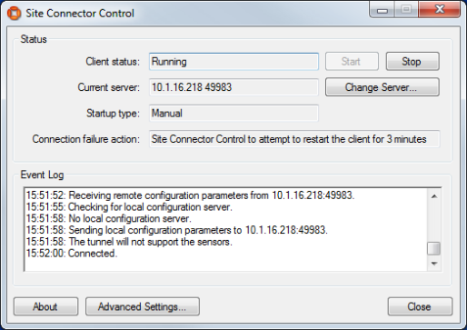
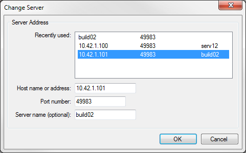
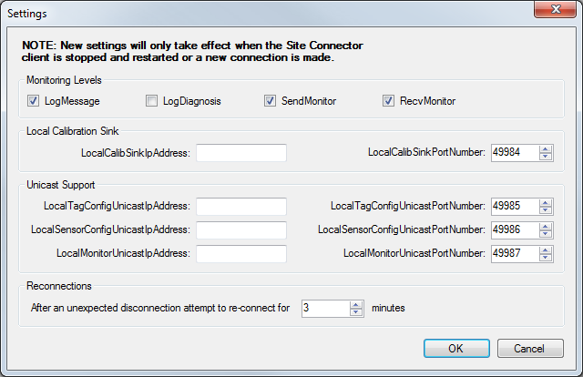
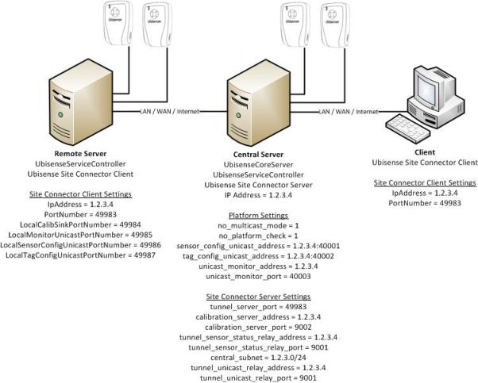

Skip To Main Content

  * placeholder

Filter:

  * All Files

Submit Search

   

You are here:

[Download as
PDF](../../../../SmartSpaceDownloads/B7GZWZS4WX9F/UbisenseSiteConnector.pdf
"link to PDF version of this content")

[Software
Version](../../../ComponentandFeatureOverview/FrontMatters\(Online\)/features-
and-versions.htm): 3.4

# Introduction to Site connector

The Site connector can be used to tunnel the Ubisense protocols across a
TCP/IP connection, effectively making two disjoint networks appear to be
connected to the same instance of the platform. This connector offers the
possibility to bridge the Ubisense protocols, via SSH, through firewalls and
over the internet.

The Site connector consists of a server and a set of clients. The number of
clients is up to a limit that can be set via the Ubisense platform's
configuration mechanism.

This manual describes Site connector version 2.1.11, though most sections also
apply to 2.1.9 and 2.1.10.

## Purpose of this Manual

The following is a guide to the use and operation of the Ubisense Site
connector system. It is divided into the following sections:

  1. System Overview: brief description of the system and its components
  2. Intended Uses: the main system use cases
  3. Server Management: installation, configuration, monitoring
  4. Client Management: installation, configuration, monitoring
  5. System Configuration: how to configure the system for different uses

The user should read this entire manual before attempting to install and
configure the system.

The system is quite complex. The user should perform the minimum installation
and configuration required for their application and should not set
configuration parameters unless they fully understand what the impact will be.

# System Overview

The Site connector consists of, first, a server application and second, a set
of client applications.

The Site connector server is an independent service rather than a package
deployed via the Ubisense platform. On Windows, it is installed as a Windows
Service. On Linux, it should be started in the same way as core and
controller, via a startup script or systemd, depending on the Linux
distribution.

The client applications run as system services (e.g., Windows service or Linux
daemon).

In the occurrence of any fatal failure that would lead to an unexpected
termination of an application (either server or clients), the application will
automatically be re-launched causing the re-binding connections to return to a
fully functional tunnel.

The Site connector bridges the following Ubisense protocols:

  * Service finder
  * Invocation protocol
  * SRM (Scalable Reliable Multicast)
  * Monitoring
  * Configuration protocol
  * Sensor-level protocols, including both multicast and unicast modes

To be harnessed, the Site connector requires both the server and at least one
client to be installed. Furthermore, some configuration steps might be
required.

From version 2.1.11 there are two different Windows Clients.

  * The Site connector Client is intended for connecting a client PC, which will just monitor and observe, to a server. It is intended to only be connected while the client PC is in use. 
  * The Site connector Client for Servers is intended to connect a server running a local controller to a central server running the Ubisense Core Server. This version is very similar in functionality to the Site connector Client versions 2.1.9 and 2.1.10.

# Intended Uses

## Single client computer running Ubisense programs only

If the entire sensor system, and the servers, is on a single network and Site
connector is being used to connect a remote computer which will observe the
system using Ubisense programs, such as Service Manager and Location Engine
Configuration, then all that is required is:

  1. Install Site connector Server on server machine and Site connector Client on remote machine.
  2. Set server IP address in client configuration.
  3. Start Site connector Client and check that it connects.

The section Client Management  describes installing and configuring the
Client, the section Server Management provides more information on Server
configuration, and the section Basic connection describes basic connection.

## Connecting two sites where the sensor system is in multicast mode

If the system is distributed over more than one network, e.g. with sensors
connected to the client machine, then, in addition to the set-up required
above, Site connector must be configured for all sensor protocols. See Sensor-
level protocols support. Note: in this scenario a Windows client machine must
be connected with Site connector Client for Servers.

## Connecting two sites where the sensor system is in unicast mode

Where multicast mode is not available, or permitted, on the network the
Ubisense sensor system will use unicast mode. In this case Site connector must
also be configured for Unicast mode. See section Unicast support.

# Server Management

The site connector server is an independent service. On Windows, this is
installed as a Windows Service. On Linux, it should be started in the same way
as core and controller, via a startup script or systemd, depending on the
distribution of Linux that is used.

NOTE: In previous releases, the site connector server was deployed as a
package into the Ubisense Platform. From version 3.4 it is an independent
service. This change was made to make remote administration of a production
server more robust, since it was easy to accidentally stop or undeploy the
Site connector service during a platform service upgrade, but Site connector
was required to proceed with the service upgrade.

## Installation

In all cases, you should undeploy and remove any existing Site Connector
package, using the Ubisense Service Manager, before installing this release.

### Installing Site connector server on Windows

  1. Go to the UbisenseSiteConnectorForServers directory of your Site connector distribution directory.
  2. Double-click the UbisenseSiteConnectorForServers.msi file and the Ubisense Site Connector Service Setup wizard appears.
  3. Click Next to display the Custom Setup dialog.

  4. Choose the components to install. For each server machine you can choose to install either the core server or service controller or both. If you intend to run SmartSpace on a single server, you need to install both the core server and service controller on that machine. For an installation with more than one server, you need to run the core server on one machine only and the service controller on the rest, and you can install the components accordingly.

By default, all features are selected. Choose whether to install or exclude
items using the dropdowns beside their names. Reset returns you to the default
selection.

  5. Choose the Destination Folder for the software.  
You can accept the default C:\Program Files (x86)\Ubisense 2.1\ or change to
another destination.

  6. Click Next and click Install.
  7. When the installation is complete, click Finish to close the Ubisense Site Connector Service Setup wizard.

After installation is complete, start the service using Windows Services
manager:

  1. Open Services by typing View local services in the Start menu.
  2. Start the service UbisenseSiteConnectorServer 2.1.

The service is configured to start automatically on reboot.

You can also stop and start the site connector service from the command prompt
(as an administrator):

net stop "UbisenseSiteConnectorServer 2.1"

net start "UbisenseSiteConnectorServer 2.1"

### Installing Site connector server on Linux

For Linux, you can find the Site connector server executable in your
distribution directory under linux/server. To install the executable:

  1. Copy ubisense_site_connector_server onto your server
  2. Create a startup script or systemd configuration to run the executable on startup.

## Configuration

Several parameters can be set via the ubisense_configuration_client
application. The command

ubisense_configuration_client set <parameter name> <parameter value>

sets the configuration parameter <parameter name> to the value <parameter
value>. Table 1: Parameters of the Site Connector server lists the parameters
specific to the tunnel server. There is no need to set parameters for which an
acceptable default value is listed.

Table 1: Parameters of the Site Connector server

Parameter name |  Type  |  Description |  Default value  
---|---|---|---  
tunnel_server_port |  ushort  |  Port number |  4998349983  
tunnel_server_log_output_diagnosis |  bool |  Activate the diagnosis log stream |  0  
tunnel_server_log_output_message |  bool |  Activate the message log stream |  1  
tunnel_server_send_monitor |  bool |  Send the monitor packets through the tunnel |  1  
tunnel_server_max_clients |  int |  Maximum number of clients |  20  
tunnel_server_max_mem_queue_clients |  int64 |  Maximum memory in bytes allocated for all the sending queues |  1,500,000,000  
tunnel_server_max_mem_queue_client |  Int64 |  Maximum memory in bytes allocated for one sending queues |  500,000,000  
tunnel_sensor_status_relay_address |  string |  Required for supporting the sensors’ status protocols. Must be set to the IP address of the machine on which the tunnel server is running |   
tunnel_sensor_status_relay_port |  ushort |  Port number of the tunnel component that forwards the sensors’ status protocols |   
calibration_server_address |  String |  IP address of the calibration server (usually same as the tunnel server IP address, for, in practice - but not always -, they run on the same machine) |   
calibration_server_port |  ushort |  Port number of the calibration server (the calibration server will bind to this port) |   
central_subnet |  string |  Must be of the form ‘a.b.c.d/y’ meaning that y bits are allocated for the network prefix, and the remaining 32-y bits are reserved for host addressing (Classless Inter-Domain Routing - CIDR - form) |   
tunnel_unicast_relay_address |  string |  Required for supporting the sensor-level protocols in unicast mode. Must be set to the IP address of the machine on which the tunnel server is running |   
tunnel_unicast_relay_port |  ushort |  Port number of the tunnel component that forwards the sensor-level protocols in unicast mode |   
  
IMPORTANT: When a parameter is updated, it is necessary to restart the
SiteConnector server service in order for the new parameter value to be
effective.

## Monitoring

The server logs its monitoring messages using the standard Ubisense logging
mechanism. The log streams can be viewed using the Ubisense Location Engine
Config application (2). The platform_monitor configuration parameter must
contain ‘site_connector’.

The streams can also be viewed using ubisense_monitor_receiver, e.g.

ubisense_monitor_receiver –f site_connector

Monitoring levels describes the monitoring levels.

# Client Management

The client (ubisense_site_connector_client) should run as a Windows service or
Linux daemon. In order to perform the installation you must know both the
server address and the port number on which the server is listening.

Note: Only one client can be running per machine (i.e., for a given client,
its address must be unique). Furthermore, the server and a client cannot
coexist in the same machine.

## Windows

### Installation

The Windows Site Connector Client is installed using
UbisenseSiteConnectorClient.msi. The Windows Site Connector Client for Servers
is installed using UbisenseSiteConnectorClientForServers.msi. The setup wizard
will guide you through installing the client.

To install the Windows Site Connector Client:

  1. Go to the UbisenseSiteConnectorClient directory of your Site connector distribution directory.
  2. Double-click the UbisenseSiteConnectorClient.msi file and the Ubisense Site Connector Client Setup wizard appears.
  3. Click Next.

  4. Choose the Destination Folder for the software.  
You can accept the default C:\Program Files (x86)\Ubisense 2.1\ or change to
another destination.

  5. Click Next and click Install.
  6. When the installation is complete, click Finish to close the Ubisense Site Connector Client Setup wizard.

To install the Windows Site Connector Client for Servers:

  1. Go to the UbisenseSiteConnectorClientForServers directory of your Site connector distribution directory.
  2. Double-click the UbisenseSiteConnectorClientForServers.msi file and the Ubisense Site Connector Client for Servers Setup wizard appears.
  3. Click Next to display the Custom Setup dialog.

  4. Choose the components to install. For each server machine you can choose to install either the core server or service controller or both. If you intend to run SmartSpace on a single server, you need to install both the core server and service controller on that machine. For an installation with more than one server, you need to run the core server on one machine only and the service controller on the rest, and you can install the components accordingly.

By default, all features are selected. Choose whether to install or exclude
items using the dropdowns beside their names. Reset returns you to the default
selection.

  5. Choose the Destination Folder for the software.  
You can accept the default C:\Program Files (x86)\Ubisense 2.1\ or change to
another destination.

  6. Click Next and click Install.
  7. When the installation is complete, click Finish to close the Ubisense Site Connector Client for Servers Setup wizard.

The Site Connector Client can be installed from the command line, without the
UI, using msiexec. For example:

msiexec /i UbisenseSiteConnectorClient.msi /passive

A number of setup parameters can be specified on the command line (see Table
2: Command line parameters of setup MSI.).

Table 2: Command line parameters of setup MSI.

Parameter name |  Type  |  Description |  Default   
---|---|---|---  
ALLUSERS |  string  |  Specify whether the client should be installed for all users, i.e. per machine, or a single user, i.e. per user. For per user set ALLUSERS=””. |  All users  
SERVICE_START |  String |  Specify whether the Site Connector Client should start automatically after a PC reboot. Set SERVICE_START=”automatic” for automatic re-starts. |  Manual  
SERVER_IP |  String |  Specify the IP address of the Site Connector server. |  127.0.0.1  
SERVER_PORT |  String |  Specify the port number to connector to on the server. |  49983  
STANDALONE_MODE |  string |  Specify whether the client should be in standalone mode. Set STANDALONE_MODE=”0” for non-standalone mode. |  1  
  
The following example will install the Site Connector Client for Servers for a
single user, connecting to address 10.42.1.101:44444, with automatic re-
starts:

msiexec /i UbisenseSiteConnectorClientForServers.msi ALLUSERS=””
SERVICE_START=”automatic” SERVER_IP=”10.42.1.101” SERVER_PORT=”44444” /passive

Note that even when automatic re-starts are specified the client needs to be
started for the first time, this can be done manually, see Basic Settings and
Connection, or by rebooting the PC.

### Basic Settings and Connection

After the installation has been successfully performed, the client can be
started, stopped and configured using the Site Connector Control application.
This can be found on the Programs menu under Ubisense 2.1 > Site Connector.
The main screen of the application is shown in Figure 4.

Figure 4: Site Connector Control main dialog

The current status of the client is shown in the ‘Client status’. This will
usually be ‘Running’ or ‘Stopped’.

When the client is ‘Stopped’ it can be started with the Start button. The
behavior is different for the Client and the Client for Servers:

  * When the Client for Servers is started it will be set to automatically re-start after a reboot. Therefore the client will run until the user stops it. When the client is ‘Running’ it can be stopped with the Stop button. When the client is stopped it will be set to not automatically re-start after a reboot. The buttons are enabled and disabled according to the current status of the client.
  * When the Client is started it is not set to automatically re-start. It will only run as long as Site Connector Control is running. If the PC is rebooted the client will not re-start. If the client loses connection the Site Connector Control will try to re-start it for a few minutes but then give up.

The ‘Connection failure action’ explains what actions are taken if the client
loses its connection.

The Event Log shows diagnostic information about the client. For example, in
Figure 4, the top line of the Event Log shows the server the client is
connecting to and the bottom line shows that the client has successfully
connected.

If the client fails to connect then diagnostic messages will appear in the
event log. If the client encounters a problem then it will stop itself.

If this happens to the Client for Server the Windows Service Manager will
restart it to try connecting again. This can lead to the client continually
stopping and restarting. The Event Log should reveal the problem.

For the Client the Site Connector Control will try to re-start it for a few
minutes but then give up.

The host name or IP address and port number for the server can be changed in
the Change Server dialog (see Figure 5: Change Server dialog).

Figure 5: Change Server dialog

The ‘Recently used’ list lists the servers that the client has recently
connected to. Selecting one of these will fill in the ‘Host name or address’,
‘Port’ and ‘Server name’ values. If the required server is not listed then
these three values can be entered by hand. The ‘Host name or address’ can be
the name of the server, e.g. ‘serv12’ or an IP address, e.g. 10.42.1.101. The
‘Server name’ is optional and may be used when an IP address is specified to
provide a user-friendly name, e.g. ‘production server’. The port will normally
take the default value of 49983.

Press OK to use the new server settings or Cancel to abandon the changes. If
the Site Connector Client is running when the server address is changed it
will immediately stop and the Windows Service Manager will restart it with the
new server settings. The ‘Client status’ and ‘Current server’ values in the
main dialog should update. If the Site Connector Client is not running then
you can start it with the new server address by pressing the Start button.

Once the Client for Servers is connected the Site Connector Control
application can be closed, however for the Client the application must remain
open while the connection is in use. In this case the Client will be stopped
when the application is closed.

Advanced users can view the state of the client and start and stop it using
the Windows Computer Management application. Look for the
UbisenseSiteConnectorClient 2.1 under Services and Applications > Services.

### Advanced Settings

Advanced settings, required for monitoring, sensor protocols and unicast
support can be edited using the Settings dialog (see Figure 6: Settings
dialog). The meaning of these setting is described in section Configuration
and their usage is described in the sections Monitoring levels, Sensor-level
protocols support and Unicast support. To accept the changes press the OK
button. To abandon them press Cancel. After changing these settings you must
stop and restart the client using the Stop and Start buttons in the Site
Connector Control main dialog.

Figure 6: Settings dialog

Advanced users can view and modify all the client settings using the Windows
Registry Editor. The parameters are located in

HKEY_LOCAL_MACHINE\SOFTWARE\Ubisense 2.1\ubisense_site_connector.

### Configuration

Table 3: Parameters of the client lists the parameters specific to the Site
Connector client.

Table 3: Parameters of the client

Parameter name |  Type  |  Description |  Default value  
---|---|---|---  
PortNumber |  ushort  |  Port number of the tunnel server |  49983  
IpAddress |  string |  Address of the tunnel server |   
LogDiagnosis |  bool |  Activate the diagnosis log stream |  0  
LogMessage |  bool |  Activate the message log stream |  1  
SendMonitor |  bool |  Send the monitor packets through the tunnel |  1  
RecvMonitor |  bool |  Request monitor packets from the server |  1  
LocalCalibSinkPortNumber |  ushort |  Local calibration sink port number |  49984  
LocalCalibSinkIpAddress |  string |  Local calibration sink address (relevant only if the machine has several network interfaces) |   
LocalBootServerIpAddress |  string |  Address of the local boot server (relevant only if the machine has several network interfaces) |   
LocalTagConfigUnicastIpAddress |  string |  Address of the local service used for tag configuration (relevant only if the machine has several network interfaces) |   
LocalTagConfigUnicastPortNumber |  ushort |  Port number of the local service used for tag configuration |  49985  
LocalSensorConfigUnicastIpAddress |  string |  Address of the local service used for sensor configuration (relevant only if the machine has several network interfaces) |   
LocalSensorConfigUnicastPortNumber |  ushort |  Port number of the local service used for sensor configuration |  49986  
LocalMonitorUnicastIpAddress |  string |  Address of the local service used for trace message forwarding (relevant only if the machine has several network interfaces) |   
LocalMonitorUnicastPortNumber |  ushort |  Port number of the local service used for trace message forwarding |  49987  
ReconnectPeriodMinutes |  ushort |  Number of minutes to try reconnecting the simple Client. |  5  
WindowsServer |  bool |  Activate the additional features of the Client for Servers. This value should not be changed. |  0  
  
### Monitoring

The Windows client logs its monitoring messages to the Windows Event Log. All
messages are displayed in the Event Log in the Site Connector Control
application.

Advanced users can view the log streams using the Windows Event Viewer
application

The Monitoring levels section describes the monitoring levels.

## Linux

### Installation

There is no particular step to install the client. Launch the application
ubisense_site_connector_client. To ensure that the daemon will restart in the
event of a fatal failure, you can write a cron script such as this one:

    
    
    #!/bin/bash
    if [[ ! `pidof -s ubisense_site_connector_client ` ]]; then
        invoke-rc.d ubisense_site_connector_client start
    fi

### Configuration

The Linux client is configured using a simple text file:

/etc/ubisense/tunnel_site_connector.conf.

NOTE: If the UCONFIG environment variable has been used to define an
alternative location for platform.conf, then site connector client expects the
parameter file to be in the same location. For example, if UCONFIG is
/home/ubisense/platform.conf, then the tunnel parameter setting file will be
/home/ubisense/tunnel_site_connector.conf.

Bear in mind that the daemon must have the adequate right to read that file in
order for the parameters to be properly set. Furthermore, if the daemon is
running when the configuration file is modified, it is necessary to restart
the daemon for the new parameter values to take effect.

Table 3: Parameters of the client lists all the parameters that can be
specified.

The file format should strictly follow this template: <parameter name>
<parameter value>. The name and value must be separated by one, or several,
blank space (or tab, or new line). Two name-value compounds must be separated
by one, or several, blank space, tab or new line.

Here is an example of tunnel_site_connector.conf:

    
    
    IpAddress 10.42.5.116
    PortNumber 49983
    LogMessage 1
    LogDiagnosis 0
    

Note that if a parameter is not specified in this file the default value is
used (see Table 3: Parameters of the client).

### Monitoring

The Linux client logs its monitoring messages using Linux’s syslog (with the
facility code set to LOG_LOCAL0 and the priority code set to LOG_INFO).

The location of the syslog output varies according to the distribution of
Linux being used. The file /etc/syslog.conf will normally contain the location
of the monitoring output which may be /var/log/messages.

The section Monitoring levels describes the monitoring levels.

# System Configuration

## Monitoring levels

Servers and clients both support two levels of monitoring. MESSAGE level
provides basic progress and event tracking. DIAGNOSIS provides more detailed
debugging information. The monitoring level can be set on both the client and
the server independently (i.e. the monitoring levels do not need to match). On
the client LogMessage and LogDiagnosis turn the two monitoring levels on or
off. On the server tunnel_server_log_output_message and
tunnel_server_log_output_diagnosis perform the same function.

If monitoring messages from the server should be sent to the client then the
server parameter tunnel_server_send_monitor should be set to 1. If monitoring
messages from the client should be sent to the server then the client
parameter SendMonitor should be set to 1.

If the client does not want to receive monitor messages from the server then
the client parameter RecvMonitor should be set to 0.

When the network speed is limited, we suggest setting the both flags
RecvMonitor and SendMonitor to 0. Otherwise, the risk is for the client to be
disconnected from the server. Note that, in practice, RecvMonitor may be more
critical than SendMonitor in such a context; therefore if you observe in the
server’s log (message stream, see next subsection for further details) that
the sending queue has overflowed (i.e., the sentence “Sending message queue
has overflowed”) causing the client to be disconnected, you may start by
setting RecvMonitor to 0. Then, if the problem persists, set SendMonitor to 0.

## Memory usage management

When the server is sending a message to a given client, the message is first
enqueued, and then a thread is in charge of dequeueing the messages and
sending them through the network (one thread is dedicated for this task for
one queue; therefore there are as much threads as sending queues, i.e., as
much as connected clients). In practice, this approach works fine most of the
time. However, if, for any reasons, a queue is (or several queues are) growing
much faster than it is (or they are) emptied, it can be the source of
undesirable behavior. For example, if a queue grows to the point of requiring
an amount of memory unbearable for the operating system, this may potentially
lead to the collapse of the entire system.

For the sake of avoiding such a scenario, a two-fold mechanism has been
implemented. First, each sending queue is limited in memory. The parameter
tunnel_server_max_mem_queue_client (Table 1: Parameters of the Site Connector
server) defines this limit. If this limit is reached, then the client is
disconnected.

Second, the global memory employed by the entire set of the connected clients
(i.e., the sum of the memory of the queue of each client) is monitored. If
this sum reaches the limit set via the parameter
tunnel_server_max_mem_queue_clients (Table 1: Parameters of the Site Connector
server), then the client that has the queue using the most memory is
disconnected.

The best values for tunnel_server_max_mem_queue_client &
tunnel_server_max_mem_queue_clients will depend on the memory available on the
computer where the Site Connector server is running. The default values, 500MB
and 1.5GB, could be too large on some computers and may need to be reduced to
a tenth of these values or less.

The memory usage can also be controlled by setting the maximum number of
clients with tunnel_server_max_clients. By default up to 20 clients are
allowed.

Advanced users may also want to adjust the value of the Ubisense platform
server_max_bytes_per_second parameter to achieve optimum message throughput.

## Basic connection

If all the sensors and the configuration & calibration servers are on the
server end of the tunnel, and the client is merely being used to observe the
state on the server end, then only 1 parameter needs to be set. The client’s
IpAddress parameter must be set to the IP address of the server. The client
PortNumber and the server tunnel_server_port parameters are also used but
normally do not need to be set as the default will suffice. If they are set
then they must be set to the same port number.

In this scenario Site Connector will not transmit the sensor-level protocols
and the warning ‘The tunnel does not support the sensors’ will appear.

## Cleaning up schema connections

By default, schema connections used by clients are kept open on the tunnel
indefinitely. The tunnel_client_test_interval parameter can be set to expire
schema connections that are no longer used, reducing the network bandwidth and
central server load. Every tunnel_client_test_interval seconds the tunnel
client will check for and expire unused connections.

If schema connection expiring is desired, it is recommended you set this value
to 60, which will gracefully and slowly clean up unused schemas. Unused
schemas are detected by dropping a packet for that schema and watching for
client recovery attempts. Using a shorter client interval will clean up
connections more aggressively at the cost of increased client recovery
attempts, which might be visible as very brief pauses in real-time data.

The default setting is 0, which turns off this functionality.

## Sensor-level protocols support

If the system is distributed, so some sensors are connected to the network at
the client end of the tunnel rather than the server end then Site Connector
needs to support all the sensor protocols.

In order to fully support the sensor-level protocols the four parameters
calibration_server_address, calibration_server_port,
tunnel_sensor_status_relay_address and tunnel_sensor_status_relay_port (Table
1: Parameters of the Site Connector server) must be defined. Any non-zero port
numbers, which are not being used for any other purpose, may be chosen. The
server will tell the client which ports to use.

Although calibration_server_address can be the address of a different machine
on the same network, in practice it is the IP address of the machine running
the tunnel server. In contrast, the tunnel_sensor_status_relay_address must
always be set to the IP address of the machine running the tunnel server.

When the setting for supporting the sensor-level protocols is done correctly
(i.e., the four parameters mentioned above are set), the calibration server
will bind the address calibration_server_address:calibration_server_port.

The parameter central_subnet is optional, however it is highly recommended to
set it properly. It defines the subnet the tunnel server, configuration server
and calibration server belong to. If it is set correctly then the tunnel
server can detect that requests for the servers do not need to be sent through
the tunnel thereby greatly reducing the level of traffic in the tunnel. It
must be of the form ‘a.b.c.d/y’ meaning that y bits are allocated for the
network prefix, and the remaining 32-y bits are reserved for host addressing
(i.e., Classless Inter-Domain Routing - CIDR - form). For example if the
addresses of the tunnel, configuration and calibration server are all of the
form 10.42.xx.yy then the central_subnet should be 10.42.0.0/16.

Where sensors are connected to the network at the client end of the tunnel
they need the address for the calibration server. As this is at the server end
of the connection, a proxy needs to be used at the client end. The proxy
address to be used at the client end is defined by LocalCalibSinkPortNumber &
LocalCalibSinkIpAddress. Any non-zero port number, which isn’t being used for
any other purpose, may be chosen. The IP address only needs to be specified if
the client machine has more than one IP address.

## Unicast support

If multicast is not supported in the target network it is possible to switch
the sensors to use a unicast-based configuration protocol as discussed in
‘Ubisense Series 7000 - Sensor Network Protocol Management’ (1). In particular
no_multicast_mode, no_platform_check, sensor_config_unicast_address,
unicast_monitor_address, tag_config_unicast_address and unicast_monitor_port
must be set on the server. The addresses would normally be the address of the
server and the port numbers may be any un-used port. no_multicast_mode and
no_platform_check must be set to 1.

Note:

  1. The initial configuration for unicast has nothing to do with Site Connector and is the same as any other unicast set-up.
  2. The server parameters must be set with ubisense_configuration_client.

The two parameters tunnel_unicast_relay_address and tunnel_unicast_relay_port
(defining an address) must be specified for the tunnel to support the unicast
mode. The tunnel_unicast_relay_address must always be set to the IP address of
the machine running the tunnel server.

Where sensors are connected to the network at the client end of the tunnel
they need the addresses for tag configuration, sensor configuration and
unicast monitoring. As these are all at the server end of the connection,
proxies need to be used at the client end. The proxy addresses to be used at
the client end are defined by LocalSensorConfigUnicastIpAddress &
LocalSensorConfigUnicastPortNumber, LocalTagConfigUnicastIpAddress &
LocalTagConfigUnicastPortNumber and LocalMonitorUnicastIpAddress &
LocalMonitorUnicastPortNumber. Any non-zero port numbers, which are not being
used for any other purpose, may be chosen. The IP addresses only need to be
specified if the client machine has more than one IP address.

Figure 7: Example Configuration

Figure 7 shows an example configuration using unicast. The central server is
running the Ubisense Core Server (boot server & configuration server), a
Ubisense Controller and the Site Connector Server. The IP address is 1.2.3.4
and it is using the default site connector port number (49983). It has some
sensors attached to it.

The remote server may be in the same building as the central server or could
be in a different country. The remote server also has sensors connected to it
and is running a Ubisense Controller. It is running the Site Connector Client.
It has the IP address and port number of the central server in its settings.
It also has the unicast port numbers set.

The client has no sensors connected and is not running a Ubisense Controller.
It is simply being used to view the central server. The set-up is very simple
(as described in the section Single client computer running Ubisense programs
only). The only settings it needs are the central server’s IP address and port
number.

## Static IP addresses

A sensor can be given a static IP address with
ubisense_sensor_ip_configuration using the following parameters:

<mac>MAC address of sensor

<address>IP address to be assigned to sensor

<netmask>Subnet Mask of local machine sensor is connected to

<gateway>Default Gateway of local machine sensor is connected to

<config>IP address of local machine sensor is connected to

The local machine the sensor is connected to will be running the Site
Connector client. The values used for <netmask>, <gateway> and <config> can be
obtained using ipconfig on a Windows PC.

Note:

  1. Static IP addresses cannot be used with a prefix
  2. Beyond ensuring that the configuration server address is the address of the machine running the Site Connector client, Site Connector has no bearing on this process.

Example:

The following is a configuration for sensor 00:11:CE:00:11:C1 where the local
machine is 10.42.5.154:

00:11:CE:00:11:C1 10.42.5.125 255.255.0.0 10.42.1.1 10.42.5.154

# FAQ and Troubleshooting

## Connection errors

Cannot connect to session host

The server IP address or port number may be wrong. Check that the host and
port are correct, that this computer is connected to the internet, and that
there is no firewall blocking outgoing TCP/IP connections.

If the Site Connector server is running in standalone mode, it may not have
added itself to the firewall exceptions. Try running the server once not in
standalone mode and then try again in standalone mode.

Both ends of the connection have core servers running

Either the platform UbisenseCoreServer is running on the machine that Site
Connector Client is running on, in which case use Platform Control to stop it,
or the client and server are on the same network, in which case enable
‘standalone mode’ on the client with Platform Control.

The tunnel will not support the sensors

The address and port of the calibration server and/or the tunnel sensor status
relay have not been set correctly. If sensor protocols are required the
parameters calibration_server_address, calibration_server_port,
tunnel_sensor_status_relay_address and tunnel_sensor_status_relay_port must be
set. This warning can be ignored for a basis connection (see Basic
connection).

## Configuration server

The configuration list obtained via the ubisense_configuration_client utility
seems to be incorrect regarding the address of the boot server (i.e., it shows
the address of the machine located on the other end, which is not valid on
this end).

This is a normal behavior. The reason lies behind the fact that
ubisense_configuration_client is not relying on the configuration protocol to
retrieve the list, but on the remote operation protocol instead (in other
words, it accesses directly to the UConfig::Params server using RPC).

  * Introduction to Site connector
    * Purpose of this Manual
  * System Overview
  * Intended Uses
    * Single client computer running Ubisense programs only
    * Connecting two sites where the sensor system is in multicast mode
    * Connecting two sites where the sensor system is in unicast mode
  * Server Management
    * Installation
      * Installing Site connector server on Windows
      * Installing Site connector server on Linux
    * Configuration
    * Monitoring
  * Client Management 
    * Windows
      * Installation
      * Basic Settings and Connection
      * Advanced Settings
      * Configuration
      * Monitoring
    * Linux
      * Installation
      * Configuration
      * Monitoring
  * System Configuration
    * Monitoring levels
    * Memory usage management
    * Basic connection
    * Cleaning up schema connections
    * Sensor-level protocols support
    * Unicast support
    * Static IP addresses
  * FAQ and Troubleshooting
    * Connection errors
    * Configuration server

   

* * *

[www.ubisense.net](http://www.ubisense.net/)  
Copyright © 2020, Ubisense Limited 2014 - 2020. All Rights Reserved.

