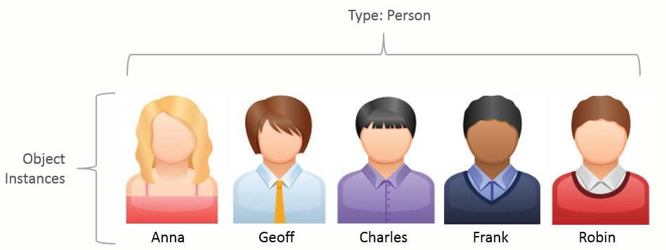
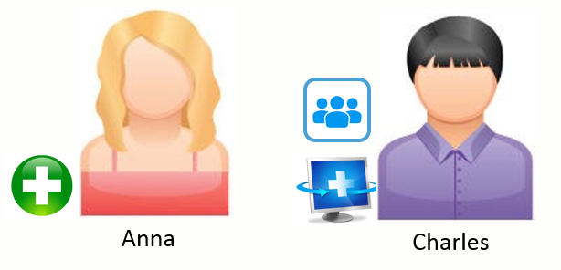
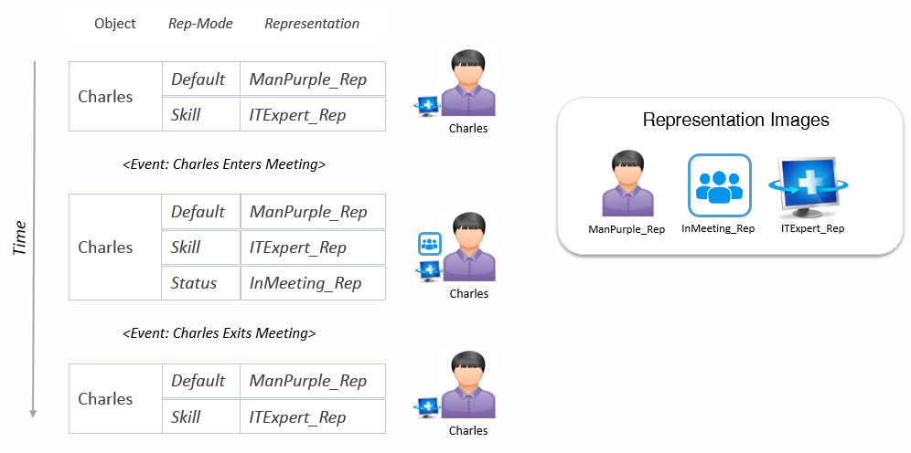

Skip To Main Content

  * placeholder

Filter:

  * All Files

Submit Search

   

You are here:

[Software
Version](../../../ComponentandFeatureOverview/FrontMatters\(Online\)/features-
and-versions.htm): 3.2

# Object representations

## Introduction to Representations

SmartSpace allows you to create a digital model of a real-world environment
that is a physical space filled with physical real-world objects. The digital
model needs to be fed location data from sensors in order to keep virtual
objects synchronized with their real-world counterparts. In so doing
SmartSpace can measure important interactions between objects, and between
objects and their environment.

In order for humans to be able to describe what should happen and then later
see what is happening in the digital model, it is necessary to give the model
a visual and volumetric description. To do this, much like the world of
computer graphics and gaming, SmartSpace uses visual representations to depict
the real-world setting and the objects within it.

SmartSpace also uses representations to portray objects to end users, for
example in the Web maps feature of Visibility, so that, as with Google Maps,
users gain context for the surrounding world, via the background map, and see
the location of objects they’re interested in via some object marker
representation.

SmartSpace has two representation modes:

  * A 3D mode is available to build up your digital model, using representations for the environment and objects so that you as a human can interact with the model in a natural way. This interface is part of the main SmartSpace Config application.
  * A 2D mapping mode is exposed when you license the Visibility component of SmartSpace. This allows you to configure two-dimensional depictions of a setting, and the objects within it, to be delivered through HTML5-compliant browsers in the SmartSpace web map.

## What are Representations, and When and How are they Used?

Representations, or reps for short, are everyday graphical types (pictures)
that can be used to present objects in a visually representative way on a
computer screen. SmartSpace supports a number of different graphical formats
that can be used as representations. Details of these types, and importing,
transforming and assigning them to objects is the subject of the following
sections.

## 3D Graphic Types

SmartSpace uses an industry-standard 3D rendering engine to construct three-
dimensional depictions of a scene and the objects within it. Being 3D, the
objects in the scene and the background model must support a 3D modeling
format. The standard format for the underlying 3D engine used in SmartSpace is
COLLADA.

COLLADA is an open-standard XML Schema that is widely supported by both open-
source and licensed 3D editing tools. In particular, COLLADA DAE is a standard
export format of many 3D editing tools including Blender, SketchUp and 3D
Studio Max. A description of the process for creating a COLLADA file from an
SVG is given in [Editing an SVG and converting it to
COLLADA](../../../ITResources/ITDocs/Graphics/SVGtoCOLLADA/SVG-to-COLLADA-
conversion.htm).

Using a 3D editing tool such as Blender you can create models and apply
appropriate textures to create a realistic 3D environment. An example of
adding textures to 3D objects and importing them into SmartSpace is given in
[Texture baking 3D
models](../../../ITResources/ITDocs/Graphics/TextureBaking/texture-
baking-3D-models.htm).

## 2D Graphic Types

All user-facing SmartSpace applications use 2D visualization that is entirely
web-based and has no third party plugin or hardware dependencies. In this way,
SmartSpace applications are readily available to large sets of users by
leveraging the 2D rendering capabilities of their browsers and the client-
server nature of the SmartSpace Platform to deliver the right visualizations
at the right time. To ensure consistent performance across devices and
browsers, it is important to keep the complexity of representations as low as
possible.

SmartSpace supports both raster and vector 2D image formats, including BMP,
JPG, PNG, GIF and SVG. Oftentimes it is necessary to convert or create these
files from unsupported formats, such as the CAD formats DXF and DWG used to
record the major structural elements of a building or site. In such cases,
Ubisense has a recommended third-party tool-chain for generating SmartSpace-
compatible images from these formats.

Examples of the preparation of graphics for use in SmartSpace are given in
[Graphics in SmartSpace](../../../ITResources/ITDocs/Graphics/graphics-
introduction.htm).

## Default and Specific Representations

Representations can be assigned to objects in one of two ways; either
generically by the Type of the object such that all objects appear the same.

Alternatively, reps can be assigned to specific Object instances such that
each object is uniquely identifiable.

In some applications, objects are assigned a rep from a collection which
references some property of the object type. For example, car objects might
have a “model” property which is used to assert which rep from a collection of
car model reps is used. Similarly, people objects might be displayed using an
image from a collection of role reps, e.g. doctor, nurse, patient.

Reps can be assigned manually using SmartSpace Config, or programmatically
using the Business rules engine (if licensed).

This allows you to give every object a visual depiction in the SmartSpace
model.

Representations are typically 3D for visualization in the SmartSpace digital
model, or 2D for visualization in the Web maps feature of the Visibility
component (if licensed).

## Decorations and Representation Modes in the web map

To see an object in the SmartSpace world model or on the SmartSpace web map,
it must be assigned at least one representation.

When objects are viewed by end-users on the web map, SmartSpace provides a
helpful extension which allows many different representations to hang off the
main object representation. Such visual augmentations that overlay the primary
object rep are called decorations in SmartSpace. Decorations offer a valuable
way to communicate status information alongside objects when they are
displayed on the web map. In the following example, decorations provide an
easy way of highlighting that Anna is a First Aid Officer and that Charles is
the office IT Manager. Additionally, decorations help to indicate that Charles
is currently in a meeting and is therefore unavailable.

Decorations can be assigned manually, in which case they persist with the
object indefinitely, or can be assigned dynamically based on state changes in
the underlying world model. To change decorations, and even the base object
representation dynamically, you need to have the Business rules engine
licensed and appropriate business logic defined to execute the change at an
appropriate time.

In doing this, the appearance of all objects is dynamically programmable based
on any state information held within SmartSpace. In order to attach and switch
between many different representations for a single object, it is necessary to
reference each representation assignment uniquely. This is achieved through
Representation Modes.

## Representation Modes

Representation modes provide a means of displaying different representations
of objects depending on context. An object, or object type, can be assigned a
different representation in each mode. Web map searches then specify which
modes to use to display their results. Rep modes can either be set once for
the lifetime of the object or can be set and unset dynamically based on the
current state of the object.

## Representation Modes in Use

In this example an object (Charles) is assigned a representation by setting a
Rep mode called Default with a value of ManPurple_Rep. Additionally, a
property (attribute) of the Person type (of which Charles is an instance) has
a value indicating that Charles is an IT Expert. It might be useful to convey
this property alongside Charles when his location is shown on a map. This is
enabled by setting an additional Rep mode called Skill to ITExpert_Rep.

Since Charles has some useful skills for his organization, he’s likely to be
in demand. Other employees might find it useful to know whether Charles is
available or not before they try to engage him for assistance. In this case
they would find it very useful to see a status indicator alongside Charles’s
representation on the map. Since Charles’s Status is likely to vary throughout
the day, it is a dynamic property that will change according to whatever
events are detected that have some relation to Status. An example event would
be if Charles entered a meeting. In this case the Status Rep mode could be set
to InMeeting_Rep for the duration of the meeting and unset when Charles exits
the meeting.

This example is a simple depiction of how decorations can be used to visually
communicate useful characteristics and status for any object shown on the
SmartSpace web map. In addition to representation modes being dynamically
settable, they can also be filtered based on the Role of the user viewing the
object's location on the map.

  * Object representations
    * Introduction to Representations
    * What are Representations, and When and How are they Used?
    * 3D Graphic Types
    * 2D Graphic Types
    * Default and Specific Representations
    * Decorations and Representation Modes in the web map
    * Representation Modes
    * Representation Modes in Use

   

* * *

[www.ubisense.net](http://www.ubisense.net/)  
Copyright © 2020, Ubisense Limited 2014 - 2020. All Rights Reserved.

