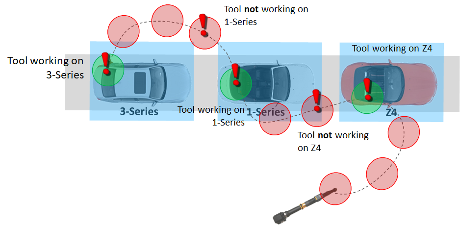

Skip To Main Content

  * placeholder

Filter:

  * All Files

Submit Search

   

You are here:

[Software
Version](../../../ComponentandFeatureOverview/FrontMatters\(Online\)/features-
and-versions.htm): 3.2

# Spatial monitoring

Spatial monitoring is a generic and scalable way of creating software
definitions of the physical relationships that exist between objects in the
real world that we want to detect and act on in SmartSpace. Two objects are
said to have a spatial relationship when a 3D zone, either attached to the
virtual object or statically placed in the world model (like a geofence),
intersect in such a way that one zone fully contains another. This is called a
containment event.

This is one of the most fundamental and powerful features of SmartSpace, as it
provides a generic language by which we can turn millions of location and
identification updates from a multitude of different sensing technologies into
a concrete set of events that have real meaning to real-world business
process. In particular, any applications that require monitoring or control
(based on sensor-driven location data) must implement some kind of spatial
monitoring to identify salient events in the flood of sensor data being
generated. In fact, spatial monitoring is key to deploying location-aware
applications across the enterprise, as it is fundamental to making those
applications reliable, highly scalable and responsive.

Using location to drive business process is about extracting meaningful events
and insight from a sea of location data being generated for all the objects
moving around in an environment. At its core, SmartSpace uses spatial
monitoring as the basis for providing accurate, reliable and real-time events
to business systems. The following sections describe why this feature is so
important.

## Reliable Process Events

Location data is noisy, which means that any system (MES or ERP) trying to use
location to monitor for interactions between two objects (or one object and
some location in the environment) must be able to interpret the location
stream in an efficient and reliable way.

More...

For example, consider two objects, A and B, whose location is derived from
some underlying location system. We want to know when those objects are
interacting?

The degree of noise depends on the source (GPS at meter level, UWB noise at 10
cm-level), so at some boundary between two objects, noise can cause streams of
rapid in/out events. A continuous succession of in/out events across thousands
of objects can potentially overload a consumer such as an MES or ERP. The
following describes how SmartSpace solves this problem.

The figure below depicts a one-dimensional location stream.

The inherent noise on the signal causes multiple boundary transitions and it
is not clear which event(s) are relevant and which ones should be ignored. The
solution implemented within SmartSpace is to overlay a spatial zone onto the
signal that moves in consort with the location stream. By making the spatial
zone proportionate to the level of noise in the underlying location stream and
only activating when the zone of one object is fully enclosed by the zone of
the second object, it is possible to eliminate false activations entirely.
This is depicted in the figure below.

Returning to the previous example of the two objects driven by noisy
locations, it is clear that with spatial monitoring reliable interaction
events between objects can be generated even when located using a noisy
underlying location stream, as shown below:

A real world application of spatial monitoring is to perform reliable
detection of when a hand-held tool is working on a particular car on an
assembly line. In knowing exactly when and which car a tool is interacting
with, the tool can be uniquely configured for the product it is working on. It
would not be possible to do this reliably just using the source location
stream.

## Handling Big Data Streams

Business systems like MES and ERP are not designed for processing Big Data
streams like those generated by the Ubisense DIMENSION4 Real-time Location
System. Such high-fidelity location systems are true big data generators, with
plant-wide tracking systems capable of generating in excess of six billion
location events per day, or 70000 updates per second.

More...

To separate the wheat from the chaff and only deliver events that business
systems care about, spatial monitoring is used to describe the relationships
and interactions between objects that truly matter to a subscribing business
process. By doing this, massive volumes of low-grade sensor data are
transformed into a handful of high-grade application-relevant facts.

The figure below illustrates an example of a SmartSpace application generating
control events for tools moving on an automotive assembly line (building
cars). In a typical factory, UbisenseDIMENSION4 generates around 1000 location
events second, but in reality only around 3 of these location updates
correspond to a meaningful interaction between tools and products on the line.

## Scalability and Latency

The cellular nature of all SmartSpace services (described in
[Partitioning](../../../ITResources/ITDocs/ArchiProtocols/architecture-and-
protocols.htm#h1_11) in the Ubisense Architecture and Protocols guide) means
that spatial monitoring is actually deployed across a cellular patchwork,
covering a tracking environment with spatial monitoring services that are
dedicated to the collection of objects within each cell.

More...

This means that cells only process the location events of objects inside them,
handing over to adjacent cells when objects migrate across cell boundaries. In
this way, the computing power to perform spatial monitoring of objects is made
very scalable, with the added benefit that real-time responsiveness can be
guaranteed for spatial events being generated in those cells.

This is a really important feature when using location to control real-world
processes in real-time. Any kind of bottleneck (single processing point) could
result in latency issues that disrupt or delay critical real-time processes.

It is because of this distributed, cellular service framework that the spatial
monitoring capability of SmartSpace has been deployed at enterprise scale in
many factories around the world and enabled customers to implement mission-
critical real-time control with six-sigma levels of reliability.

  * Spatial monitoring
    * Reliable Process Events
    * Handling Big Data Streams
    * Scalability and Latency

   

* * *

[www.ubisense.net](http://www.ubisense.net/)  
Copyright © 2020, Ubisense Limited 2014 - 2020. All Rights Reserved.

