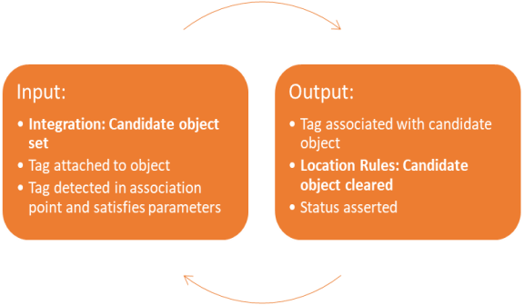
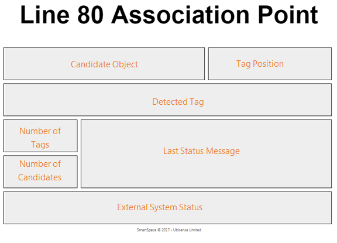
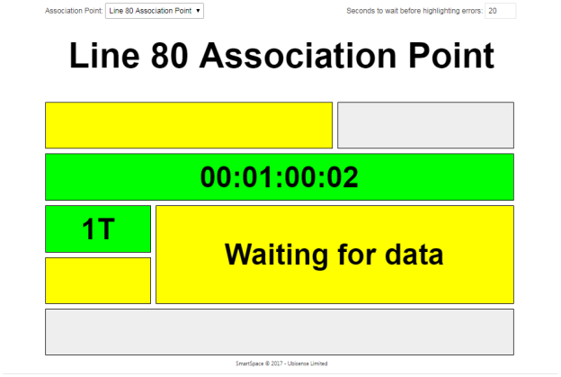
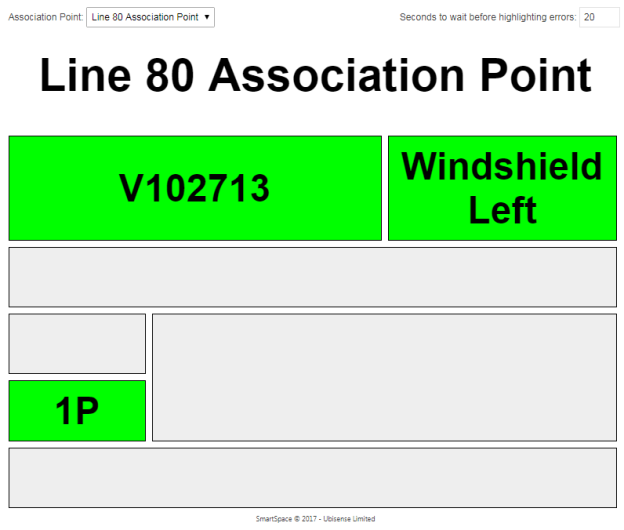
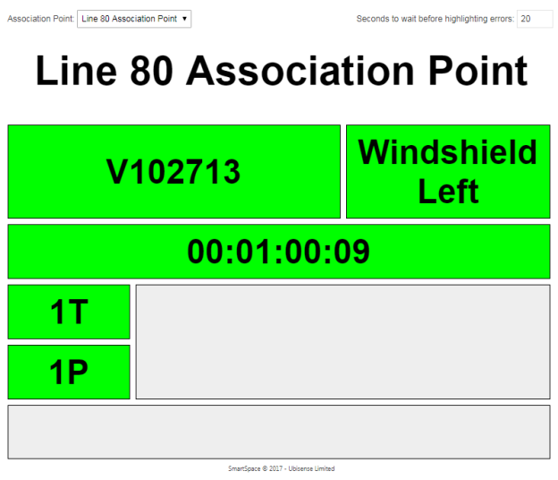
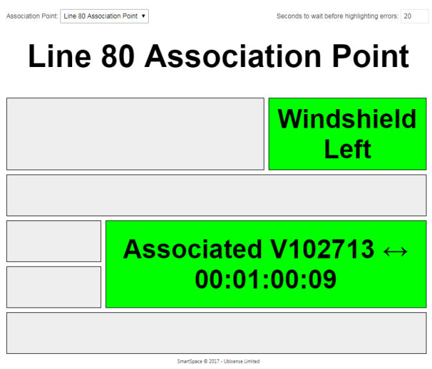

Skip To Main Content

  * placeholder

Filter:

  * All Files

Submit Search

   

You are here:

[Download as
PDF](../../../../SmartSpaceDownloads/B7GZWZS4WX9F/SmartSpaceLocRulesConfig.pdf
"link to PDF version of this content")

[Software
Version](../../../ComponentandFeatureOverview/FrontMatters\(Online\)/features-
and-versions.htm): 3.2

# Automated tag association

The automatic tag association feature operates by assigning a sequence of
objects created from an external source to tags detected at an association
point, usually as the tag is attached to the object during production. The
candidate objects are provided to each association point using an assertion
which must be set in time for the tag to be attached, and is then
automatically retracted when the association has been made. We will discuss
options for implementing this integration process below.

The cycle of operation of an association point

## Creating a Tag Association Point

The following steps are used to create and configure a tag association point.

  1. If you haven’t already done so, set up a representation model for tag association points so you can place them and see where they are placed. See [Importing an object representation](../../BuildandCreate/SiteVisualization/model-import.htm#Importin2) and [Adding a representation to a type](../../BuildandCreate/SiteVisualization/assignreps/model-assignment.htm#Adding) for how to set a representation on a type in SmartSpace Config. Make sure the representation is scaled to a suitable size, and the origin set appropriately.
  2. Create an object for the tag association point. Using SmartSpace Config, under TYPES/OBJECTS drag the Tag Association Point type into the right-hand pane. Double-click <Create new object> from the Tag Association Point objects dialog. Enter the name of the association point into the name field, and click Save.

Creating a new tag association point

  3. Place the tag association point in the correct location on your site map. Using OBJECT PLACEMENT, select the Tag Association Points type in the bottom left pane, and then drag the association point instance onto the correct location in the map.

Placing the tag association point: select Tag Association Point type

Placing the tag association point: dragging onto the map

  4. Configure the parameters of the tag association point. In SERVICE PARAMETERS, select Parking and tag auto-association. Drag the Tag Association Point type into the object browser and double-click the association point to display its parameters. Click Edit to change them.

Parameters for a Tag association point

**Note:** You can set parameters for all instances of the Tag Association
Point type by double-clicking 'Tag Association Point' objects instead of a
single instance. This will set values for parameters which are not overridden
for a specific object instance or sub-type.

## Parameters for Tag Association Points

The following static parameters can be set for tag association points. They
define configuration that is not frequently changed during operation. For
dynamic configuration and operational data, see the assertions below.

accept associated

If false, the tag association point will ignore any tags that have already
been associated with another object. If true, an associated tags will be
considered for association provided it satisfies all the other constraints.

activation distance

The detected tag must be within this distance of the association point in
order to be considered for association.

data warning timeout

How long to wait for a candidate object to be set for the association point,
before the web page will display a warning. Once a tag is detected at the
association point, the status page will wait this long for a candidate object,
before it highlights the error. If this is set to 0 (the default) the web page
will not display a warning after a timeout.

exclusion distance

If other tags are located within this distance of the tag association point,
they will block association. Specifically, each time a different tag is seen
within the exclusion distance, the tag reading count for the current tag will
be reset to zero. See required readings below.

height range

The tag must be located within this vertical distance of the tag association
point in order to be considered for association. Tags outside this range will
be ignored.

required readings

In order to make association more robust to stray tag or tag sighting errors,
the association point will wait until it has seen the tag this many times
within the activation distance and height range before associating it to the
candidate object.

tag position

The tag will be placed at a given attachment point on the candidate object.
This parameter defines the offset of the tag from the origin of the object. It
must be set to a tag position defined in the [TAG ASSOCIATION
workspace](../../BuildandCreate/ManTagAssociation/tag-association-
configuration.htm#Assignin2) of SmartSpace Config. If a different tag position
is used for different objects (for example different models of car) then this
can be supported using the property “sets tag position” as described below.

tag type

From version 3.4, a tag type (with type Tag Type) can be associated with an
association point. This parameter is set by choosing one of the currently-
defined tag types from a drop-down list. (There is no attempt to reinforce
referential integrity so the tag type assigned here will not have a name if
the tag type is deleted from the system. Deleting a tag type is not an
expected behavior in normal datasets,) Use of this parameter is described in
Support for Tag Types.

### Support for Multiple Tag Positions

Different tag positions for different object types can be supported:

  * by using the same name for the tag position, but defining the tag position differently for each candidate object type; or
  * by defining external integration logic or rules to set the “‘Tag Association Point’ sets tag position ‘String’” assertion before the candidate object is set. See Assertions for Tag Association Points.

For example, if Business Rules was licensed, the product could have a “model”
property, and the model could have a “tag position” property, and this
position could be set for the association point before the candidate object is
set. Similar behavior could be achieved using an integration API.

### Support for Tag Types

From version 3.4, Tag Association Point objects can have an associated tag
type, in which case they will only assign tags that either have no type or
have the exact same type. After assignment they will ensure that the assigned
tag now has the exact same type, so this mechanism can be used to protect
users from assigning inappropriate tags within a tag cycle, and to allow
designers to assign tag types (and hence tag battery monitoring and filter
properties) automatically.

Assignment process

Pre-assignment check: When a tag is ready to be associated, various properties
of the tag are checked (for example, the tag battery status is checked). At
this stage, a new check has been introduced on the tag type:

  1. If the tag type of the Tag Association Point is undefined, the check is OK
  2. If the tag type of the tag to be assigned is undefined, the check is OK
  3. Otherwise, the check is OK if and only if the type of the Tag Association Point matches the type of the tag to be assigned.

If the check is OK then the assignment is done (assuming no other check
fails).

If the check is not OK then the assignment fails with the error message "tag
has the wrong type" and the following health monitoring counters are
incremented:

  * auto_association_bad_type
  * auto_association_errors

Assignment actions: When a tag is assigned by a Tag Association Point, if this
point has a tag type specified, then the service will ensure that the tag has
this tag type.

## Assertions for Tag Association Points

The operational control of tag association points is performed using
assertions. These will typically be set using some integration code, or via
the Business Rules component if it has been licensed. For testing and
development they can be set using TYPES/OBJECTS in SmartSpace Config.

‘Tag Association Point’ has candidate ‘Object’

This assertion should be made for each candidate object in turn. It is an
essential input to the association point. The association will not happen
until there is both a candidate object and a tag that has satisfied the
parameters of the association point. Once a tag has been associated, the
candidate will be cleared, indicating that the association point is ready for
the next candidate to be set.

‘Tag Association Point’ sets tag position ‘String’

This assertion can be used if different objects have tags attached at
different positions. Before setting the candidate object, set the tag position
to use for the next association. Unlike the candidate object, this assertion
is not cleared when the association has been made, so it is up to the
integrator to ensure that at most one assertion has been made for each tag
association point.

external system message of <Tag Association Point> is <String>

This assertion can be set to deliver a system message to the status web page
for a tag association point. It should be combined with the next assertion.

external system status of <Tag Association Point> is <String>

This assertion can be set to indicate a status of the external system
integration on the status web page for a tag association point. Valid strings
are (without the quotes):

String |  Effect  
---|---  
ok |  green status  
warn |  yellow status  
error |  red status  
  
status of <Tag Association Point> is <String> for object <String> and tag
<String> at <Time>

This is generated as output of the association point, and indicates when a
successful association has been made, or the cause of a failure to associate.
It is displayed in the status web page.

current tag id of <Tag Association Point> is <String>

The currently detected tag id is set as output during operation of the
association point. This is cleared once an association succeeds. It is
displayed in the status web page.

## Web Site Operation

The automatic association web page is reached by clicking on the Association
menu item. It allows the association point to be selected from a dropdown, or
by URL anchor. The first association point will be selected by default.

  * The web site shows all the relevant state about the association point: 
  * the candidate object and the position at which the tag should be attached
  * the tag id detected
  * the most recent status of association, including reasons for not associating
  * any external system message or status

The parts of the association status web page

The association status web site showing a tag detected in the station with the
required number of sightings, but no candidate object or position.

An association point for which the MES integration has set the next candidate,
but no tag has yet been detected in the association point.

The association point now has a detected tag, and when the number of sightings
has been satisfied the tag will be associated.

The association station has successfully associated the tag, and the message
is displayed.

### Association Status Messages

The following status messages can be displayed:

Association Status |  Condition  
---|---  
multiple tags in exclusion zone |  other tags have been seen within the exclusion distance and height range around the association point  
tag battery is not ok |  the battery status of the current tag is not OK  
tag has the wrong type |  the tag type of the current tag is not OK  
object already associated |  if “accept associated” is not set, the candidate must not be associated already  
tag already associated |  if “accept associated” is not set, the tag must not be associated already  
no tag position |  a tag position has not been defined in either the assertion or configuration parameter for this association point  
tag position not defined |  the tag position set for the association point has not been defined for the candidate object type  
waiting for data |  a tag is ready to be associated, but no candidate has yet been set for the association point  
associated |  the association was successful  
  
### Data Warning Timeout

If “data warning timeout” is not 0, the web page displays the missing fields
in red after the tag has been detected for the given time but no candidate has
been set.

If the user logged on to the web site is a member of the role System.Operator,
then the page also shows a form to set and save the “data warning timeout”
parameter.

### URL to a Specific Association Point

To create a shareable URL for a specific tag association point, append the
name of the association point as the query string at the end of the URL. For
example, if the default status page URL is:

http://smartspace.int/SmartSpace/AA/Association/Public

then a URL that goes directly to an association point “AP ITL” will be:

http://smartspace.int/SmartSpace/AA/Association/Public?AP%20ITL

Note that any special characters in the association point must be URL encoded,
as has been done for the space in the name above.

  * Automated tag association
    * Creating a Tag Association Point
    * Parameters for Tag Association Points
      * Support for Multiple Tag Positions
      * Support for Tag Types
    * Assertions for Tag Association Points
    * Web Site Operation
      * Association Status Messages
      * Data Warning Timeout
      * URL to a Specific Association Point

   

* * *

[www.ubisense.net](http://www.ubisense.net/)  
Copyright © 2020, Ubisense Limited 2014 - 2020. All Rights Reserved.

