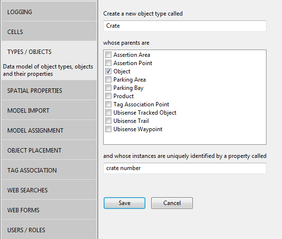
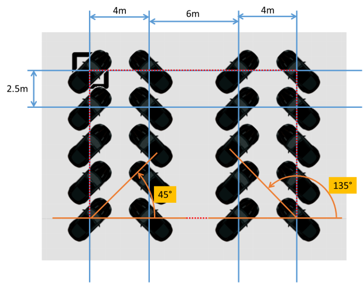

Skip To Main Content

  * placeholder

Filter:

  * All Files

Submit Search

   

You are here:

[Download as
PDF](../../../../SmartSpaceDownloads/B7GZWZS4WX9F/SmartSpaceLocRulesConfig.pdf
"link to PDF version of this content")

[Software
Version](../../../ComponentandFeatureOverview/FrontMatters\(Online\)/features-
and-versions.htm): 3.2

# Driven objects

The Driven objects feature supports locating an object based on the location
of another container object. When the container moves, the contained objects
are positioned relative to the container. Various layout options can be
configured using the parameters of the driven object.

## Configuring Driven Objects

We will work through a container configuration, suitable for tracking crates
holding work orders.

  1. Create the types we will use to represent crates and work orders. In SmartSpace Config, select the TYPES / OBJECTS task, and double-click <Create new type>. In the dialog enter the type name “Crate” and tick “Object” from the list of parents. Enter “crate number” as the unique identification property. Click Save.

  2. Repeat to create type “Work Order”, named with the property “id”.
  3. Import and assign representation models for these two types. See [Model import](../../BuildandCreate/SiteVisualization/model-import.htm) and [Model assignment](../../BuildandCreate/SiteVisualization/assignreps/model-assignment.htm) for how to set a representation on a type in SmartSpace Config.
  4. Now we will set up the default layout parameters for crates. In the SERVICE PARAMETERS task, select the Co-located objects configuration, and then the Crate type. (Use the Expand All button to display the object hierarchy, if necessary.) Drag the Crate object into the object browser and double click 'Crate' objects to set the parameters for all crates. Click Edit in the parameters window. We will set up the crate to hold four objects in a 2x2 array. Enter the parameters as shown below, then click Save.

  5. Create an instance of crate and four instances of work order. In the TYPES/OBJECTS task, drag type Crate into the right-hand pane, then double-click <Create new object> and enter CR1 as the crate number. Click Save.
  6. Repeat using the Work Order type to create four work orders, with ids “A0001”, “A0002”, “A0003” and “A0004”.
  7. Set the work orders to be contained by the crate. In TYPES/OBJECTS, under the COMPLEX PROPERTY list drag the ‘Object’ is contained by ‘Object’ property into the right-hand pane. In the window created, double-click <Create new property row> and pick “A0001” as the first object, and “CR1” as the second. Click Save. Repeat for the other work orders.
  8. Now place the crate on the map. Use the OBJECT PLACEMENT task, select Crate in the type filter dropdown. Drag the CR1 crate onto the map. The crate and all the work orders will be located. Now use Shift+left mouse to drag the crate. The work orders will be placed relative to the crate as soon as it is dropped.

## Parameters for Driven Objects

The following parameters control the layout behavior of driven objects. In the
descriptions below, the x, y and z directions are all relative to the
orientation of the container.

X direction capacity

How many slots along the x direction of the container

Y direction capacity

How many slots along the y direction of the container

X direction spacing

The distance between slots along x direction

Y direction spacing

The distance between slots along y direction

Z direction spacing

The distance between slots along z direction (filled after x and y)

unset locations on leaving

When an object is removed from a container, unset its location. Defaults to
false, so the object will be left at its last location until it is located by
some other means.

default orientation

The orientation in degrees of each slot. Contained object yaw (rotation around
z axis) is set to this orientation.

origin X

The horizontal position of the origin relative to the contained slots: “left”,
“middle” or “right”

origin Y

The vertical position of the origin relative to first slot: “top”, “middle” or
“bottom”

starting corner X

The horizontal position of the first slot to fill: “left” or “right”

starting corner Y

The vertical position of first slot to fill: “top” or “bottom”

fill X first

If true, fill across then down. If false, fill down then across.

fill method

This determines what happens when containments are added and removed. It is
set to one of:

  * “insert at start”: New containment goes into the first slot, all other slots are shifted to make way. On removal, all slots are shifted to close the gap.
  * “insert at end”: New containment goes into the last slot. On removal, all slots are shifted to close the gap.
  * “insert into first gap”: New containment goes into the first unoccupied slot. On removal no other contained objects are moved.

alternate orientation

If “direction to use alternatives” is set, this is the orientation in degrees
of alternate rows or columns.

alternate spacing

If “direction to use alternatives” is set, this is the spacing of alternate
rows or columns

direction to use alternates

In which direction the alternate spacing and orientation are used, one of “x
direction” or “y direction” or “not used"

minimum distance to leave

If a contained object has a tag, and that tag is seen more than this distance
away from where it would be if the contained position is correct, then the
object will leave the container. Set to zero to prevent leaving based on tag
locations.

## Assertions for Driven Objects

The following assertions are used by the driven objects feature.

<Object> is contained by <Object>

This input assertion indicates that a contained object is driven by a
container.

<Object> has <Object> at slot <int>

An output assertion (not visible in TYPES/OBJECTS) this is derived from the
changes to “is contained by” and the “fill method” parameter of the container.
The assertion indicates that a container object has a given contained object
at its nth slot.

## Details of Driven Objects Operation

If an object with an associated tag is asserted as contained in a container,
its location is set based on the container position, and tag locations are
ignored unless they are more than a configured distance from the current
position generated by the container.

Note that driven object locations are only updated when some location event is
received for the location cell.

For example, if no tags are sending sightings to the location cell, no update
of driven objects will occur. This means that if you add a row to ‘Object’ is
contained by ‘Object’ you may not see the contained object get located until
another location event occurs. In operational use, with tag events arriving
regularly at each location cell, this is not usually an issue. During
demonstrations and development work, this can be confusing behavior until it
is understood. In this case, you can simply place the container again to
generate all contained locations.

## Example Layout Using “Alternates”

The use of the “alternate” parameters can be confusing, so here is an example
to illustrating their effects on layout. The parameters used are:

Parameter | Value  
---|---  
X direction capacity |  4  
X direction spacing |  4  
Y direction capacity |  5  
Y direction spacing |  2.5  
alternate orientation |  135  
alternate spacing |  6  
default orientation |  45  
direction to use alternates |  X direction  
origin X |  left  
origin Y |  top  
starting corner X |  left  
starting corner Y |  top  
  
The resulting layout is shown below, where the black square is the container
(with origin in its center), and the black cars are the contained objects
(with origin at their rear-view mirror).

The offset of the contained objects from the origin of the container requires
some careful consideration. Conceptually the layout generates a set of slot
locations which are contained by the box shown as red dotted line. This is the
box that is aligned, as configured by the origin parameters, with the origin
of the container.

So in this case, because we have specified “left” and “top” for the origin,
the top left slot location is aligned with the origin of the container. If we
had specified “right” and “bottom” then the bottom right slot location would
be aligned with the container origin. If we specified “middle” and “middle”,
then the center of that red box would be on top of the container origin.

  * Driven objects
    * Configuring Driven Objects
    * Parameters for Driven Objects
    * Assertions for Driven Objects
    * Details of Driven Objects Operation
    * Example Layout Using “Alternates”

   

* * *

[www.ubisense.net](http://www.ubisense.net/)  
Copyright © 2020, Ubisense Limited 2014 - 2020. All Rights Reserved.

