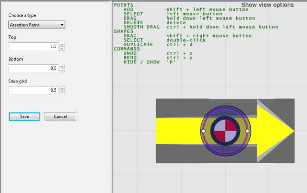
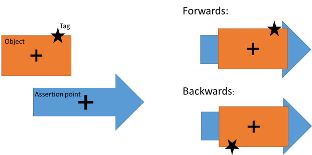

Skip To Main Content

  * placeholder

Filter:

  * All Files

Submit Search

   

You are here:

[Download as
PDF](../../../../SmartSpaceDownloads/B7GZWZS4WX9F/SmartSpaceLocRulesConfig.pdf
"link to PDF version of this content")

[Software
Version](../../../ComponentandFeatureOverview/FrontMatters\(Online\)/features-
and-versions.htm): 3.2

# Robust assertion points

Assertion points report when an object is at a given place, using strong
evidence, including distance from the point and the speed at which the object
is moving. This evidence allows the assertion point to be robust to transient
errors in production, such as assets moving past a process step or gate
location but not actually stopping there. The output of assertion points is
the assertion that an object is located at the point, which can then be used
by integration code, or the Business rules component if licensed, to trigger
other actions or track process.

Robust Assertion Points are closely related to Parking: the difference between
them is that Robust Assertion Points provide the ability to assert an object
is located at a point, whilst Parking provides the additional capability of
snapping an object into a given bay. If you need to snap objects to a
location, you must use the Parking Area and Parking Types object types
described in [Parking](parking-configuration.htm).

There are two object types introduced by Robust Assertion Points: Assertion
Area and Assertion Point. The assertion area has two main functions:

  1. It groups together assertion points with the same configuration parameters; and
  2. It controls a set of objects, which can be located at one of its assertion points.

In a normal configuration, spatial containment is used to define both the
points within each area, and the objects controlled by the area.

Assertion points only work for objects that have associated tags, because it
is the tag location events that are processed to decide when the object is
located at an assertion point.

## Configuring Assertion Points

This section will walk through creating and configuring robust assertion
points. This guide assumes that you have already created a type for the assets
to be tracked, and have some instances associated with tags. See [Types and
objects](../../BuildandCreate/TypesAndObjects/types-and-objects-
configuration.htm) and [Tag
association](../../BuildandCreate/ManTagAssociation/tag-association-
configuration.htm) for how to do this. We assume the asset type is called
Product.

  1. If you haven’t already done so, set up a representation model for Assertion Point so you can place them and see where they are placed. See [Importing an object representation](../../BuildandCreate/SiteVisualization/model-import.htm#Importin2) and [Adding a representation to a type](../../BuildandCreate/SiteVisualization/assignreps/model-assignment.htm#Adding) for how to set a representation on a type in SmartSpace Config. Make sure the representation is scaled to a suitable size, and the origin set appropriately.
  2. Create an object for the assertion area. Using SmartSpace Config, under TYPES/OBJECTS drag out the Assertion Area type into the object browser. Double-click <Create new object> from the Assertion Area objects window. Enter the name of the assertion area into the name field, and click Save. 

  3. Similarly create an instance of type Assertion Point for each assertion point you want in the assertion area. In our example, we will create assertion points called “B4 Gate 1” and “B4 Gate 2”. Drag the Assertion Point type into the object browser,double-click <Create new object> and then enter the two names on separate lines of the name box. Click Save.
  4. Now set up a spatial extent for the assertion area, covering the region containing all the assertion points that will be in this area. In SPATIAL PROPERTIES select the Assertion Area type, and then the “extent” spatial property. Under SPECIFIC SPACES double-click <Create new specific space> and select the area you are creating in Choose an object, then use Shift + left mouse to place points for the boundary of the extent. Click Save.

  5. Also create a default space for the origin of the association point type – in this case a small space with a limited height, so that it can be contained within the extent of the association area. Select the Assertion Point type, then the “origin” spatial property. Under DEFAULT SPACES, double-click <Create a new default space>, select Assertion Point type again, click in the editor and press Space to reset the view. Now create a 1 m diameter cylinder around the point with vertical extent from top 1.0 m to bottom 0.5 m. Click Save.

  6. Place each of the assertion points that were created. In the OBJECT PLACEMENT task, select the Assertion Point type from the filter dropdown, and then drag each assertion point instance into the location on the map. If Assertion Point does not appear as a choice, you have not set a representation model – see step 1.

  7. At this point, the spatial properties you have just set up should automatically populate the Assertion Area contains Assertion Point property. To check this, go to TYPES / OBJECTS and in the COMPLEX PROPERTY list find ‘Assertion Area’ contains ‘Assertion Point’. Drag this into the right hand pane. There should be two rows.

  8. Configure the parameters of the assertion area. Go to the SERVICE PARAMETERS task, choose Parking and tag auto-association, and then drag the Assertion Area type into the object browser. In the dialog that displays, double-click the area you created. You can now set up the evidence required for the area. The parameter meanings are described below. For the moment we will leave them with their default values.

  9. Now we define a spatial property of the Product type to automatically make product instances controlled by the assertion area when they enter its extent. In TYPES / OBJECTS, select the Product type, and under PROPERTIES OF PRODUCT, double-click <Create new property>. Create a property called “origin” whose value has type Space. Now go to the SPATIAL PROPERTIES task, and follow a similar process to step 5 to create a default space for this origin property. Then in MONITORED SPATIAL RELATIONS, double-click <Add new request> and for Container select extent of ‘Assertion Area’ and for Contained select origin of ‘Product’. Click Save.
  10. Now move one of your products so that it is at the location of one of the association points. The tag should get sightings at the corresponding offset, and once the evidence is satisfied, the assertion should be made that the assertion point has located the object. In TYPES / OBJECTS, under the COMPLEX PROPERTY list, drag the property ‘Assertion Point’ has located ‘Object’ into the right hand pane. There should be a row for the detected object.

## Parameters for Assertion Areas

The following parameters are defined for assertion areas, and apply to the
assertion points they contain.

forwards only

When set to false (the default), the object will be detected whether it is at
the assertion point forwards or backwards. When true, the object must be
pointing only in the same direction as the assertion point. The two cases,
forwards and backwards, are illustrated below.

The two possible orientations of the object when located at an assertion
point, and their relationship to the tag position.

readings threshold

The minimum number of tag events required to have been seen for an object that
is controlled by the area, before it is located at an assertion point.

damping factor

The sightings of the tag are passed through a low-pass filter, before
computing the distance of the object from the assertion point, and the speed
of the object (see the parameters below). This filter effectively smooths out
the tag position by blending each sighting with the previous position. The
damping factor controls the strength of this smoothing, and should be in the
range 0 <= damping factor < 1\. At 0, there is no damping, so the raw tag
sightings are used. At 0.5, the current position of the tag is blended equally
with the previous position of the tag. A value of 1 should not be used, as the
current position of the tag would be entirely discarded.

If the tag sightings are noisy, such as locations produced by GPS, then a
higher damping factor can be used to smooth the data out before attempting to
satisfy the constraints below. The trade-off will be how many sightings it
takes before “located at” is asserted.

maximum distance to enter

The damped position of the tag must be below this distance from where it would
be if the object was located at an assertion point (forwards or backwards) to
consider it as “located at” the point.

maximum speed to enter

The damped speed of the tag must be below this threshold to consider the
object as “located at” a point.

minimum distance to leave

The damped position of the tag must be above this distance from where it is
would be if the object was located at an assertion point (forwards or
backwards) to consider it as no longer “located at” the point.

minimum speed to leave

The damped speed of the tag must be above this threshold to consider it as no
longer “located at” a point.

use default containment

If true (the default), then use the default spatial property interactions to
populate the ‘Assertion Area’ contains ‘Assertion Point’ and ‘Assertion Area’
controls ‘Object’ assertions. See the section on Assertions for Assertion
Areas.

allow multiple objects

Whether multiple objects can be asserted as located at a single assertion
point at the same time. If true, then a single assertion point can have
multiple rows at one time in the ‘Assertion Point’ has located ‘Object’
assertion. If false, only a single object can be detected at a time, and a
second detection will be ignored.

use damped locations

Where location streams are noisy, smoothing locations by using the calculated
damped position for object locations rather than the original tag x,y,z.
locations can make dealing with these streams much easier, and can, for
example, reduce the amount of jitter you see on the web map

When used damped locations is set to true, the damped tag position is used for
any subsequent location inference of the associated object while that object
is controlled by the association area. Defaults to "false".

## Assertions for Assertion Areas

<Assertion Area> contains <Assertion Point>

An input assertion, which should contain one row for each assertion area that
contains a given assertion point. In most cases this will remain relatively
constant in operation, unless the assertion points themselves are mobile. If
“use default containment” is true, the contents of this assertion will match
the spatial relation “Assertion Area extent contains Assertion Point origin”.

<Assertion Area> controls <Object>

An input assertion, which contains the set of objects that can be located at
an assertion point within each assertion area. If “use default containment” is
true, then contents of this assertion will match all spatial relations
“Assertion Area extent contains <any other monitored type and role>”.

<Assertion Area> has located <Object>

The output of assertion points, indicating which objects have been located at
each point.

## Advanced use

While the default behavior when “use default containment” is true covers many
useful cases, it is possible that a process requires more sophisticated logic
to decide which assertion point is in a given assertion area, and which object
can be controlled by a given assertion area. For example, it may be that only
objects which a specific other property (such as “ready to ship”) are allowed
to activate a process gate.

If this is the case, set “use default containment” to false, and then
implement your own method of maintaining the two input assertions, for example
use a Business Rule that combines spatial containments with other logical
predicates.

## Details of Assertion Operation

The technical details of how assertion areas operate are as follows.

  * For each object controlled by an area, the service maintains a damped estimate of the position and velocity of the object’s associated tag.
  * In order to be detected at a point contained in the area,

    * has tag must be seen at least readingsthreshold times while controlled by the area; and
    * the tag position estimate must be closer than maximum distancetoenter from where it would be if the object were at the point, and its speed estimate must be less than maximum speed to enter.
  * If the area is forwards only then the object is only considered for detection in the same direction as the point. Otherwise it is tested for detection in both the direction of the point and also rotated 180 degrees.
  * Once an object is detected at a point, the haslocated assertion is made, and it remains until either:

    * the damped tag position is more than minimum distance to leave from the position when located at the point, and moving faster than the minimum speed to leave; or
    * the area no longer “controls” the object.

Once conditions are met the assertion is retracted.

  * Robust assertion points
    * Configuring Assertion Points
    * Parameters for Assertion Areas
    * Assertions for Assertion Areas
    * Advanced use
    * Details of Assertion Operation

   

* * *

[www.ubisense.net](http://www.ubisense.net/)  
Copyright © 2020, Ubisense Limited 2014 - 2020. All Rights Reserved.

