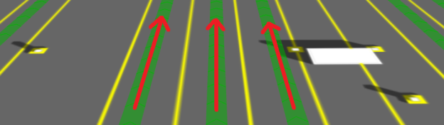
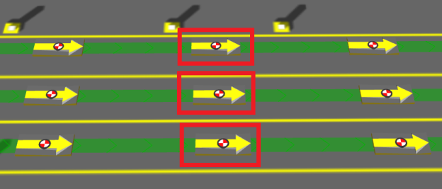

Skip To Main Content

  * placeholder

Filter:

  * All Files

Submit Search

   

You are here:

[Download as
PDF](../../../../SmartSpaceDownloads/B7GZWZS4WX9F/SmartSpacePathsAndQueuesConfig.pdf)

[Software
Version](../../../ComponentandFeatureOverview/FrontMatters\(Online\)/features-
and-versions.htm): 3.4

# Paths and queues configuration

## What is Paths and queues?

Paths and queues is a feature introduced into the Location Rules component of
SmartSpace 3.4. Its purpose is to allow you to introduce prior knowledge of
object locations in your system, in particular when objects travel along fixed
paths like this:

When you configure Paths and queues to control objects, they will be snapped
to nearby paths as tags move around. You can introduce further constraints to
control object speed and separation such that objects form queues along the
paths. You can then use the object sequence information in your application to
report things like “number of vehicles in front”.

### Paths

Paths are physical routes that you know objects will follow. You draw these in
SmartSpace Config:

Paths configured to keep object neatly positioned within the lanes

### Path constraints

Path constraints are normally intended to match the real-world, physical,
immutable constraints of the thing being modeled. In SmartSpace 3.4, the
following constraints are configurable:

  * Rotates – object rotations, which can change as they move along a path
  * HasSpeed – object speeds
  * IsInTrain – object separations

For example, a production line might move at a known constant speed that won’t
change over time. In this case, you could use the HasSpeed constraint.

### Path sections

Paths can be split into sections in order to assign different constraints to
different sections of the path.

### Path points

A path point is an object intended to be located exactly on a path. There is
an object type called Path Point that you can use directly, or inherit, to
give objects special UI features to get them to snap to paths or generate them
at regular intervals.

Path points, automatically generated at regular intervals

### Path groups

A path group is a logical grouping of paths used to determine which objects
are being controlled by the path tracking location rules. A path group has an
extent which, by default, is used to determine which objects to control.

## How do I get Paths and queues?

### Version and license

You will need SmartSpace 3.4 with a license for Location rules.

### Installation

Use the INSTALL SERVICES task in Service Manager to install service packages.
If you have a license, Paths and queues will appear in the list of features:

Selecting the Paths and queues feature in Service Manager

## Where does Paths and queues appear?

Once you have installed Paths and queues, since it is integrated into existing
SmartSpace components, it will appear in various places in Ubisense programs.

### Service Manager

In MANAGE SERVICES, there are some new Location rules services:

Service Manager showing Paths and queues services

### Application Manager

In DOWNLOADABLES, there are new items in the Location rules topic:

Application Manager showing Paths and queues downloadables

### SmartSpace Config

In TYPES / OBJECTS, there are two new types:

SmartSpace Config TYPES / OBJECTS automatically has two new types

There is a new task called PATHS:

SmartSpace Config PATHS task

In SERVICE PARAMETERS, there are new options in the drop-down list:

SmartSpace Config path tracking service parameters

# Creating the data model for Paths and queues

## Using the PATHS task

Use the PATHS task in SmartSpace Config to model the physical layout and
constraints of your environment.

### Draw a path

Getting started in SmartSpace Config PATHS

When drawing a path, read the instructions carefully to ensure you know all
the capabilities of the tool. You can line paths up neatly using the Snap grid
and Path height controls.

Drawing a path in SmartSpace Config PATHS

See the green drawing instructions on the map for how to smooth a path to look
like this:

Drawing a smoothed path in SmartSpace Config PATHS

The path will always go through the control points, so if the smoothing
doesn’t behave as required, add more control points.

### Add path constraints

If your environment has physically constrained paths, use the path editor to
add constraints:

Adding path constraints in SmartSpace Config PATHS

If your path has different constraints in different sections, you can split
the path by following the instructions in the in-place help in the PATHS map.

A path split into three sections in SmartSpace Config PATHS

Double-click individual path sections to edit constraints separately.

### Generate path points

Use <Generate path points> to automatically generate objects at regular
intervals along paths. You can create types that inherit from Path Point in
TYPES / OBJECTS. To avoid confusion, give them a representation using MODEL
IMPORT and MODEL ASSIGNMENT before creating any.

Generating path points in SmartSpace Config PATHS

There is nothing special about objects created in this way, other than the
fact that their name and location were generated by SmartSpace Config. You can
see them in TYPES / OBJECTS, give them properties, and use them in SmartSpace
Business rules if you have the appropriate licenses.

Path points are normal objects in SmartSpace Config TYPES / OBJECTS

### Moving path points

Since they are normal objects, you can drag path points around in OBJECT
PLACEMENT. However, this doesn’t snap them to paths. The PATHS map will warn
you when path points are not on a path:

SmartSpace Config PATHS map warns about orphaned path points

Fix this error by double-clicking on the path point to bring up the editor:

Moving a path point using the editor in SmartSpace Config PATHS

## Controlling path tracking

### Path-to-group mapping

You must assign paths to groups using SERVICE PARAMETERS. Select Path tracking
and Path in the dropdowns. Drag the group parameter onto the right-hand panel.
Assign path groups as required.

Assigning paths to groups in SmartSpace Config SERVICE PARAMETERS

### Default containment

The default path tracking behavior is to control objects that are contained in
the extent of a path group. To set this up, create objects of type Path group
in TYPES / OBJECTS. Set their extent property in SPATIAL PROPERTIES:

Creating path group extents in SmartSpace Config SPATIAL PROPERTIES

Create a SPACE property for the objects to be controlled in TYPES / OBJECTS
and SPATIAL PROPERTIES and monitor the spatial relation:

Setting up default containment in SmartSpace Config SPATIAL PROPERTIES

### Controlling objects using business rules

For some applications, you might need to decide which objects are controlled
by path tracking based on some other business logic. For this, you will need
SmartSpace Business rules licenses.

First, turn off default containment in SERVICE PARAMETERS:

Turning off default containment in SmartSpace Config SERVICE PARAMETERS

Then, use BUSINESS RULES to set and unset rows for <Path Group> controls
<Object> as required:

Setting <Path Group> controls <Object> using SmartSpace Config BUSINESS RULES

## Advanced path tracking parameters

Path tracking uses filtering to estimate the offsets of objects along paths.
You might need to change filter parameters for some or all paths in your
model, depending on the layout, quality of the location system, and so on. For
example, if you have lots of lanes alongside each other, you might need to
make them “stickier” such that objects change lane less readily.

Always test your application with the default values before changing anything
described in this section.

In this context, “variance” means how uncertain the filter for a particular
path is that it has the object in the right place.

Using SmartSpace Config SERVICE PARAMETERS to change path tracking filter
parameters

### default stderr

The value to use when the sensor system fails to provide an estimate of the
measurement accuracy.

Do not normally change this parameter.

### handover variance threshold

Filter variance threshold above which path tracking will allow other location
rules to be applied.

  * higher = path tracking will hold onto objects more, possibly without generating locations
  * lower = path tracking will allow other location rules to take over more easily

Set this higher if tags are coming off paths too easily.

Set this lower if tags are getting stuck on paths when you want other location
rules to take over.

### innovation multiplier

Multiplier applied to the inferred error based on the distance from the
estimated tag position to the measurement. For example, if this is zero, the
distance from the estimated tag position to the measurement will not directly
affect the filter variance at all.

  * higher = measurements further from the estimated tag position will be trusted less
  * lower = distance from estimated tag position to measurement doesn’t matter as much

Set this higher if tag locations that are far away from the estimated tag
position are placing the object on the path incorrectly.

### max consecutive outliers

The maximum number of consecutive measurements deemed to be outliers before
the filter resets to the nearest point on the path to the next measurement.

  * higher = filter will reset less readily; objects will make fewer big jumps
  * lower = objects will jump to the nearest point to the measurement more easily

### max valid position variance

The maximum value of the filter variance for which an object location will be
generated.

  * higher = generate more locations, potentially of lower quality
  * lower = generate fewer locations, but with more certainty that they are correct

Set this lower if your application requires locations to be generated with
more certainty.

Note that it doesn’t make sense for this to be larger than max variance before
reset; the filter variance will never be higher than that (because it will
reset instead).

Note that it doesn’t make sense for this to be larger than handover variance
threshold; the path tracking location rule will have handed over to other
rules already.

### max variance before reset

The maximum possible variance of the filter state. When the variance goes over
this value, the filter resets to the nearest point on the path to the next
measurement.

  * higher = filter will reset less readily; objects will make fewer big jumps
  * lower = objects will jump to the nearest point to the measurement more easily

### outlier distance

The minimum distance between the estimated tag position and the measurement
where the reading is defined as an outlier. See max consecutive outliers for a
description of what outliers do.

  * higher = filter will reset less readily; objects will make fewer big jumps
  * lower = objects will jump to the nearest point to the measurement more easily

Set this higher if your readings are very noisy and you want to stop objects
making a lot of jumps.

### raw stderr multiplier

Multiplier applied to the raw error computed by the sensor system. For
example, if this is zero, sensor measurements will be assumed to be completely
correct by the filter.

  * higher = noisy measurements from the sensor system will be trusted less
  * lower = sensor system noise doesn’t matter as much

Set this higher if noisy sensor measurements are placing the object on the
path incorrectly.

### stickiness

Number of consecutive tag measurements for which a path filter needs the
lowest variance in order to take control of the object.

  * higher = path will hold onto objects; objects will flicker between paths less
  * lower = path will release objects to other paths in the same group more easily

Set this higher if objects jump back and forth incorrectly between paths.

### variance multiplier

Multiplier applied to the variance prediction as time elapses. When the filter
predicts a new state, the variance increases because time has elapsed since
the last measurement. The elapsed time is multiplied by this value when
increasing the variance over time.

  * higher = filter will be quicker to reset or handover to other paths or location rules
  * lower = filter will take longer to reset or handover to other paths or location rules

# Paths and queues simulation

## What is the simulator?

The SmartSpace Location rules component includes some support for simulating
tags or objects moving along paths. This is a good way to ensure you have set
everything up before deploying Paths and queues into production.

### Services

Path simulation services are included in the service packages for the
SmartSpace Paths and queues feature:

Path simulation services shown in Service Manager MANAGE SERVICES

The Path simulator services wait for a simulation request, so you can leave
all these services running all the time. Simulation only starts when you use
the admin program to request a simulation.

### Admin tool

You can download the simulation admin tool using Application Manager
DOWNLOADABLES:

Path simulation admin tool shown in Application Manager DOWNLOADABLES

Use the admin tool to set the service parameters used by the simulator.

### Simulator service parameters

In SmartSpace Config, SERVICE PARAMETERS shows the parameters that are set by
the admin tool and consumed by the simulator services:

Path tracking simulation in SmartSpace Config SERVICE PARAMETERS

## Example simulation walkthrough

### Create the XML script

To create a simulation script, start by running this command:

    
    
    ubisense_path_simulation_admin.exe example > path_simulation.xml

Edit path_simulation.xml to see the format and example data. The following
steps will make it work without modification.

### Create objects to attach to simulated tags

In SmartSpace Config TYPES / OBJECTS, create 20 objects of type “Car”:

Make sure “Car” has an assigned representation model by using MODEL IMPORT and
MODEL ASSIGNMENT.

### Attach tags to the objects

Use TAG ASSOCIATION to attach tags. The ids need to match those that will be
simulated in the XML script:

Simulated tags assigned to cars in SmartSpace Config TAG ASSOCIATION

### Create paths

Use TYPES / OBJECTS to create a Path group.

Use PATHS to create “path1”, “path2”, “path3” and “path4”:

Creating paths for simulation in SmartSpace Config PATHS

### Assign a path group

Assign the paths to a group in SERVICE PARAMETERS:

Assigning path groups in SmartSpace Config SERVICE PARAMETERS

### Monitor the spatial relation

In SPATIAL PROPERTIES, make the path group extent contain the paths and
monitor the spatial relation:

Monitoring the spatial relation in SmartSpace Config SPATIAL PROPERTIES

### Run the simulation

Assuming your cell is called “Location Cell 00001”, run the following on a
Windows command line:

    
    
    type path_simulation.xml | ubisense_path_simulation_admin.exe start “Location Cell 00001”

Or this on a Unix-style command line:

    
    
    ubisense_path_simulation_admin start “Location Cell 00001” < path_simulation.xml

Back in SmartSpace Config, turn on Show foreground objects in the PATHS map.
Double-click an object to see its tag being simulated:

Simulated cars shown on the map in SmartSpace Config PATHS

  * Paths and queues configuration
    * What is Paths and queues?
      * Paths
      * Path constraints
      * Path sections
      * Path points
      * Path groups
    * How do I get Paths and queues?
      * Version and license
      * Installation
    * Where does Paths and queues appear?
      * Service Manager
      * Application Manager
      * SmartSpace Config
  * Creating the data model for Paths and queues
    * Using the PATHS task
      * Draw a path
      * Add path constraints
      * Generate path points
      * Moving path points
    * Controlling path tracking
      * Path-to-group mapping
      * Default containment
      * Controlling objects using business rules
    * Advanced path tracking parameters
      * default stderr 
      * handover variance threshold
      * innovation multiplier
      * max consecutive outliers
      * max valid position variance
      * max variance before reset
      * outlier distance
      * raw stderr multiplier
      * stickiness
      * variance multiplier
  * Paths and queues simulation
    * What is the simulator?
      * Services
      * Admin tool
      * Simulator service parameters
    * Example simulation walkthrough
      * Create the XML script
      * Create objects to attach to simulated tags
      * Attach tags to the objects
      * Create paths
      * Assign a path group
      * Monitor the spatial relation
      * Run the simulation

   

* * *

[www.ubisense.net](http://www.ubisense.net/)  
Copyright © 2020, Ubisense Limited 2014 - 2020. All Rights Reserved.

