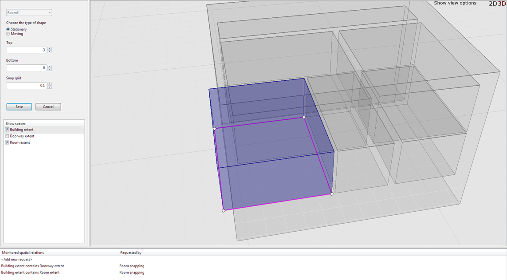
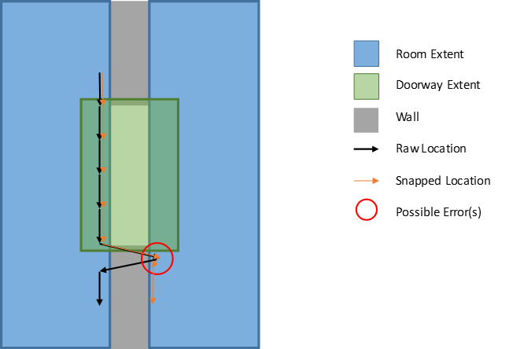

Skip To Main Content

  * placeholder

Filter:

  * All Files

Submit Search

   

You are here:

[Download as
PDF](../../../../SmartSpaceDownloads/B7GZWZS4WX9F/SmartSpaceRoomSnapping.pdf
"link to PDF version of this content")

[Software
Version](../../../ComponentandFeatureOverview/FrontMatters\(Online\)/features-
and-versions.htm): 3.3

# Overview of Room snapping

Room snapping eliminates through wall error where tagged objects close to the
edge of a defined area are incorrectly located.

Room snapping manages the location of tags in a predefined area, called a
room, by snapping them inside the room's extent until they have moved a
specified distance outside it. SmartSpace achieves this by applying a room-
based hysteresis to adjust tag locations. Hysteresis defines the radius around
the tag location that must be completely outside a room’s extent for the tag
to leave a room. With Room snapping operational, tag locations remain snapped
to the room they are in until either they move outside the room by a distance
greater than that defined by the room's hysteresis or they move into a defined
area, called a doorway, where snapping for a tag is disabled. Thus doorways
allow you to define valid routes for tags to move between rooms.

Rooms and doorways are contained in a building of which at least one must be
defined. Whilst you can use a single building only, it is best practice to
create several buildings to isolate areas where room snapping is active from
ones where it is not used or to separate different areas within a room
snapping scheme where there are no connecting doorways. In normal use each
physical building will have a corresponding building object in the room
snapping configuration.

Room snapping requires you to configure objects and their extents based on the
following Ubisense types:

  * Room: an area with a perimeter wall/boundary, within which tag locations are snapped
  * Doorway: an area where tags can move between/exit rooms. Doorway extents can overlap rooms
  * Building: used to group doorways/rooms together. All rooms and doorways must be contained in a building

You can control how far inside the extent of a room objects are snapped by
defining spacing. This also eliminates the possibility of tags being located
inside walls.

## Requirements

You will need SmartSpace 3.3.6854 or later with a license for Location rules.

# Installing Room snapping

To install the Room snapping feature:

  1. Make sure that the SmartSpace platform includes a license for Location rules version 3.3 or higher.
  2. Install the Room snapping feature using Service Manager.

For further information, see [SmartSpace
Installation](../../Installation/InstallationWiz.htm).

# Configuring Room snapping

The following steps describe how to configure Room snapping using the
SmartSpace Config application.

  1. Create the room snapping objects. You will need to define:

     * Room instances for each snapped area
     * Doorway instances where snapping is disabled
     * At least one building instance to contain the rooms and doorways

In TYPES / OBJECTS, drag out the snapping type into the right-hand pane. In
the dialog, double-click <Create new object> and enter the name of the
snapping object. Click Save.

Creating a snapping object

Do the same for every room, doorway and building in your room snapping scheme.
You can create all the snapping objects of the same type by typing the name of
each one on a new line in the create objects dialog:

Example of adding several rooms

For more information on creating new objects, see [Creating new object
instances](../../BuildandCreate/TypesAndObjects/types-and-objects-
configuration.htm#Creating).

  2. After you have created the objects, you need to define their extents. For each snapping object, in the SPATIAL PROPERTIES tab, select the snapping type and the Extent spatial property. Under Specific Spaces double-click <Create new specific space> and select the area you are creating in Choose an object, then use Shift + left mouse to place points for the boundary of the extent. Ensure that Stationary is selected as the type of shape. Click Save.

Adding a room extent

  3. When configuring extents for doorways, you should keep the following in mind:

     * Doorway extents can overlap room extents or be distinct. When there is an overlap, the doorway will supersede the room (as if the room extent had the doorway extent cut out of it).
     * Doorway extents should be large enough so that whenever a tag moves between rooms via this doorway, it is seen in the doorway extent.
     * Doorway extents should be as small as possible, while still satisfying the above criteria, to reduce the chances of tags changing rooms incorrectly.
     * Doorway extents need to account for sensor inaccuracies near doorways.

       * Inaccuracies can be identified by walking the perimeter of each room with a tag, past the doorway, and reviewing the raw location path.
       * If locations jump into the wrong room immediately after leaving a doorway, the tag will get snapped to the wrong room. Assuming the doorway extent is already as small as possible and this area of inaccuracy cannot be avoided, the extent will need to be extended to include the inaccurate area to avoid cases like the following.

In this case, the doorway should cover the entire area of "room uncertainty",
and will need to be extended down.

  4. To ensure buildings are defined correctly, in the OBJECT PLACEMENT tab select Building extent contains Doorway extent and Building extent contains Room extent in Show spatial relationships. The extents of your room snapping objects are displayed in the workspace.

Checking rooms and doorways are contained within a building

In the example above, a single building has been defined along with a number
of rooms and doorways. The extents that satisfy the selected spatial
relationships are highlighted in blue; the one room that is not completely
contained is shown in brown and will need its spatial extent correcting in
theSPATIAL PROPERTIES tab.

  5. Configure parameters for the rooms in the SERVICE PARAMETERS tab. Choose Room snapping and then drag the Room type into the object browser. You can edit parameters for all rooms by double-clicking 'Room' objects or for individual rooms by double-clicking a particular room's name.

The following parameters are available for the Room snapping:

     * hysteresis: The maximum swappable distance. Tags seen more than this distance away from the room are considered to have left the room and will not be snapped to it, even if the tag was not seen leaving through a doorway.
     * spacing: The perimeter spacing or wall thickness of a room. Snapped locations are placed this distance inside the perimeter of your room extents. This avoids tags being located in walls.

Parameters for Room snapping

  6. When room snapping is configured, locations sent to the location cells will be the (possibly) snapped locations. You can view these locations in the OBJECT PLACEMENT tab in SmartSpace Config or, if licensed, in Web maps.
  7. If you are running the Location System services and have access to location logging, the locations seen in the event viewer will be raw, unsnapped locations. To log snapped locations, in SmartSpace Config go to SERVICE PARAMETERS and choose Room snapping. For the Location Cell type set the enabled parameter to true for the cells you want logging on. Snapped locations will be logged using modified tag IDs starting with FF. For example, if your tag ID is 00:11:CE:00:00:00:00:01, the snapped location will be shown in the logs under the tag ID FF:11:CE:00:00:00:00:01.

  * Overview of Room snapping
    * Requirements
  * Installing Room snapping
  * Configuring Room snapping

   

* * *

[www.ubisense.net](http://www.ubisense.net/)  
Copyright © 2020, Ubisense Limited 2014 - 2020. All Rights Reserved.

