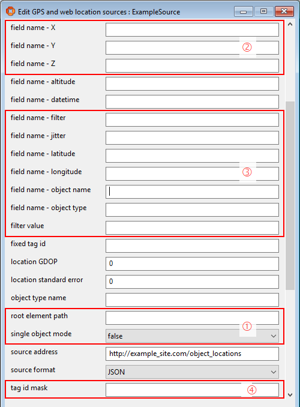
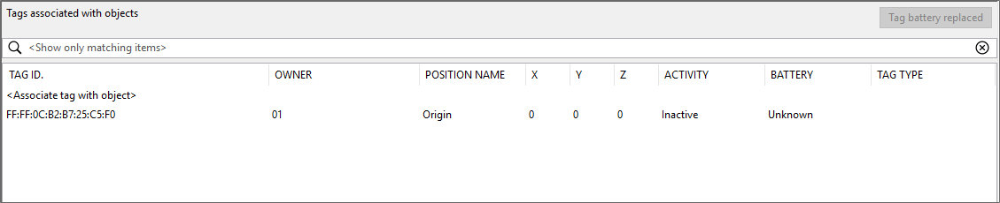

Skip To Main Content

  * placeholder

Filter:

  * All Files

Submit Search

   

You are here:

[Download as PDF](../../../../SmartSpaceDownloads/B7GZWZS4WX9F/AVL-
GPSConnect.pdf "link to PDF version of this content")

[Software
Version](../../../ComponentandFeatureOverview/FrontMatters\(Online\)/features-
and-versions.htm): 3.2

# Web Source Injector

The web source injector is a service that periodically sends requests to web
sources or location information and injects these locations into the Ubisense
location platform. The service supports a range of formats and has various
features that need to be configured prior to use, this process is covered in
detail in this document.

# Supported formats

The web source injector supports response messages in JSON, XML, CSV or SQL
formats.

## JSON

JSON messages can be either a JSON object or array containing one or more
location objects. Each location object should be a JSON object containing
members, named value/array pairs, for the data fields. You can configure which
name/array index corresponds to which data field in service parameters. (See
Data field labels). The location objects can be the top level object/array or
nested within other JSON objects and each data field within those objects can
be further nested or contained within an array at a fixed index.

## XML

XML messages can be either a single location object element or set of location
object elements. Each location object should be an element consisting of data
fields as attributes or child elements in the form <Tag>value</tag>, you can
configure which attribute names/tags correspond to which data field in service
parameters (see Data field labels). The location objects can be contained
within the root element (or be the root element itself when in single object
mode), or be contained within some XML element at a greater depth. Each data
field within those objects can also be an indirect descendant or, when several
elements at the same level have the same name, can be identified fixed index.

## CSV

CSV messages should be a rows of location objects where each row is separated
by a new line and each column is separated by some configurable delimiter. The
CSV should start with a row of column headings. You can define which column
(in terms of heading) corresponds to which data field in service parameters.
(See Data field labels).

## SQL

SQL queries should return rows of location objects. You can define which
column (in terms of names) corresponds to which data field in service
parameters. (See Data field labels).

# Configuration Parameters for Web Source Injector

The service is configured within SmartSpace Config by creating configuration
objects in the Types and objects workspace and then applying parameters to
them using the Service parametersworkspace.

## Web source parameters

Create a Web Location Source object for each source in the Types and objects
workspace. Then configure its parameters in the Service parameters workspace
by choosing GPS and web location sources and Web Location Source and then
dragging the object you created into the object browser. The parameters you
can configure are described in the following sections.

For an example of configuring a web source, see Web Source Injector Example.

### Connection parameters

Parameter | Description  
---|---  
enabled |  A web source must be enabled to be used.  
source address |  The URL of the web source. For SQL sources this is the connection string.  
source format |  The format type, i.e. XML, JSON, CSV or SQL  
update interval |  The time to wait between sending requests to the web source.  
root element path |  For XML or JSON sources. The path to the XML element/JSON object where the locations objects are contained, defined using the field path syntax outlined in Field Path Syntax. The top level element/object is assumed if this is not set.  
single object mode |  Whether the element/object pointed to is a single locations object or a set/array of them. Only relevant for XML and JSON sources.  
DMS format GPS |  When true, latitude/longitude fields in the source data are assumed to be in degrees, minutes, seconds format (as ddmmss.s). Otherwise decimal degrees format is assumed.  
CSV separator |  The delimiter between fields, for CSV format sources.   
SQL query |  The query to execute, for SQL format sources.  
  
### Data field labels

The following parameters define what data fields are in your source data. Any
non-empty field label will be looked for in the source data. A location object
must contain all labeled fields else it will be skipped. Define x, y and z for
a Cartesian web source or define latitude, longitude and (optionally) altitude
for a GPS web source.

All field name parameters support the field path syntax, outlined in Field
Path Syntax, for JSON or XML sources.

Parameter | Description  
---|---  
field name - X |  The X location field label.  
field name - Y |  The Y location field label.  
field name - Z |  The Z location field label.  
field name - latitude |  The latitude field label.  
field name - longitude |  The longitude field label.  
field name - altitude  |  The altitude field label. If absent, default altitude is used for GPS locations.  
field name - datetime  |  The datetime field label. If absent, current time of the service is used on injection.  
field name - jitter  |  The jitter field label. This data field is used to reset the median filter where a value of “1” signifies a reset and “0” otherwise.  
field name - object name  |  The object name field label. Locations will be injected for objects with these names or tags with those ids depending on the object/tag configuration.  
field name - object type  |  The object type field label. Used with object field name to determine what object to assign the location to, the type name should be in UDM format. Use when using dynamic object injection, covered in the next section, when the data is for more than one type of object. Use object type name instead when all objects are of a single type.   
field name - filter |  The label for the filter field. When defined, this field’s value is checked against the filter value. If the values do not match the location object is ignored.  
filter value |  The filter value to use with field name - filter.  
  
### Object/tag parameters

These parameters are used to configure how the service determines which
Ubisense object each location object is for. The service supports several
modes for object/tag assignment:

  1. fixed tag injection, where all location objects are injected with a predefined, fixed Ubisense tag;
  2. dynamic tag injection, where tag ids are parsed from the object name field and locations are injected for those tags;
  3. dynamic object injection, where the object the location is for is determined using the object name field and locations are injected for those objects/the tags they are associated with;
  4. dynamic object injection with tag assignment, where the object is determined for the object name field and a tag is automatically assigned to the object if required. Also allows for automatically creating the object if it does not already exist.

Parameter | Description | Modes  
---|---|---  
fixed tag id |  All locations are injected for this tag id. |  1  
tag id mask |  64-bit mask to be bitwise OR-ed with tag ids read from the source. |  2  
object type name |  The UDM type name of the object type. Use this or object type field name, together with object name field name to use dynamic object injection. |  3,4  
create missing objects |  When set, if no platform objects match the name/type of the location object, a new platform objects will be created with this name. This option is only supported when the object name property is unset. Note: locations will not be injected when the object is first created, it will have to wait for a subsequent location for that object. |  4  
tag range minimum id |  The minimum tag id to automatically assign to an object.  |  4  
tag range maximum id |  The maximum tag id to automatically assign to an object. |  4  
enforce tag range |  When true, objects already associated with tags outside the dynamic range will be assigned new tags within the range, when locations are injected for those objects. |  4  
  
### Transformation parameters

The service includes several parameters for transforming coordinates if your
source coordinate system is different from the Ubisense platform coordinate
system.

Parameter Name | Description  
---|---  
transform offset x |  The offset to add to the x coordinate after applying the rotation.  
transform offset y |  The offset to add to the y coordinate after applying the rotation.  
transform offset z |  The offset to add to the z coordinate after applying the rotation.  
transform yaw |  The rotation, in degrees, about the z axis (i.e. of the xy plane) to rotate locations by. This is the same as the angle from the x axis of the Ubisense coordinate system to the source coordinate system.   
transform pitch |  The rotation, in degrees, about the y axis (i.e. of the xz plane) to rotate locations by.   
transform roll |  The rotation, in degrees, about the x axis (i.e. of the yz plane) to rotate locations by.   
transform left handed |  Set to true when the source coordinate system uses left handed axis i.e. the y coordinate needs to be negated to match the Ubisense coordinate system.  
  
### Filtering and miscellaneous parameters

The Web Source Injector has support for applying median filtering to your
locations. Median filtering will smooth the injected locations by storing a
history of locations for each tag, local to that web source. A median of the
recent locations is stored and the injected location will be the mean of the
recent median locations. If your data supports it, you can also configure a
jitter reset as outlined above in Data field labels.

Parameter | Description  
---|---  
location GDOP |  The geometric dilution of precision of the locations injected by this source.  
location standard error |  The standard error of the locations injected by this source.   
use median filter |  Whether to use the median filter. Filter setting are configured in the global parameters.  
arbitration time |  Locations will not be injected if the platform has seen the tag within this time (seconds).  
  
## Global Parameters

In addition to the web source parameters, there are parameters that apply to
all sources the service is running. Choose GPS and web location sources and
Location Cell to view these parameters (the service runs at the location cell
level). When setting these parameters it is recommended that you set them to
the same value for all location cells using the <All objects of type Location
Cell> option.

Parameter Name | Description  
---|---  
Date format |  The format of DateTime fields in messages. The service can parse ISO 8601 conforming formats automatically without needing to set this.  
Default altitude |  The altitude to use for GPS locations when one is not specified in the data fields.  
Inject with current time |  When true, locations will be injected with the current time regardless of the time from data. Data time is still used for arbitration.  
Median filter length |  The maximum number of locations stored by the median filter and used to generate the median location.  
Mean filter length |  The maximum number of median locations to store and use to generate the final filtered location.  
Median filter reset length |  After a jitter reset, the number of locations to prune the median filter’s location store to.  
Report interval |  The interval between ws_status monitor messages.   
Use local timezone |  If true, parsed times are assumed to be in the same time zone as the service, otherwise UTC time is assumed.   
  
## GPS References

At least two GPS reference points are needed to convert GPS locations to the
Cartesian coordinates used by the platform. These coordinates are defined by
creating GPS Reference Point objects in the Types and objects workspace and
then setting their x, y, latitude and longitude values in the Service
parameters workspace.

The service also provides several types of GPS spatial zones that are used to
control how/where the service injects locations, configured in a similar way
to the reference points. These zones have the following effects:

GPS Exclusion Zone |  Web source locations in this zone will be ignored and not injected.  
---|---  
GPS Inclusion Zone |  If at least one inclusion zone is defined, web source locations outside this zone will be ignored and not injected.   
GPS Removal Zone |  Removal events will be injected for web source locations in this zone.  
GPS Non Removal Zone |  If at least one non-removal zone is defined, removal events will be injected for web source locations outside this zone.  
  
To configure these zones, create a GPS Zone object in the Types and objects
workspace and then in the Spatial properties workspace define a stationary
shape for that object’s GPS Zone extent property. In Service parameters,
choose GPS and web location sources and GPS Zone and choose the object to set
the type of zone it represents.

When zones overlap the following order of precedence is used; exclusion >
removal > inclusion > non-removal.

Note that if you are using a transformation, the Cartesian coordinates of any
reference points should be in the source coordinate system. Zones are applied
post transformation and should be defined in the Ubisense coordinate system
regardless of transformation.

# Field Path Syntax

For XML/JSON sources, some configuration parameters use a field path syntax to
allow the definition of paths to elements/objects that are nested or within a
set/array. If your location objects are the root element/object of your source
data and the data fields are direct descendants of those objects you do not
need to use this syntax, simply use the XML element/JSON object names when
defining you field names.

The field path syntax is a sequence of XML element/JSON object names,
separated with a '.' character, with the topmost element/object on the left.
For example in the JSON message in Figure 1: Example JSON message with nested
name field, the name field would have the field path syntax of
“locationObject.name”.

    
    
    {
       "locationObject":
       {
          "name": "object1",
          "x": 42,
          "y": 13,
          "z": 0
       }
    }
    

Figure 1: Example JSON message with nested name field

<?xml version="1.0" encoding="UTF-8"?>

<locationObject>

<name>object1</name>

<x>42</x>

<y>13</y>

<z>0</z>

</locationObject>

Figure 2: Example XML message with nested name field

The syntax also supports paths to data at fixed indices in JSON arrays, or
sets of XML elements defined at the same level with the same name, using an
index in square brackets indexing from 0. For example, in the JSON message in
Figure 3: Example JSON message with a data array, the name field of object1
would have the field path syntax of “locationObjects[0].name”.

    
    
    {
       "locationObjects":
       [{
          "name": "object1",
          "x": 42,
          "y": 13,
          "z": 0
       },
       {
          "name": "object2",
          "x": 8,
          "y": 59,
          "z": 0
       }]
    }
    

Figure 3: Example JSON message with a data array

<?xml version="1.0" encoding="UTF-8"?>

<locationObjects>

<element>

<name>object1</name>

<x>42</x>

<y>13</y>

<z>0</z>

</element>

<element>

<name>object2</name>

<x>8</x>

<y>59</y>

<z>0</z>

</element>

</locationObjects>

Figure 4: Example XML message with a set of elements

# Web Source Injector Example

The following walks you through an example of the configuration process for
the Web Source Injector. It will cover how to set up the Web Source Injector
to retrieve JSON data from a website and use it to inject tag locations.

# Example Web Data

In this example we’ll be using a web source that server JSON data to clients
connecting to the URL http://example_site.com/object_locations. The JSON data
served has the following format:

    
    
    {
      "sourceName": "example source",
      "locationObjects": [
        {
          "tagId": "0cb2b725c5f0",
          "tagType": "type1",
          "location": [
            12.2,
            6.6,
            0.93
          ],
        },
        {
          "tagId": "0cb2b725c5f2",
          "tagType": "type2",
          "location": [
            23.6,
            -12.3,
            0.89
          ],
        },
      ]
    }
    

If you want to try out this example yourself without setting up your own web
service, you can copy this example data to a text file and point your web
source at it using the file URI scheme instead. For example, you could use the
URI file:///C:/source_data.txt in place of the above URL, where the path
following the file:/// part is the path to your text file.

# Example Configuration for the Web Source Injector

## Creating the web sources

The configuration process is performed within SmartSpace Config. Firstly we
need to go to the TYPES / OBJECTS tab and create some web source objects. You
will need at least one web source object for each source address, and
generally only one per source address. We’ll be using a single source, called
ExampleSource.

In the TYPES / OBJECTS tab, drag the Web Location Source type into the
workspace and double-click <Create new object>. Create a new web location
source object and click Save.

(In the TYPES / OBJECTS tab you can also create and configure GPS Zones and
GPS Reference Points but we will not be needing them in this example.)

With the source created we can set up its properties in the SERVICE PARAMETERS
tab.

## Configuring the connection

Next we need to configure the parameters for this web source so it can
retrieve the data from our website. The parameters for our web sources can be
found in the SERVICE PARAMETERS tab by choosing GPS and web locations sources
configuration and then drag the Web Location Source type into the object
browser.

Open the parameter list for the web source you just created by double-clicking
or dragging it into the workspace. Click Edit and set the source address to
the URL of your source, http://example_site.com/object_locations in our case,
and the source format, which will be JSON in this example. Also set the update
interval to how frequently you want to retrieve data from this source (you
will need to scroll to the end of the list for this parameter).

## Configuring the parsing

With the connection parameters set, the service should be able to retrieve a
JSON string that looks like the example data. Now we need to tell the service
how to parse this string. Firstly we need to set the root element path to the
JSON object containing the location objects. For the example data the value of
this is locationObjects (see Field Path Syntax for further details of the
syntax). As the JSON object pointed to by this root element path contains an
array of location objects, as opposed to a single location object, we also
need to ensure single object mode is set to false. See 1 in the screenshot
below.

Next we need to set the data labels. These are the names of the JSON members
corresponding to each data field. Our sample data above has a tag id, tag type
and location member. We will set field name – object name to tagId to point to
the tag id. We will also set the location fields, field name – x, field name –
y, field name – z, to point to the entries in the location array, location[0],
location[1] and location[2] respectively. See 2 in the screenshot below.

In this example we want our web source to only use locations for objects of
type type1. For this we need to set field name – filter to tagType and filter
value to type1. Any location object with a “tagType” value other than “type1”
will be ignored. See 3 in the screenshot below.

The example source also uses 48 bit tag ids but we want modify these ids
before we inject them into our platform, which use 64 bit ids, such that the
leading 16 bits are 1s. We will need to set the tag id mask to
FFFF000000000000 for this, the hex representation of this mask, which will be
bitwise ORed with the tag ids read from the data. See 4 in the screenshot
below.

Note that setting a mask is not necessarily required when using tag id of
fewer than 64 bit, we are just doing it here as an example.

### Additional configuration

The Web Source Injector service offers several other configurations options
including parameters for filtering, transforming coordinates and other
tag/object options but we are not using any of these in our example here. See
Configuration Parameters for Web Source Injector for details on how to use
these other parameters.

### Enabling the web source

With the configuration process complete, we need to set the enabled parameter
for this web source to true. The service will then attempt to retrieve data
from the source address and inject locations.

## Viewing locations

With the web source set up we should be getting locations injected based on
the source data. As the data source is a tag source, these locations are
injected as tag locations; we need to associate these tag ids with objects to
be able to view the injected locations in SmartSpace Config.

In the TAG ASSOCIATION tab, select the Associate tag with object option then
select the appropriate object and input your tag Id. For the first tag in our
example data, using our example tag id mask, the id would be FFFF0cb2b725c5f0.

After associating this tag with an object, and assigning a representation to
that object’s type, you should be able to see the object located on the map in
the OBJECT PLACEMENT tab so long as it would be located in one of your
location cells.

  * Web Source Injector
  * Supported formats
    * JSON
    * XML
    * CSV
    * SQL
  * Configuration Parameters for Web Source Injector
    * Web source parameters
      * Connection parameters
      * Data field labels
      * Object/tag parameters
      * Transformation parameters
      * Filtering and miscellaneous parameters
    * Global Parameters
    * GPS References
  * Field Path Syntax
  * Web Source Injector Example
  * Example Web Data
  * Example Configuration for the Web Source Injector
    * Creating the web sources
    * Configuring the connection
    * Configuring the parsing
      * Additional configuration
      * Enabling the web source
    * Viewing locations

   

* * *

[www.ubisense.net](http://www.ubisense.net/)  
Copyright © 2020, Ubisense Limited 2014 - 2020. All Rights Reserved.

