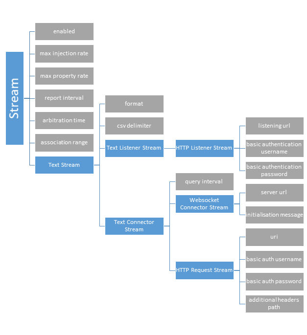
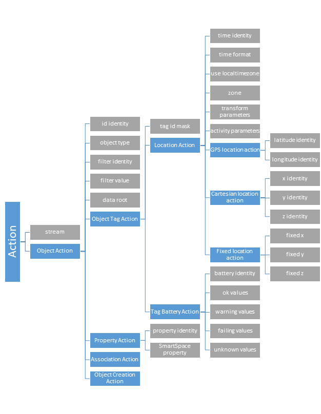
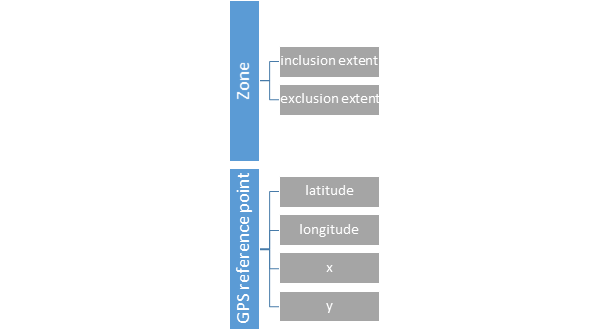

Skip To Main Content

  * placeholder

Filter:

  * All Files

Submit Search

   

You are here:

[Download as
PDF](../../../../SmartSpaceDownloads/B7GZWZS4WX9F/UbisenseSmartSpaceExternalDataConnector.pdf)

[Software
Version](../../../ComponentandFeatureOverview/FrontMatters\(Online\)/features-
and-versions.htm): 3.5

# Overview of the External data connector

The External data connector is a service for collecting location and/or
property data from an external system and injecting it into SmartSpace. It
supports a range of protocols for connecting to external customer systems,
including HTTP(S) queries (server and client) and web sockets (client), and
allows imports in various formats, including XML, JSON and CSV.

Configuration is carried out entirely within the SmartSpace Config application
and this guide takes you through the configuration process step by step.

The External data connector requires the creation of two kinds of objects:

  * streams that configure the connection and data retrieval for external systems. One stream object is required for each external system connection
  * actions that operate on streams to parse and inject data into SmartSpace. A stream can have one or more action object defined for it

Streams and actions are created based on Ubisense-supplied types in the TYPES
/ OBJECTS task in SmartSpace Config. You are only required to give these
objects names: they have no other properties. Instead, their behavior is
configured in the SERVICE PARAMETERS tab where they have service parameters
specific to their functionality. It is in the SERVICE PARAMETERS tab that you
link one or more actions to a stream.

When you are ready to deploy a stream, you set its enabled parameter to true
in the SERVICE PARAMETERS tab. This creates a service to manage that stream
and its actions. The service is deployed, but you need to start it manually
using the Ubisense Service Manager application.

## Configuration workflow

Configuration is performed in SmartSpace Config and Ubisense Service Manager.
The configuration process involves creating objects for stream and action
types and setting service parameters for them as follows:

  1. Create stream object(s).
  2. Create action object(s).
  3. Configure stream object parameters.
  4. Configure action parameters.
  5. Start stream services.

These steps are described in the sections that follow, using an example that
involves setting up a service to retrieve locations from an HTTP URL.

# Requirements

## SmartSpace

The External data connector requires a license for RTLS integration version
3.5 or higher.

## .NET Core

The External data connector requires Microsoft .NET Core 2.2. For Linux
servers, you may need to install .NET Core: follow the instructions for Linux
at https://dotnet.microsoft.com/).

## External Systems

External systems must use a supported format and protocol. Format specific
requirements are outlined below.

General format:

  * Timestamps can be in an ISO 8601 compliant format or a Unix epoch time
  * Where the format supports it, values of null will be parsed but ignored by the service

### JSON

All relevant JSON data values must be within named JSON objects or at fixed
array indices. If the data is nested the same must be true for all parent
objects of those data values.

### XML

Valid XML where data values can be either attributes or elements.

### CSV

CSV data should consist of two or more rows separated by line breaks. The
first row must start with a line/row of column headings. Columns are separated
by commas by default but other character(s) can be configured.

# Installing the External data connector

To install the External data connector feature:

  * Make sure that the SmartSpace platform includes a license for RTLS integration version 3.5 or higher.
  * Install the External data connector feature using Ubisense Service Manager.

For further information on installing SmartSpace features see [SmartSpace
Installation](../../Installation/InstallationWiz.htm)the SmartSpace website at
http://www.ubisensesmartspace.com/.

# Configuring the External data connector

The following sections take you through configuring a stream object,
ExampleHttpRequester stream, and the single action associated with it. You
will then see how to define the parameters for these types and how to deploy
the service.

## Creating Stream Objects

You create stream objects based on the Ubisense-supplied types in the TYPES /
OBJECTS tab of SmartSpace Config. Each external system connection requires its
own stream object.

To create a stream object:

  1. In SmartSpace Config, choose the TYPES / OBJECTS task.
  2. Drag the HTTP Request Stream type into the object browser and double-click <Create new object>. 

  3. In the dialog, enter the object’s name, here ExampleHttpRequester, and click Save.

## Creating Action Objects

You create actions in the same way you create stream objects.

To create an action object:

  1. In SmartSpace Config, choose the TYPES / OBJECTS task.
  2. Drag the Cartesian Location Action type into the object browser and double-click <Create new object>.

  3. In the dialog enter the object’s name, here ExampleLocationAction, and click Save.

## Parameters for Stream Objects

To configure service parameters for a stream object:

  1. In SmartSpace Config, choose the SERVICE PARAMETERS task.
  2. Choose the External data connector configuration, and then find Http Request Stream in the list of objects. (Use the Expand All button to display the object hierarchy, if necessary.)
  3. Drag the Http Request Stream stream into the object browser to display the available objects, double-click ExampleHttpRequester and click Edit to edit its parameters.

The parameters offered depend on the kind of stream you have created. The
complete list of stream parameters for all stream types is given in Stream
Parameters.

In our example, we have set the URI, format and enabled the stream, leaving
the other parameters with their default values.

  4. Click Save.

Note: Stream services do not react to changes to stateful configuration
parameters, for example changes of address for TCP streams. We recommend that
you always restart a stream service in Ubisense Service Manager after changing
its parameters. See Starting Stream Services.

## Parameters for Actions

You can create one or more actions to associate with a stream. Each action can
have different parameters.

To configure service parameters for an action:

  1. In SmartSpace Config, choose the SERVICE PARAMETERS task.
  2. Choose the External data connector configuration, and then find LocationAction in the list of objects. (Use the Expand All button to display the object hierarchy, if necessary.)
  3. Drag the LocationAction into the object browser to display the available objects, double-click ExampleLocationAction and click Edit to edit its parameters.

The parameters offered depend on the kind of action you have created. The
complete list of action parameters for all types of action is given in Action
Parameters.

In our example, we have configured the identities of fields that should be
present in the data: x, y, z and name fields. Because this data is object data
(not tag data), we have also asserted the object type, InjectionObject.
Lastly, we set what stream this action should operate on, the
ExampleHttpRequester stream we created earlier.

  4. Click Save

## Starting Stream Services

When a stream is enabled (by setting the enabled parameter to true, described
above), a service named after the stream object is created to manage that
stream and its actions. This service is deployed but not started: you must
start it manually after configuration is complete.

To start the service for a stream:

  1. In Ubisense Service Manager, open the MANAGE SERVICES tab.
  2. Navigate to the service by opening folders in the SERVICES pane to locate it. Open All > Ubisense autogenerated service > RTLS integration and any enabled services are listed, identified by the name given to the stream objects.

  3. Select the service and click Start.

In our example, we start the Ubisense autogenerated service::RTLS
integration::ExampleHttpRequester service.

### Updating the configuration

Stream services do not react to changes to stateful configuration parameters,
for example changes of address for TCP streams. We recommend that you always
restart a stream service after changing its parameters (by locating it, as
described above, and clicking Restart).

Changes to actions should not require a service restart.

## Configuring Location Action Zones

Inclusion/exclusion zones can be used with location actions to control what
locations are injected. After creating a Location Action Zone object in the
Types and objects workspace, the inclusion/exclusion shapes can be configured
in the Spatial properties workspace. Locations inside an exclusion shape will
be ignored. When an inclusion shape is defined, locations outside the shape
will be ignored. A zone can have both an exclusion shape and inclusion shape
with exclusion shapes superseding inclusion shapes.

Zones should be stationary shapes. A stream can use one zone at a time.

# Types and parameters

This section lists the types available for use with the External data
connector and the parameters to configure them. The lists include the parent
types on which the Ubisense types for the different connection types are
based. These are shown for information only: you should base your streams and
actions on the Ubisense types derived from them.

## Types

### Stream Types

Table of stream types Type |  Purpose  
---|---  
Stream |  Abstract base type for streams  
Text Stream |  Abstract base class for text based streams  
Text Listener Stream |  Abstract base class for text listener streams  
HTTP Listener Stream |  Listens for POST/PUT HTTP(S) requests  
Text Connector Stream |  Abstract base class for text connector stream  
HTTP Request Stream |  Retrieves data via periodic HTTP(S) GET requests  
Websocket Connector Stream |  Connects to a server via websockets and listens for data  
  
### Action Types

Table of action types Type |  Purpose  
---|---  
Action |  Abstract base type for all actions  
Object Action |  Abstract base class for actions on object data  
Object Tag Action |  Abstract base class for actions on object/tag data  
Location Action |  Abstract base class for actions on object/tag location data  
Cartesian Location Action |  Injects object/tag locations from Cartesian (x/y/z) data  
GPS Location Action |  Injects object/tag locations from GPS data  
Fixed Location Action |  Injects object/tag locations at a fixed position  
Tag Battery Action |  Asserts tag battery status from parsed data  
Property Action |  Sets UDM property values for objects based on parsed data  
Association Action |  Associates unassociated parsed objects with free tags from a given range  
Object Creation Action |  Creates missing SmartSpace objects to match objects from parsed data. It is recommended that you only have one Object Creation Action per External system  
  
### Zones

Table of zone types Type |  Purpose  
---|---  
Location Action Zone |  Used to define inclusion/exclusion extents for location actions  
GPS Reference Point |  Used to configure GPS coordinate conversion  
  
GPS Reference Points

At least two GPS reference points are needed to convert GPS locations to the
Cartesian coordinates used by the platform. These coordinates are defined by
creating GPS Reference Point objects in the Types and objects workspace and
then setting their x, y, latitude and longitude values in SERVICE PARAMETERS.

When more than two GPS reference points are defined, only the two points
closest to a parsed location are used in the conversion. This should allow the
use of GPS reference points when multiple areas that are not geographically
adjacent are placed adjacent on the map, so long as there are at least two
reference points for each area.

## Parameters

### Stream Parameters

Table of stream parameters Parameter |  Type |  Purpose  
---|---|---  
max property rate | Stream | Maximum rate (Hz) at which properties will be set  
report interval |  Stream |  Interval between monitor of the service in seconds  
arbitration time |  Stream |  Arbitration time in seconds. When set to a positive value, tag/object locations must be newer by this amount than the most recent location seen by the platform for that tag/object, else they will be ignored. How arbitration time is used: In the External data connector Arbitration time is used as follows. Where: A is arbitration time X is the time of a new location seen by the service for a tag T Y is the last time the platform saw the tag T The location will only be injected if X >= Y + A Significant values for arbitration time are:

  * 0 (or any negative number) = arbitration disabled
  * 0.1 (or any small, positive number) = avoid injecting repeated locations
  * 10 (some larger number) = give priority to another system, i.e. if you are using both Ubisense tags and an external GPS system, give Ubisense tags priority

  
association range mimimum |  Stream |  For use with the association action. Mimimum tag id of the tag pool available to the association action  
association range maximum |  Stream |  For use with the association action. Maximum tag id of the tag pool available to the association action  
format |  Text Stream |  Format of received data  
csv delimiter | Text Stream | Delimiter used to separate values in CSV data. The service will use the default for the current culture when unset  
listening url |  HTTP Listener Stream |  URL to listen for clients on  
basic authentication username |  HTTP Listener Stream |  Username to use for basic authentication. Only requests using basic authentication and matching this username will be accepted  
basic authentication password |  HTTP Listener Stream |  Password to use for basic authentication. Only requests using basic authentication and matching this password will be accepted  
query interval | Text Connector Stream | Interval between HTTP queries in seconds  
server url |  Websocket Connector Stream |  URL to connect to  
initialisation message path | Websocket Connector Stream | Stream Path to text file containing message(s) to send to the server when the service connects. For use when the external system requires an initialisation/subscription message before receiving data  
username |  Websocket Connector Stream |  Basic authentication username to use with the websocket  
password |  Websocket Connector Stream |  Basic authentication password to use with the websocket  
uri |  HTTP Request Stream |  URI to query  
basic auth username |  HTTP Request Stream |  Basic authentication username to use with HTTPS  
basic auth password |  HTTP Request Stream |  Basic authentication password to use with HTTPS  
additional headers path |  HTTP Request Stream |  Path to a file containing one or more HTTP headers to include in requests  
  
### Action Parameters

Table of action parameters Parameter |  Type |  Purpose  
---|---|---  
stream |  Action |  The stream to act on  
id identity |  Object Action |  Identity of the id field (the tag id or object name) in source data  
object type |  Object Action |  When set, the id is assumed to be an object name, otherwise id is assumed to be a tag. The type to use, together with the id, to determine which object from source data  
filter identity |  Object Action |  Identity of the filter field in source data. When set, data for objects not matching the filter value will be ignored  
filter value |  Object Action |  Accepted value for the filter  
data root |  Object Action |  Identity of the element containing the relevant data. For nested data, e.g. complex JSON/XML.  
tag id mask |  Object Tag Action |  Bitmask to apply (as a bitwise OR) to parsed tag ids. Cannot be used with tag id namespaces.  
tag namespace |  Object Tag Action |  The namespace to use for non-Ubisense tag ids. See tag namespace section for details  
time identity |  Location Action |  Identity of time values in source data. Current time is assumed when this is not set  
time format |  Location Action |  Custom format specifier for non-ISO 8601, non-unix timestamp date/times. Details of suitable values can be found here [https://docs.microsoft.com/en-us/dotnet/standard/base-types/custom-date-and-time-format-strings?view=netframework-4.8](https://docs.microsoft.com/en-us/dotnet/standard/base-types/custom-date-and-time-format-strings?view=netframework-4.8)  
use local timezone |  Location Action |  Whether parsed times are assumed to be local or UTC times  
zone |  Location Action |  Inclusion/exclusion zones to use  
transform offset x |  Location Action |  Offset to add to the x coordinate of parsed locations (after applying transform rotation)  
transform offset y |  Location Action |  Offset to add to the y coordinate of parsed locations  
transform offset z |  Location Action |  Offset to add to the z coordinate of parsed locations  
transform yaw |  Location Action |  Yaw rotation in degrees to apply to parsed locations  
transform pitch |  Location Action |  Pitch rotation in degrees to apply to parsed locations  
transform roll |  Location Action |  Roll rotation in degrees to apply to parsed locations  
transform left handed |  Location Action |  Set to true when the source system uses a left handed coordinate system, i.e. the y coordinate needs to be negated to match the Ubisense coordinate system  
activity timeout |  Location Action |  Interval, in seconds, without the action seeing an object/tag before its activity is set to inactive. The tag must be in the monitored range. When this parameter is not manually set (or is set to a value <= 0 with 0 being the default), the location action will not set the tag’s activity to active.  
activity tag range minimum |  Location Action |  Minimum tag boundary of the monitored tag range. Tags in this range will have their activity set to inactive when unseen by the action for activity timeout seconds  
activity tag range maximum |  Location Action |  Maximum tag boundary of the monitored tag range. Tags in this range will have their activity set to inactive when unseen by the action for activity timeout seconds  
latitude identity |  GPS Action |  Identity of the latitude field in source data  
longitude identity |  GPS Action |  Identity of the longitude field in source data  
x identity |  Cartesian Location Action |  Identity of the x coordinate field in source data  
y identity |  Cartesian Location Action |  Identity of the y coordinate field in source data  
z identity |  Cartesian Location Action |  Identity of the z coordinate field in source data  
fixed x | Fixed Location Action | Fixed x co-ordinate to use for injected locations  
fixed y | Fixed Location Action | Fixed y co-ordinate to use for injected locations  
fixed z | Fixed Location Action | Fixed z co-ordinate to use for injected locations  
battery identity |  Tag Battery Action |  Identity of the battery status field in source data  
ok values |  Tag Battery Action |  Comma-separated values to parse as ok  
warning values |  Tag Battery Action |  Comma-separated values to parse as warning  
failing values |  Tag Battery Action |  Comma-separated values to parse as failing  
unknown values | Tag Battery Action | Comma-separated values to parse as unknown  
property identity | Property Action | Identity of the field containing the property value  
SmartSpace property | Property Action | Name of the SmartSpace property to set  
  
### Miscellaneous Parameters

Table of miscellaneous parameters Parameter |  Type |  Purpose  
---|---|---  
x |  GPS Reference Point |  Platform x coordinate of the reference point  
y |  GPS Reference Point |  Platform y coordinate of the reference point  
longitude |  GPS Reference Point |  Longitude of the reference point  
latitude |  GPS Reference Point |  Latitude of the reference point  
  
## Types and properties tree view

### Streams

### Actions

### Miscellaneous Properties

# Trace Messages

The External data connector has several trace streams to help monitor
performance and spot issues. These can be enabled using the platform_monitor
configuration parameter.

Currently, the platform_monitor configuration parameter must be set in the
registry (Windows) or in /etc/ubisense/platform.conf (Linux) in order to see
these trace messages. Setting them for the whole platform using
ubisense_configuration_client does not currently work.

The trace streams available are as follows:

  * data_connector

Periodic messages giving an overview of the number/rate of events and errors
occurring. The rate of these messages is controlled with the report_interval
parameter.

  * data_connector_debug

Verbose messages giving real-time information on received data and errors
encountered.

**Not recommended for regular use.**

## Understanding reports

When enabled, the data_connector stream will output periodic reports
summarizing the number of events and errors that occurred over the report
period. These reports are grouped by action/component and look like the
following:

    
    
    [01/08/2019 18:01:58] data_connector: HttpRequester: Reports for last 10 seconds:
    [01/08/2019 18:01:58] data_connector: HttpRequester: 1 HTTP(S) requests completed, 0 requests failed.
    [01/08/2019 18:01:58] data_connector: HttpRequester: 1 JSON objects/arrays deserialized, 0 deserialization errors, 0 errors parsing action root elements, 1 JSON objects passed to actions
    [01/08/2019 18:01:58] data_connector: HttpRequester: 1 locations for injection, 0 discarded as outside cells, 0 discarded due to arbitration
    [01/08/2019 18:01:58] data_connector: HttpRequester: 1 properties for settings, 1 discarded as value unchanged, 0 errors setting value
    [01/08/2019 18:01:59] data_connector: HttpRequester: CartesianAction: 1 objects for parsing, with 0 object/tag retrieval errors, 0 removed by data fields filter, 0 removed by location filter, 0 location/time parsing errors
    [01/08/2019 18:01:59] data_connector: HttpRequester: PropertyAction: 1 objects for parsing, with 0 object/tag retrieval errors, 0 removed by data fields filter, 0 unrecognised SmartSpace properties, 0 property value parsing errors
    [01/08/2019 18:01:59] data_connector: HttpRequester: TBAction: 1 objects for parsing, with 0 object/tag retrieval errors, 0 removed by data fields filter, 0 status parsing errors
    

Each report has a similar format with the general format as follows:

  * The first item in the report is the number of operations/attempts that occurred in this report period
  * Subsequent numbers are the number of these total operation/attempts that had issues/errors

# Identity language

To help with parsing of complex, nested data structure, the service uses a
language, mirroring C# syntax, to help define the significance of data members
in stream data. An identity is a sequence of data labels describing a path to
a data member in stream data. Identities are read from left to right, with the
leftmost data label being a top level label and depth increasing as you move
right. An empty identity signifies the root element. The specific syntax of
identities and their composition operators is specific to the format of the
data.

## JSON

Identities are made up of sequences of object keys, starting with a key in the
top level object. A ‘.’ is used to denote a nested object and ‘[x]’ is used to
denote a fixed index in an array where x is the index, starting at 1. For
example, the root of the locations in the JSON below is “Locations” and the y
coordinate of tag1 is “Locations[1].Coords[2]”.

    
    
    {
       "Irrelevant": "some_data",
       "Locations": [
       {
          "name": "tag1",
          "Coords": [
             1,
             2,
             3
          ]
       },
       {
          "name": "tag2",
          "Coords": [
             1,
             2,
             3
          ]
       }],
       "More irrelevant": "some_data"
    }

## XML

Identities start with an element tag in the root element, each nested element
or attribute is denoted with a ‘.’. Attributes can only be the rightmost
element.

## CSV

There is no nesting of data in CSVs. Identities are either empty, for the
“root element”, or the name of a column heading.

# Supported protocols

The following outlines the protocols and formats supported by the External
data connector service.

## Protocols

### HTTP(S) connector

The EDC supports retrieval from an external system via both HTTP and HTTPS
with basic authentication. Custom request headers are also supported. Data
provided by the external system should be in a valid text format.

### HTTP(S) receiver

The EDC supports running as an HTTP(S) server, receiving locations via HTTP or
HTTPS requests. Optionally supports use of basic authentication of incoming
requests. Data sent to the service should be in a valid text format.

### Web socket connector

The EDC can retrieve data from external systems via a web socket client,
optionally supporting basic authentication. The client will connect,
optionally send a configurable initialization message then wait for the server
to send response(s). After a configurable period of no server communication,
the client will close and attempt to reconnect again, sending the
initialization message on reconnect. A compatible server should periodically
the required data to connected clients (optionally after an initialization
message), or it should send the required information once to a connected
client and rely on the timeout/reconnect functionality to send more data when
the EDC reconnects.

## Formats

Currently, the service only supports (or has planned support for) tag/object
data. This may be location, property or battery/activity data. Formats will be
described in terms of the following definitions:

  * Field – A single piece of information in source data e.g. object id or a location coordinate.
  * Action object – A collections of fields, grouped together logically in source data. Together, these fields contain all information required for an action for a single tag/object.
  * Root field – For nested source data formats. A field containing the action object or collection of action objects.

### Text formats

For sources where the data retrieved is a string.

#### JSON

JSON string data should be a valid JSON object or array of objects. The action
object(s) should be JSON object(s), either singular or as an array. All
relevant fields (and all ancestors of that field) must be a named JSON value
or a value in an array with a fixed index.

Fields – All relevant fields must be a named JSON value or a value in an array
with a fixed index.

Action objects – All fields for a single object/tag should be within a JSON
object, either at the top level or nested.

Root field – Action objects can be defined as a JSON object/array at the top
level or within a nested field.

Valid examples

    
    
    {
       "name":"object1",
       "location":[  
          12.3,
          43.7,
          0.0
       ],
       "irrelevant_data":80946
    }
    
    
    
    {
       "system_name":"external source 1",
       "status":"good",
       "location_data":{  
          "location_count":2,
          "locations":[  
             {  
                "name":"object1",
                "x":3.2,
                "y":4.6,
                "z":1.0
             },
             {  
                "name":"object2",
                "x":2.6,
                "y":15.7,
                "z":0.8
             }
          ]
       }
    }
    

#### XML

XML data should be a valid XML string. The action object(s) should be an
element with one or more child elements (possibly nested) or attributes. Field
values can be the contents of the elements or attribute values (of the parent
element of child elements).

Fields – Relevant fields can be child elements with contents or attributes of
the parent or child elements.

Action objects – Fields for a single object/tag should be contained in a
single. When there are multiple action objects in a single data string, they
should be sibling elements with the same name.

Root field – Action objects can be in XML elements at any level in the tree.

Valid examples

    
    
    <?xml version="1.0"?>
    <ArrayOfLocationObject xmlns:xsi="http://www.w3.org/2001/XMLSchema-instance" xmlns:xsd="http://www.w3.org/2001/XMLSchema">
      <LocationObject>
        <name>TestObject1</name>
        <x>4.4679310077186347</x>
        <y>7.6369389699012684</y>
        <z>0</z>
      </LocationObject>
      <LocationObject>
        <name>TestObject2</name>
        <x>6.4845871801881989</x>
        <y>7.4083634868303143</y>
        <z>0</z>
      </LocationObject>
    </ArrayOfLocationObject>
    

#### CSV

CSV data must start with a row of column headings.

Fields – A column in a single row.

Actions Objects – Each row is treated as an action object.

Root field – CSV data is not nested.

Valid examples

    
    
    id,x,y,z
    TestObject1,4.4679,7.6369,0.0
    TestObject2,6.4856,7.4084,0.0
    

# Tag namespaces

Tag namespaces are used by the External data connector to support non-Ubisense
tags for ObjectTagActions. Currently only EPC tag ids up to 128 bits in length
are supported.

Tag namespaces can be specified by adding the appropriate prefix to the start
of a tag id followed by “::”, e.g. EPC-64::1234567890abcdef. Namespaces can be
used as tag ids in SmartSpace, in tag association or for tag parameters for
External data connector service parameters. The tag namespace parameter can be
used to automatically prepend the prefix to parsed tag ids in external data
(do not include the “::” in the parameter value).

Some actions or functionality may not be supported for non-Ubisense tags, e.g.
battery and activity data.

## Supported Namespace Prefixes

  * EPC-64
  * EPC-96
  * EPC-128

  * Overview of the External data connector
    * Configuration workflow
  * Requirements
    * SmartSpace
    * .NET Core
    * External Systems
      * JSON
      * XML
      * CSV
  * Installing the External data connector
  * Configuring the External data connector
    * Creating Stream Objects
    * Creating Action Objects
    * Parameters for Stream Objects
    * Parameters for Actions
    * Starting Stream Services
      * Updating the configuration
    * Configuring Location Action Zones
  * Types and parameters
    * Types
      * Stream Types
      * Action Types
      * Zones
    * Parameters
      * Stream Parameters
      * Action Parameters
      * Miscellaneous Parameters
    * Types and properties tree view
      * Streams
      * Actions
      * Miscellaneous Properties
  * Trace Messages
    * Understanding reports
  * Identity language
    * JSON
    * XML
    * CSV
  * Supported protocols
    * Protocols
      * HTTP(S) connector
      * HTTP(S) receiver
      * Web socket connector
    * Formats
      * Text formats
  * Tag namespaces
    * Supported Namespace Prefixes

   

* * *

[www.ubisense.net](http://www.ubisense.net/)  
Copyright © 2020, Ubisense Limited 2014 - 2020. All Rights Reserved.

