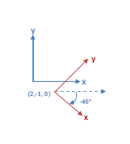
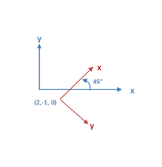

Skip To Main Content

  * placeholder

Filter:

  * All Files

Submit Search

   

You are here:

[Download as
PDF](../../../../SmartSpaceDownloads/B7GZWZS4WX9F/UbisenseISO24730.pdf "link
to PDF version of this content")

[Software
Version](../../../ComponentandFeatureOverview/FrontMatters\(Online\)/features-
and-versions.htm): 3.2

# Introduction to ISO 24730

ISO/IEC 24730 defines protocols for transferring information between different
Real Time Location Systems.

Ubisense ISO 24730 consists of Ubisense services and tools that allow a
Ubisense system to receive real-time locations using a ‘Text over Socket’
connection over TCP/IP. The Ubisense services act as a client connecting to a
server within a third-party RTLS system. The services are added to a Ubisense
dataset which contains the Ubisense platform and, optionally, additional
Ubisense applications.

The Ubisense ISO 24730 package is available for Microsoft® Windows® and for
Linux.

## Purpose of this Manual

This User Manual is a guide to the configuration and use of the Ubisense ISO
24730 Interface. It is divided into the following sections:

  * ISO 24730 Service Installation: instructions for installing the components 
  * ISO 24730 System Configuration: instructions for configuring the system 
  * ISO 24730 Service Behavior: a description of the system’s behavior 

The user should read this entire manual before attempting to install and
configure the system.

## References

[1] ISO/IEC 24730-1:2014(E) – Information technology – Real-time locating
systems (RTLS) – Part 1: Application programming interface (API)

# ISO 24730 Service Installation

There are two services in the ISO 24730package: Configuration Server and
Forwarder Server.

To install the ISO 24730 feature:

  * Make sure that the SmartSpace platform includes a license for ISO 24730 version 3.2 or higher.
  * Install the ISO 24730 feature using Ubisense Service Manager.

For further information on installing SmartSpace features see [SmartSpace
Installation](../../Installation/InstallationWiz.htm)the SmartSpace website at
http://www.ubisensesmartspace.com/.

# ISO 24730 System Configuration

The Ubisense services are configured using the ubisense_iso24730_config.exe
tool. The configuration tool supports the following operations:

Mode  |  Description   
---|---  
list  |  List the current configuration in a form that can be stored in a batch file and used to recreate the configuration.   
setserver  |  Define an external RTLS server which provides ISO24730 Locate Messages, specify its address and associate it with a Ubisense cell.   
removeserver  |  Remove an external RTLS server.   
setoptions  |  Set options for handling Locate Messages from an external RTLS server.   
removeoptions  |  Remove options for an external RTLS server.   
settransform  |  Set a transform to apply to positions in Locate Messages from an external RTLS server.   
removetransform  |  Remove transform for an external RTLS server.   
  
## list

Syntax:

    
    
    ubisense_iso24730_config.exe list 

Example output:

    
    
    # List of all servers 
      ubisense_iso24730_config.exe setserver "AA" "Location Cell 00001" "10.42.5.186" 11 
      ubisense_iso24730_config.exe setserver "BB" "Location Cell 00001" "10.42.5.186" 22 
    # List of server options 
      ubisense_iso24730_config.exe setoptions -s "AA" 
    # List of server transforms
      ubisense_iso24730_config.exe settransform "BB" 2 -1 0 -45 0 0  

## setserver

Syntax:

    
    
    ubisense_iso24730_config.exe setserver <name> <cell> <host> <port> 

Parameters:

name  |  The unique name to give to the server. This name is used to give options and a transform to the server.   
---|---  
cell  |  The name of the Ubisense cell to associate with the server.   
host  |  The DNS name or IP address of the server's host. The Forwarder Server will connect to this address.   
port  |  The number of the port to connect to on the server's host. The Forwarder Server will connect on this port.   
  
Example:

    
    
    ubisense_iso24730_config.exe setserver RTLS1 ‘Location Cell 00001’ 10.42.5.222 12345 

## removeserver

Syntax:

    
    
    ubisense_iso24730_config.exe removeserver <name> 

Parameters:

name |  The unique name of the server.   
---|---  
  
## setoptions

Syntax:

    
    
    ubisense_iso24730_config.exe setoptions [OPTIONS] <name> options Parameters: 

name  |  The unique name of the server.   
---|---  
options  |  A list of custom options, of the form ‘opt1=val1:opt2=val2’, whose meaning is known to the forwarder.   
  
Options:

-s, --updatesync  |  Use synchronous method to pass position from Locate Message to Ubisense Cell, i.e. block until each position has been permanently stored. The default is to use an asynchronous method which returns immediately but does not guarantee that all positions will be persistent.   
---|---  
-b, -usebattery  |  Use the tag battery level values from the Locate Message and pass them to the Ubisense Battery Monitor. The default is to ignore battery levels.   
  
Custom Options:

KeepAliveTime |  The time (in seconds) that the connection should be kept alive, in the absence of any messages from the server, if the server does not send a KeepAlive message. Default is 5s.   
---|---  
BatteryUpdateInterval |  The time (in seconds) between successive battery status updates, if the battery level values from the Locate Message are being used and the value does not change. Default is 3600s.   
  
Example:

    
    
    ubisense_iso24730_config.exe setserver –b RTLS1 KeepAliveTime=30:BatteryUpdateInterval=300 

## removeoptions

Syntax:

    
    
    ubisense_iso24730_config.exe removeoptions <name> 

Parameters:

name  |  The unique name of the server.   
---|---  
  
## settransform

Syntax:

    
    
    ubisense_iso24730_config.exe settransform [OPTIONS] <name> -- <off_x> <off_y> <off_z> <yaw> [pitch] [roll] 

Note: to allow negative values to be parsed correctly a double dash should
appear after the server name.

Parameters:

name  |  The unique name of the server.   
---|---  
off_x  |  The offset to add to the x coordinate from the Locate Message after applying any rotation and before passing the position to the Ubisense Cell.   
off_y  |  The offset to add to the y coordinate from the Locate Message after applying any rotation and before passing the position to the Ubisense Cell.   
off_z  |  The offset to add to the z coordinate from the Locate Message after applying any rotation and before passing the position to the Ubisense Cell.   
yaw  |  The rotation, in degrees, around the z axis (i.e. in the xy plane) to apply to positions from the Locate Message before the x, y & z offsets are added. The angle is the same as the angle from the x axis in the Ubisense coordinate system to the x axis in the external RTLS coordinate system.   
pitch  |  (optional) The rotation, in degrees, around the y axis (i.e. in the xz plane) to apply to positions from the Locate Message before the x, y & z offsets are added.   
roll  |  (optional) The rotation, in degrees, around the x axis (i.e. in the yz plane) to apply to positions from the Locate Message before the x, y & z offsets are added.   
  
Options:

-l, --lefthanded |  The positions supplied in the Locate Message use left-handed axes, i.e. the y coordinate must be negated. The default is to use righthanded axes which is what Ubisense uses.   
---|---  
  
Example 1:

Consider the two coordinate systems above where the blue axes are the Ubisense
coordinate system and the red axes are the external RTLS coordinate system.
The offset is the location of the origin in the external RTLS as expressed in
the Ubisense coordinate system. In the example this is (2, -1, 0). The
rotation is the angle between the x-axis of the Ubisense coordinate system and
the x-axis of the external RTLS coordinate system. In the example this is -45
degrees. So the command to configure this transformation is

    
    
    ubisense_iso24730_config.exe settransform RTLS1 -- 2 -1 0 -45

Example 2:

Consider the two coordinate systems above where the blue axes are the Ubisense
coordinate system and the red axes are the external RTLS coordinate system.
The external RTLS uses a left-handed coordinate system. The offset is the
location of the origin in the external RTLS as expressed in the Ubisense
coordinate system. In the example this is (2, -1, 0). The rotation is the
angle between the x-axis of the Ubisense coordinate system and the x-axis of
the external RTLS coordinate system. In the example this is +45 degrees. So
the command to configure this transformation is

    
    
    ubisense_iso24730_config.exe settransform –l RTLS1 -- 2 -1 0 45 

## removetransform

Syntax:

    
    
    ubisense_iso24730_config.exe removetransform <name> Parameters: 

name  |  The unique name of the server.   
---|---  
  
# ISO 24730 Service Behavior

## Configuration Server Behavior

The Configuration Server stores all the configuration values.

The Configuration Server is also responsible for deploying and undeploying the
Forwarder Services for Ubisense Cells. The Configuration Service will ensure
that those Cells which have external RTLS servers associated with them have
Forwarder Servers deployed. If a Cell has an external RTLS server associated
but no Forward Server then a Forwarder Server is deployed, for that cell, and
started. If a Cell has a Forwarder Server but no external RTLS servers
associated with it then the Forwarder Server is undeployed.

Note: if the Forwarder Server is manually stopped the Configuration Server
will not re-start it.

The behavior of the Configuration Server can be monitored with the
iso_24730_config stream.

## Forwarder Server Behavior

The Forwarder Server connects to all the external servers which are associated
with its Ubisense Cell. It creates a socket connection to each server using
the host and port stored in the configuration. It then listens for and parses
all messages sent by the server.

The Forwarder will parse and act on the LocateMessageDefinition, KeepAlive and
LocateMessage messages. It will ignore FieldDefinition messages as it only
uses the default formats.

When a LocateMessage message is received the position (x,y,z), battery status
and timestamp are extracted.

The position is mapped from the coordinate system of the external RTLS to the
Ubisense coordinate system as follows:

  1. if the ‘left-handed flag’ is set negate the y coordinate 
  2. rotate new the position about the origin of the external RTLS coordinate system using the configured rotation 
  3. add the x, y & x offsets to the new position 

The Forwarder then determines which Ubisense Cell contains the position, using
the extents of the Cells, and queues a Location Event, including the position
and timestamp, to send to that Cell. If the ‘synchronous flag’ is set then the
Forwarder waits for each Location Event, in the queue, to be actioned before
sending the next one, otherwise queued Location Events are sent as fast as
possible. If the position is not in any Ubisense Cell then it is ignored.

If the ‘use battery flag’ is set then the battery status is sent to the
Ubisense Battery Monitor.

The behavior of the Forwarder Server can be monitored with the
iso_24730_forwarder stream.

  * Introduction to ISO 24730
    * Purpose of this Manual 
    * References 
  * ISO 24730 Service Installation
  * ISO 24730 System Configuration
    * list 
    * setserver 
    * removeserver 
    * setoptions 
    * removeoptions 
    * settransform 
    * removetransform 
  * ISO 24730 Service Behavior
    * Configuration Server Behavior 
    * Forwarder Server Behavior 

   

* * *

[www.ubisense.net](http://www.ubisense.net/)  
Copyright © 2020, Ubisense Limited 2014 - 2020. All Rights Reserved.

