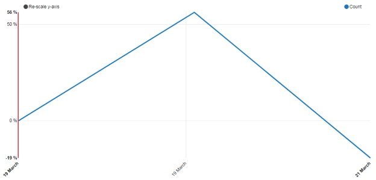
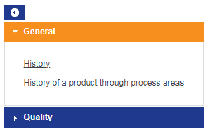
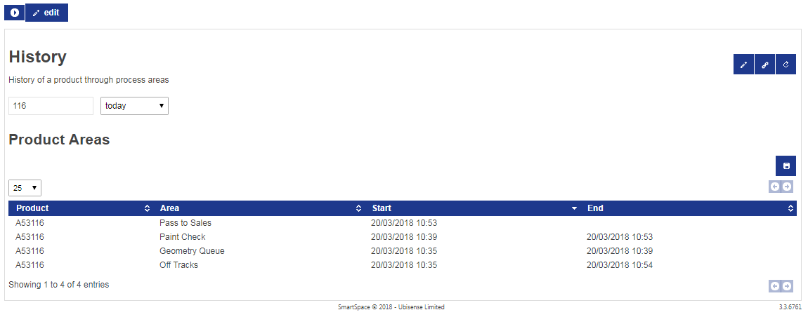

Skip To Main Content

  * placeholder

Filter:

  * All Files

Submit Search

   

You are here:

[Download as
PDF](../../../SmartSpaceDownloads/B7GZWZS4WX9F/UbisenseSmartSpaceReporting.pdf)

[Software
Version](../../ComponentandFeatureOverview/FrontMatters\(Online\)/features-
and-versions.htm): 3.5

#  SmartSpace Reporting

This document is a guide to the configuration and use of Ubisense SmartSpace
Reporting. The intended audience includes users who are:

  * Installing Reporting into a SmartSpace system
  * Configuring Reporting for a SmartSpace system
  * Users of configured reports, for whom the section Web reports at runtime is most relevant

# Introduction to Reporting

In general terms, Reporting in SmartSpace is concerned with the long-term
recording and analysis of data model state. The data model describes the
current application state of the SmartSpace system, such as the set of objects
currently being located, their current or recent state, and properties of
those objects. See the documentation of Types and objects elsewhere. Reporting
allows this state to be recorded into a database, and then for that database
to be used to generate reports of the recorded state.

## Reporting Architecture

The layers of the reporting component are shown below.

### Business object properties

This layer permits the definition of the data model with user-defined types
with a variety of simple and complex properties, as described in [Business
object
properties](../../ComponentandFeatureOverview/TopLevelFeatures/Reporting/business-
object-properties-reporting.htm).

### Logging

In the Logging layer, the properties to be written to the database are chosen.
As changes occur in the data model, they are saved into the database. The
logging services automatically create database tables to match the chosen
properties. They also manage the clean-up of old data according to the data
retention settings for each property.

There are two different ways that a property can be logged: current values and
temporal.

Current Values

For current values, when the value of a property changes for some object, only
the most recent value is retained. For example, if the property is
“name<Product>”, and the name of a given product is updated, the database will
only record the current name of the product. The database row containing the
previous name of the product will be updated to show the new name.

The database table also includes an integer column L_REMOVED. When a property
is removed, it is marked as not being current in the database, but is still
retained so that historical reports will still find the property value. For
example, if a product instance is removed from SmartSpace, the “name<Product>”
row for the object will have a flag “L_REMOVED” set to 1, but will not be
removed from the database table.

A retention duration cannot be specified for properties logged with current
values.

Temporal

Temporal logging records the history of changes to rows in the property. The
database will indicate the date and time when each property row was inserted,
and when it was removed. The database table includes two date/time columns,
L_FROM and L_TO which indicate this time interval. The L_TO column is
nullable, and will be null if the row is still currently present in the
property.

For example, if the property is “<Process Area> contains <Product>: bool”, and
a given product P1 enters process area Stage1 at date/time T1. The
corresponding logged database table will now contain:

Process Area |  Product |  L_FROM |  L_TO  
---|---|---|---  
Stage1 |  P1 |  T1 |  null  
  
Now P1 moves to process area Stage1 at date/time T2. The database table will
now contain:

Process Area |  Product |  L_FROM |  L_TO  
---|---|---|---  
Stage1 |  P1 |  T1 |  T2  
Stage2 |  P1 |  T2 |  null  
  
A property that is logged temporally may also have a retention duration
defined. The logging services automatically remove rows which have L_TO not-
null and with a value older than the number of days defined in the retention
setting.

A property that is logged temporally can also have a shift associated with it
for use in recording duration. This is described in Recording duration using
shifts.

### Reporting

In the Reporting layer, reports are executed by querying the database, and the
report results are displayed in the browser. If the Reports engine developer
is licensed, then reports can be created and edited in the browser-based
editor as described in Designing Reports in SmartSpace. Without the developer
license, only predefined reports can be loaded into SmartSpace and viewed by
users. Reports are made available to specific user roles.

For information on viewing reports in SmartSpace Web, see Web reports at
runtime.

## Requirements

The reporting component requires a database engine in which the data will be
recorded. In the current release, the following database engines are
supported:

  * SQL Server 2008 R2 or higher
  * Oracle 11G R2 or higher

Note on computing containments at run-time (SQL Server only)

Under normal use, spatial containments are computed in real-time by the
SmartSpace platform, and any containment properties required for reports are
logged to the database. However, if reports are required to compute spatial
containments directly from logged object locations at report run time, then
the database engine must support spatial extensions. For SQL Server, this is
available as standard.

SmartSpace does not provide similar support for computing containments at run-
time with Oracle.

# Installing Reporting Services

Reporting services support only one backend database at a time. So if SQL
Server is the database required, only the reporting services for SQL Server
should be installed and deployed, and the corresponding reporting services for
Oracle must be undeployed and removed. Conversely, if Oracle is required, only
its services should be available and the SQL Server services must not be
present.

You can check which services are deployed using Service Manager.

  1. Using Service Manager, open the MANAGE SERVICES tab and open All > Ubisense > Reporting in the Services tree.
  2. Check that the following services are deployed (note they may be in a state of continually restarting until configuration is complete):

For SQL Server:

     * Location logger SQLServer
     * Property logger SQLServer
     * Report client interface SQLServer

For Oracle:

     * Location logger Oracle
     * Property logger Oracle
     * Report client interface Oracle

If these services are not visible in the MANAGE SERVICES tab, open the INSTALL
SERVICES tab to locate the installation files and install and deploy them.

  3. Ensure that the following services  are not deployed. Undeploy and remove them if necessary:

For SQL Server:

     * Location logger Oracle
     * Property logger Oracle
     * Report client interface Oracle

For Oracle:

     * Location logger SQL Server
     * Property logger SQL Server
     * Report client interface SQL Server

# Configuring Reporting

The first task when configuring reporting is to set up logging, so that data
is written to the database and can be queried by reports. There are three
stages to this:

  1. Create a database. The SmartSpace logging services must be able to connect to the database with sufficient privileges to make changes to the database schema, and to write and read data.
  2. Configure SmartSpace to connect to the database. The connection settings are stored in SmartSpace and can be tested.
  3. Configure logging of required properties. The mode of logging determines what happens in the database when the property values are changed, and how long they are retained.

Configuring the database connection and logging is carried out using the
PROPERTY HISTORY task in SmartSpace Config.

Click on PROPERTY HISTORY to display the workspace.

The workspace is described in the following sections:

Database logger

The current connection is displayed.

Select SQL Server or Oracle and click Edit to edit the connection string.
Connection settings depend on how the database was created.

Property and type selection

The middle pane shows a list of all defined properties. Double-click the
property for which you want to record property rows and select a logging
method and (temporal only) a retention interval.

Click Save and the database table corresponding to the logged property will be
created automatically.

Location logging

The bottom pane shows a list of all object types. Double-click the type for
which you want to enable location logging and select a logging method and
(temporal only) a retention interval. Set a distance threshold which is
considered to be a “significant” change in location.

Click Save and the database table corresponding to the logged property will be
created automatically.

## Creating a Database with SQL Server

In general, the database must be created and configured such that the
connection from SmartSpace has rights to modify the database schema, and to
read and write data.The database engine documentation should be consulted for
the details of how this is done. Here we walk through examples of setting up
SQL Serverdatabase security both for a local database engine (running on the
same server as the SmartSpace platform services) and for a remote database
engine (running on a different server within the same domain).

SQL Server has two methods of authentication when connecting to the server:
Windows Authentication and SQL Server.To see which are enabled for your server
engine, Start SQL Server Management Studio and then connect to the database
engine. Right click on the server at the top of the tree view, and select
Properties.

SQL Server authentication connections will not work unless SQL Server mode is
enabled.

### SQL Server on same server

For SQL Server on the same server as the SmartSpace controller, we will use
integrated authentication. In SQL Server Management Studio:

  * Create a new database
    * Right-click on Databases in tree view and select ‘New Database…’
    * Enter Database name
  * Add required roles
    * Security -> Logins -> NT AUTHORITY\SYSTEM -> Properties
    * User Mapping -> select database -> check db_datareader, db_datawriter, db_ddladmin

### SQL Server on a remote server with SQL Server authentication

This method will require a username and password stored in the SmartSpace
platform to connect to the server. In SQL Server Management Studio:

  * Create a new database
    * Right-click on Databases in tree view and select ‘New Database…’
    * Enter Database name
  * Add required roles
    * Security -> Logins. Right click and select New Login
    * Enter a login name, such as Ubisense, select SQL Server Authentication, and enter a password and policy options as required
    * Select User Mapping under “select a page” on the left -> select database -> check db_datareader, db_datawriter, db_ddladmin

### SQL Server on a remote server with integrated authentication

For SQL Server using integrated authentication and a domain-wide user, the
services that connect to the database will all have to be running as the
domain user you configure.

First create a service domain user for the Ubisense services. We will call
this DOMAIN\UbisenseServiceUser. Then in SQL Server Management Studio:

  * Create a new database
    * Right-click on Databases in tree view and select ‘New Database…’
    * Enter Database name
  * Add required roles
    * Security -> Logins -> DOMAIN\UbisenseServiceUser -> Properties
    * User Mapping -> select database -> check db_datareader, db_datawriter, db_ddladmin.
  * Now on the controller that will be running the reporting services run services.msc, and find the UbisenseServiceController 3 service. Double-click to edit properties, select the Logon tab, and enter the details for DOMAIN\UbisenseServiceUser.
  * Ensure that the local dataset folder on this server allows full control for the DOMAIN\UbisenseServiceUser.
  * Restart the controller service.

## Connecting to SmartSpace with SQL Server

Connection settings depend on how the database was created above. To set and
test connection settings, go to SmartSpace Config and select the PROPERTY
HISTORY task. Select SQL Server from the dropdown and click Edit to set the
connection string.

  * For integrated authentication methods enter a connection string of the form:

> Driver={SQL Server Native Client 11.0}; Server=LOCALHOST\SQLSERVER2008;
> Database=Ubisense; Trusted_Connection=yes;

  * For SQL Server authentication, enter a connection string of the form:

> Driver={SQL Server Native Client 11.0}; Server=LOCALHOST\SQLSERVER2008;
> Database=Ubisense; Uid=Ubisense; Pwd=mypassword;

Click Test to check that the login worked. If an error is generated, for more
information go to SQL Server Management Studio and under Management/SQL Server
Logs, look for the notification of a failed login, which should describe the
reason the login failed. If the login failure doesn’t appear in the server
log, check the server name and instance. If they are correct, run the SQL
Server Configuration Manager and ensure that the TCP/IP protocol is enabled
for your server instance..

### Troubleshooting connections to a remote SQL Server database

  1. The database instance needs to be correct. Try connecting using another tool, such as OSQL or sqlcmd first to make sure you have the right instance.
  2. Make sure the target SQL Server instance has firewall exceptions and has TCP/IP connections enabled.
  3. If you want to use Windows authentication then the platform services (core and controller) need to be running as a domain user that is also valid on the SQL Server machine.

Otherwise you have to use SQL Server authentication and include the
username/password in the connection string. See SQL Server on a remote server
with SQL Server authentication.

  4. Make sure you are using the right version of the SQL Server native client in your connection string, and that the version of SQL Server native client is available on your platform server. For example: 10 versus 11.

## Creating a Database with Oracle

The following outlines the steps required to establish a connection from
SmartSpace to an Oracle database to support SmartSpace Reporting. The process
starts with installing suitable Oracle client software on the Ubisense server
and walks you through the steps to ensure that SmartSpace can connect to the
database. Setting up an Oracle database is not described: it is assumed that a
suitable schema and user account have been created in Oracle prior to
configuring SmartSpace.

### Required Database Privileges

The user account must have the following privileges in the Oracle schema:

  * Create table
  * Create procedure
  * Create sequence
  * Create type
  * Select on DBA_OBJECTS

The user account must also have tablespace quota to permit the creation of
database objects.

## Installing the Oracle Client

This guide uses the example of installing a connection for Oracle 12.1. Other
versions of Oracle will follow a similar procedure.

### Oracle Client

The 32-bit version of Instant Client for Oracle is required for compatibility
with Ubisense services.

  1. Download the 32-bit Instant Client for Oracle 12.1 zipfile from <https://www.oracle.com/technetwork/topics/winsoft-085727.html>.
  2. Unzip the file, placing the contents in a suitable folder, for example C:\Oracle\instantclient_12_1.
  3. Append this folder location to the system PATH environment variable.

Windows has two path variables, system and user: make sure you update the
system environment variable.

    1. Start Control Panel and choose System and Security > System> Advanced system settings.
    2. Click Environment Variables....
    3. Select Path from the system variables in the lower pane, click Edit and amend the path by adding the location of the Instant Client for Oracle.

### Microsoft Visual C++ Redistributable

Instant Client for Oracle 12.1 requires that the redistributable package for
Visual Studio 2010 is installed.

  1. Download the redistributable package for Visual Studio 2010 from Microsoft from <https://support.microsoft.com/en-us/help/2977003/the-latest-supported-visual-c-downloads>.
  2. Make sure to download the 32-bit version of this software: the downloaded file will be called vcredist_x86.exe.
  3. Run vcredist_x86.exe to install the redistributable library.

## Connecting to SmartSpace with Oracle

To set and test connection settings, go to SmartSpace Config and select the
PROPERTY HISTORY task. Select Oracle from the dropdown and click Edit to set
the connection string.

Enter the details of the user account and database that will be used to form
the connection to the Oracle database. The connection string is in the typical
Oracle OCI format:

<username>/<password>@<database server address>:<port>/<database instance
name>

For example:

ss_reporting/Ubi123$@CAM2ORACLE01:1522/sf.ubisense.local

Click Test to verify that a connection can be made. If this is successful,
click Save to store the connection string. If this is a new database a number
of tables and database objects will now be created in the database.

Use Service Manager to verify that the Reporting services are all stable and
have ceased restarting.

## Configuring Logging of Properties

With a database connected, you can now configure the logging required for each
Business object property.

  1. Open SmartSpace Config and select the Property History task. The middle pane shows a list of all defined properties.

  1. Double-click the property for which you want to record property rows. Select a logging method: current values or a time interval (temporal).

  1. If time interval is selected (temporal logging), you can configure two further options:

     * a retention interval in days
     * that the duration is recorded using shifts. See Recording duration using shifts for further information
  2. Click Save to apply the change. The database table corresponding to the logged property will be created automatically.

If you change a property from current values to temporal, then the table
structure will be changed in the database, and all previous rows recorded will
be moved to a backup table. See the section on Schema changes below.  
Selecting or deselecting The duration is recorded using shifts will also
result in a schema change.

### Location logging

If you want to generate location history reports, then you should enable
location logging for the types of objects you wish to report on.

Open SmartSpace Config and select the Property History task. The bottom pane
shows a list of all object types. Double-click the type for which you want
locations logged, and enter the parameters:

It is important to select a distance threshold that is as large as possible
while still capturing the required level of detail. This reduces the amount of
data that is stored into the database, and thus returned by location history
queries. At the very least, the distance threshold should be greater than the
noise expected from the location system, but generally you should set a
threshold which is considered to be a “significant” change in location for the
type of object tracked. Otherwise your database will quickly become unwieldy,
and reports will be slow to generate and hard to interpret.

### Recording duration using shifts

Recording duration using shifts can be specified when using temporal logging.

  1. Configure shifts in the Shift patterns workspace in SmartSpace Config or, if you have the Visibility component, in the Shifts screen in SmartSpace Web. See [The Shift patterns workspace](../BuildandCreate/shift-patterns-configuration.htm#The) and [Shifts in SmartSpace Web](../Visibility/OpsWebInterface/shifts-configuration-operations-web-interface.htm).
  2. To enable the use of shifts for a business property, open SmartSpace Config and select the Property History task. The middle pane shows a list of all business properties. Double-click the type, select Log values for an interval of time specified below (temporal logging) and select The duration is recorded using shifts.

Selecting or deselecting this check box for a property will result in a Schema
Change: see the section on Schema changes.

  3. The shift to use for each logged object is configured using the Service parameters task in SmartSpace Config. Choose Shifts and then the type of object. (Use the Expand All button to display the object hierarchy, if necessary.) Drag the object into the object browser.  Double-click a row and click Edit to define parameters: you can define parameters for a type or separately for individual objects (see [The Service parameters workspace](../BuildandCreate/service-parameters-configuration.htm#The)). Select the shift to use from the log duration in shift dropdown.

For each logged row, the shift associated with the first object in the row
that has one defined will be used to log and compute shift duration. If no
objects have a shift, then shift duration will not be computed and will stay
at "0".

Because the logged database row is only updated on start/end and on shift
activity changes, if you change a shift pattern for the shift while that shift
pattern is active, it will be applied from the last time the shift activity
changed.

If the Reports engine developer is licensed, you can use the shift duration
functions when writing queries. See Designing Reports in SmartSpace for
further information.

## Schema changes

If the configuration of logging for a property is changed such that the table
columns in the database must be changed, the logging services will rename the
current table, and create a new table with the required structure. It is up to
the configurer to copy any previous rows that are still required, and provide
any missing column values, by writing suitable SQL. The old table will be
renamed by appending “_1”. If a table called “_1” already exists, that will be
renamed to “_2”. If that table exists, it will be removed.

## Indexes

Database indexes allow the database engine to execute queries and operations
on tables without having to scan through the entire table contents.

Note that although the logging services create the schema tables with suitable
formats to record the logged properties, they do not create any indexes on
those tables. The reason for this is that the specific indexes best suited to
the application depend on the data logged and on the queries that are executed
against that logged data. Since each index created increases database storage
use, and also adds overhead for row changes, no indexes are created by
default.

It is suggested that an index should be created for each object column in the
tables that are created, as these are the most commonly joined columns.
However missing index analysis, or database performance optimization tools,
might be used to find a better set of indexes to be generated. It is suggested
that checks should be performed from time to time during production operation
of the Reporting component, especially if executed queries are becoming slow,
or database engine load is growing. For further details, see the third-party
documentation:

  * SQL Server Profiler
  * Oracle SQL Tuning Advisor

# Designing Reports in SmartSpace

This section describes how to configure or design reports in SmartSpace.
Designing reports can only be done if the Reports engine developer feature has
been licensed. Otherwise you can load and run third-party designed reports.

Before you can run or design reports, you must have configured your database,
as described in Configuring Reporting.

## Loading predefined reports

The Reporting component comes with command-line tools that can be used to
import reports written by other parties. This is most commonly used where the
Reports Builder has not been licensed. The tools are ubisense_ai_config and
ubisense_report_config.

These command-line tools are deployed using the Ubisense Application Manager.
Select the DOWNLOADABLES task, and select Reporting/Reporting admin tools.
Click the “Download selected items” button and specify a path into which the
tools will be written. This will typically be a folder that is on the user
PATH, to make it easy to run the command-line tools.

You will most likely be provided with scripts to load the reports into your
SmartSpace platform using these tools. Run the tools with no arguments to see
usage help.

If you have licensed the Rules engine developer, you can also use the BUSINESS
RULES workspace to load reports (and any dependent items) that have been
developed in other SmartSpace installations, and you can export reports you
have created, for use elsewhere. See the [Module import and
export](../../ITResources/ITDocs/BusinessRulesExport/business-rules-
export.htm) guide.

## Enabling the report editor

With Reports engine developer, you can edit reports directly from within the
SmartSpace web site. In order to run the editor, you must be logged in as a
user that has the Ubisense.SmartSpace.Administrator role. See [Users and
roles](../BuildandCreate/UsersAndRoles/users-and-roles-configuration.htm).

Once you are logged in as an administrator, visit the Reporting section of the
SmartSpace web site, and you will see an edit button as part of the interface.

Click the edit button to open the main editor pane. You can also click the
pencil button in the top right corner when viewing a specific report, to
directly edit the definition of that report.

## The report editor window

The report editor has five sections: Queries, Tables, Charts, Reports and
Timezones.

Click on the header for a section to expand the contents. The structure of a
report definition is as follows:

Reports

A report consists of a number of divisions, each of which is either a table or
a chart, along with parameters and filters that control what subset of the
data is displayed, and the roles for which the report is visible. See Defining
Reports.

Charts

A chart displays report data in graphical form – line charts, histograms, flow
charts, and location history. Depending on the type of chart various options
can be set to control its appearance. See Defining Charts.

Tables

A table displays report data in tabular form, and provides options for
formatting data, colors, sorting and paging. See Defining Tables.

Queries

A query specifies how data is extracted from the properties logged to the
database. This is the heart of the reporting component, because it provides a
powerful builder to generate arbitrary views joining together multiple logged
properties of objects. Expressions can be computed, and results can be
aggregated as required for the report. See Defining Queries.

Timezones

This section is used to set the timezone of the site. Date/time filters and
parameters in reports always use this “site local” timezone, regardless of the
local timezone of the browser.

The timezone must be set during initial setup of logging. It will not normally
need to be configured again.

## Defining Queries

We will start by describing queries and how they are edited, and then work
back through the tables and charts, and finally to the reports.

### What is a query

A query is a recipe for extracting information from the database. When a query
is executed, it returns a table of rows, and each row has a number of columns.
Each row returned is some fact about the data you are retrieving from the
database. Here are some simple examples of rows:

  * A tracked object was located in some process step over a time interval:
    * Object Name, Process Step Name, Start Time, End Time
  * The number of objects that have been through a process step:
    * Process Step Name, Number of Objects
  * An object was located at a position over some time interval:
    * Object Name, Position, Start Time, End Time

The query defines how these rows are computed from the database properties. To
define the query, we have to specify:

  1. the source properties we need to use to build the result rows;
  2. how the properties are linked together to build each result row;
  3. external or user-specified parameters that are used to determine which rows are returned or how they are computed;
  4. any filtering that must be applied to restrict the set of result rows that are returned;
  5. if necessary, how the rows should be grouped together in order to compute sums, maximums, minimums, etc.;
  6. and finally, how the columns of the result rows are computed.

### Query editor layout

These steps are presented as sections in the query editor. The sources and
links are at the top of the editor. Parameters, filters, grouping and results
are in the expandable sections below on the left. On the right is the drag-
and-drop expression editor with its associated toolbox of terms and
expressions. At the bottom of the page are the buttons to Save and Test the
query, and the table showing test output. If the query has parameters defined
for it, you can test the effects of these by typing into the fields alongside
the test button.

You can test a query without saving it first.

The comment line next to the query name is not visible to end users, but is
shown in the main report editor window next to the query name, so it is a good
idea to describe the intended purpose of the query here.

### Adding query sources

To add a source property to the query, select the property from the Add Source
dropdown. Available sources will include all currently logged properties, and
also any other queries already defined.

Once the property has been selected, it will appear as a new source line, and
the property columns will appear in the toolbox to be added to expressions.

### How multiple sources work

To understand the behavior of sources, a bit of background on relational
database queries is necessary. Consider two database tables, as follows:

| ProductName  
---  
Product | Name  
Object1 | V000001  
Object2 | V000002  
|  | ProductModel  
---  
Product | Model  
Object1 | Alpha  
Object2 | Beta  
  
When we select ProductName and ProductModel, and return all columns as
results, we would get the following table:

Cross Join  
---  
Product |  Name |  Product |  Model  
Object1 |  V000001 |  Object1 |  Alpha  
Object2 |  V000002 |  Object1 |  Alpha  
Object1 |  V000001 |  Object2 |  Beta  
Object2 |  V000002 |  Object2 |  Beta  
  
You can see that we have returned all possible combinations of rows from the
two tables. Sometimes this is the actual result that is needed, but in this
case we actually want the sensible set of results where the model and name
refer to the same product object. To do this we conceptually filter the
results by only returning rows where the first product column is equal to the
second product column. We can then also remove the duplicate columns:

| Filtered on Products Equal  
---  
Product |  Name |  Product |  Model  
Object1 |  V000001 |  Object1 |  Alpha  
Object2 |  V000002 |  Object1 |  Alpha  
Object1 |  V000001 |  Object2 |  Beta  
Object2 |  V000002 |  Object2 |  Beta  
|  | Join on Product  
---  
Product |  Name |  Model  
Object1 |  V000001 |  Alpha  
Object2 |  V000002 |  Beta  
  
This join action is what you get in the query editor when you “link” columns
together. Actually there is a subtle but important detail here, which is what
happens when the second table does not have a value corresponding to the
product in the first table:

| ProductName  
---  
Product |  Name  
Object1 |  V000001  
Object2 |  V000002  
Object3 |  V000003  
|  | ProductModel  
---  
Product |  Model  
Object1 |  Alpha  
Object2 |  Beta  
  
If we join these two, we are actually performing a “left join”, so all rows in
the left table are in the results, regardless of whether the corresponding
right hand table has a matching row. So we get:

Left Join on Product  
---  
Product |  Name |  Model  
Object1 |  V000001 |  Alpha  
Object2 |  V000002 |  Beta  
Object3 |  V000003 |  (null)  
  
That (null) result is a special value that indicates there was no
corresponding data. When such a result is presented to the user, it gives a
blank table entry, or a missing data point in a chart.

In the query editor, the sources are joined in the order they appear in the
query sources. So when you link columns, you will get all rows from the first
table joined with rows in the second. When you don’t link columns, you will
get all pairs of rows in both tables. To get the behavior of an inner join
(where only rows with a matching column in BOTH tables are returned) choose
the two tables as sources without linking their columns, and then use a filter
expression to filter for rows which have matching columns in the two sources.

### Linking query sources

As described above, each column is considered as independent when the source
is added to the query. The query will return all combinations of rows from
each query source. To specify that columns in different sources are the same,
click “Link” next to the source. You will be offered any of the unlinked
columns from the source, and once you have selected one, you will be offered
the choice of other compatible columns from other sources.

For example, here we add a source “Process Area” extent contains “Product”
origin: “Bool”, and then also add the name of “Product”: “String”.

Here we have two Product columns in the query – Product1 and Product2. But we
want these to be the same thing – so that String1 is the name of the product
in the first source. So click on Link in the second source, and pick Product2:

Then select Product1 from the second dropdown:

Now the sources look like this:

Note that there is only one Product object now, so String1 is the name of
Product1.

### Sub-queries

Note that it is possible, and indeed encouraged, to build a set of common
queries and then use those as the basis for higher level queries. For example,
if a product object has a name and a model, and several reports use product
names and models, it would be sensible to create a single query that joins
product, name and model, and to base the other reports on this query.

### Result expressions

Continuing our example, we will now add some results and then test the query.
To add a result, open the Results section of the editor, and then click on the
“+” button to add a new result.

Select the new result, and a template for its expression will appear in the
editor window.

The name of the result column can be changed from result0 to something more
meaningful, such as product.

Now click in the blank space (slot) in the result template and the set of
valid items for that slot will be highlighted in the toolbox:

If you are unsure what you can put in a given slot in an expression, just
click in the slot for help. Similarly, when you try to drag an item into a
slot, the slot will be highlighted if the item can be dropped there.

In this case, we drag the Product1 to the result slot.

Now we add another result, select it, and drag String1 into it.We call it
“productname”.

Now click the Test button to run this first query. The results should be shown
in the test output:

You can see the two result columns, one of which is the internal object
identifier (not normally presented to the end user) and the other is the
corresponding name of the product.

### Filters

Filters allow the results of the query to be restricted to those for which an
expression is satisfied. The expression is composed of predicates from the
toolbox. See Toolbox elements for a description of all the available elements
that can be used to build predicates.

To build a filter, select the Filters section of the editor, and then click on
“where” to show the filter expression. Drag predicates into the slot to build
the filter expression required. For example, the following filter restricts
results to those where the String1 column begins with a V.

### Grouping

To define the groups over which to compute aggregation expressions, open the
Groups section of the editor, and then click on “group” to show the grouping
columns. Drag column values from the toolbox into the group slots. When an
aggregation expression is used in a query the only things that can appear in
the results are expressions based on the aggregation, or on the grouping
columns. Other columns are being aggregated over, so are not defined in the
results of the query. See Aggregation elements for details.

For example, if String2 is the name of a process area, you can aggregate
results for each process area using the following group section.

With this group section, the following example results would be allowed:

 

The following result would not be allowed:

If you find you need to group and aggregate over one set of columns, and then
group again over another set, then split your query into a sub-query with the
first group/aggregate, and then use that sub-query as a source in another
query with the second group/aggregate.

### Parameters

Parameters provide a way to restrict the results of a query based on user
input when the report is run. To use parameters, you add the parameter name
and type to the query definition. This makes the parameter available in the
toolbox to be combined into the filter and result expressions. In this way you
can specify exactly how each the parameter is used. Later, when you build a
report containing charts/tables that are based on your query, you configure
the parameter as a value that can be specified in the report. See also the
section on Filters and parameters for how they are used in reports, and a
simpler but less powerful alternative.

To add a parameter, click to open the Parameters section, and then click the
“+” button to add a parameter. Select the new parameter to display it in the
editor. You can change the parameter name, and select the type of parameter
expected.

You can test the effects of parameters on a query, table or chart by typing
into the fields alongside the test button and then clicking Test.

### Roles

From version 3.5, the reports editor supports assigning roles that can execute
queries directly to allow them to be run from an HMI. This is similar to
ensuring that web searches bound in HMIs are available to the roles that can
run the HMI. See [SmartSpace HMIs](../Visibility/SmartSpaceHMIs/HMIs-
configuration.htm#Purpose) for information on configuring HMIs and binding
SmartSpace data sources.

The correct web site must be installed to match the services.

**Note:** A query can be executed as part of a Report without specifying roles
here. You need only specify roles here if you are using the query with an HMI.

To add a role, click to open the Roles section, select a role from the
dropdown and then click the “+” button to add it.

### Toolbox elements

At the top of the toolbox is the Scratch area. You can drag an expression into
the scratch area to copy into scratch, then drag it out of scratch to make a
copy. You can use this, for example, to move expressions between different
parts of the query.

To remove an expression you have dragged into the editor, just drag it back
over the toolbox.

We will now describe the meaning of each of the elements in the toolbox. Many
of these elements provide an expandable number of slots, where a new slot is
added when the last one is filled. In these cases the last slot can be left
empty.

all of

This provides an expandable number of slots, and is true if all the slots are
true. It is a logical “AND” predicate.

any of

This also provides expandable slots, and is true if any one of the slots is
true. It is a logical “OR” predicate.

none of

This returns true if none of its contents are true. It is a logical “NOR”
predicate. If a single slot is used, this is a “NOT” predicate.

=

The equals operator returns true if the two slots have the same value. Note
the subtle detail that null values are never considered equal in queries. This
is because null means “has no value”, so you can’t say that it is equal to
anything else. For this reason (null = null) will always be false.

!=

Returns true if the two values do not have the same value. Has the same
treatment of nulls as the equals operator.

<=

Returns true if the first slot is less than or equal to the second. For
strings this uses the collation settings of the database, which will typically
reflect the locale by default.

>=

Returns true if the first slot is greater than or equal to the second. For
strings this uses the collation settings of the database, which will typically
reflect the locale by default.

<

Returns true if the first slot is strictly less than the second. For strings
this uses the collation settings of the database, which will typically reflect
the locale by default.

>

Returns true if the first slot is strictly greater than the second. For
strings this uses the collation settings of the database, which will typically
reflect the locale by default.

like

Returns true if the first slot matches the second slot pattern. There are two
wildcards used in the pattern for the like operator:

% | The percent sign represents zero, one, or multiple characters  
---|---  
_ | The underscore represents any single character  
  
The pattern must be in the second slot, but can be another expression that
evaluates to a pattern.

is null

This test returns true if the slot has an undefined value.

is true

Another special operator, this turns a boolean value into a predicate that can
appear in logical operators. For example, if a logged property includes a
boolean column, use “is true” to allow that column value to be dropped into
“any of”, “all of”, etc. This is necessary because of the distinction made in
the underlying databases between boolean values (which are actually one bit
numbers) and logical values.

is in

(RESERVED) This is not currently implemented, but will be used to bind to
parameters with multiple values in a later release.

start time of

For source that is a temporal logged property, this function returns the
date/time at which each row was created. It is invalid when applied to a
source logged for current values, or a sub-query source.

end time of

For source that is a temporal logged property, this function returns the
date/time at which each row was retracted, so it was no longer a current value
of the business object properties. It is invalid when applied to a source
logged for current values, or a sub-query source.

is current

For a property source, this is true for each row that is a current value in
the corresponding property. This is typically used to remove historical logged
rows from the results returned.

case

This is a multiple test expression element. It contains pairs of
condition/expressions. The conditions are tested in order, and the expression
is returned for the first condition that evaluates to true. If none are true,
the default expression is returned.

switch

This is another multiple test expression element. It tests a single value
expression against a set of pairs of test/result expressions. The result is
returned for the first test expression that equals the value expression. If
none of the test expressions equal the value expression, then the default is
returned.

seconds between

This takes two date/time expressions, and computes the number of seconds
between them. If “from” is later than “to” then the result will be negative.
The computation is correct across clock changes such as daylight savings.

day of

This returns the date/time rounded to the start of the day in the local time
zone.

time of

This gives the date/time in local time only, discarding the time zone offset
in which the time was recorded.

+

Adds the slots. For strings, concatenates the slots.

\-

Subtracts the slots.

* 

Multiplies the slots.

/

Divides the first slot by the second slot.

floor

Returns the largest integer less than or equal to the slot.

round

Returns the nearest integer to the slot.

now

Returns the date/time at which the query is being evaluated.

week of

Returns the date/time at the start of the week that the slot is in. Start of
the week is considered to be Monday.

month of

Returns the date/time of the start of the month that the slot is in. For
example, 2015-02-15 01:59 will return 2015-02-01 00:00.

year of

Returns the date/time of the start of the year that the slot is in. For
example, 2015-02-15 01:59 will return 2015-01-01 00:00.

week number of

Returns the ISO 8601 week number of the week the slot is in. For example,
2015-02-15 01:59 will return 7.

add weeks to

Returns the date/time which is a number of weeks after (or before for negative
numbers) the given date/time.

add months to

Returns the date/time which is a number of months after (or before for
negative numbers) the given date/time.

add years to

Returns the date/time which is a number of years after (or before for negative
numbers) the given date/time.

grid x

Takes a point argument and a distance. Computes floor(point.x / d).

grid y

Takes a point argument and a distance. Computes floor(point.y / d).

get x

Returns the x coordinate of a point.

get y

Returns the y coordinate of a point.

get z

Returns the z coordinate of a point.

string…

Allows a literal string to be entered into query expressions.

date…

Allows a literal date to be entered into query expressions.

number…

Allows a literal floating point or integer number to be entered into query
expressions.

seconds in shift of

Computes the duration of the row value up to the current time given the shift
for that row. If used on a source that does not have "The duration is recorded
using shifts" enabled, this will result in an invalid query.

shift active of

Returns true only if the shift for the row is currently active. If used on a
source that does not have "The duration is recorded using shifts" enabled,
this will result in an invalid query.

### Aggregation elements

The following toolbox elements compute aggregate values over rows. When used
without a “group by”, they compute the aggregate over all rows of the query,
and only the aggregate can be in the results. When a “group by” is defined,
the aggregation is computed for all rows with each distinct value of the group
by columns, and those columns can also be included in the result expressions.

minimum of

Computes the minimum across all values.

maximum of

Computes the maximum across all values.

count of

Computes the count of all values.

sum of

Computes the sum of the values.

average of

Computes the average (mean) value.

### Spatial elements (SQL Server only)

The following toolbox elements are spatial and should only be used if you have
set up spatial indexes on the database. It is better, if you can, to compute
spatial properties using the Business object properties feature, and then log
those spatial properties, since these are symbolic and do not require on-the-
fly spatial computations to execute the queries.

contains

True if the first slot contains the second slot. The first slot must be a
space, and the second can be either a space or a point.

intersects

True if the first slot intersects the second slot. The first slot must be a
space, and the second can be either a space or a point.

### Saving

To save the changes to the query, click the Save button.

If you close the editor window without saving, or navigate away, then any
changes will be lost. The editor will prompt to confirm this action.

## Defining Tables

To create a new table, open the Tables section of the report editor, enter the
new table name and click Create. Then click the edit link next to the newly
created table. This will open the table editor.

### Source query

The first step in defining a table is to specify the query that will be used
for its data. Select the query from the dropdown. As a short-cut, you can go
to the query editor for the selected query by clicking the pencil button next
to the query dropdown.

The comment field next to the source is not visible to end users who run the
report, and can be used for internal reference and notes. It is shown in the
top level report editor next to the name of the table.

### Columns

Once the query has been selected, choose the columns to display in the table.
Click the “+” button under Columns to add a column to the table. Select the
query result to display as the column value, and optionally give it a title.
If no title is given, the result name will appear as the column header. Note
that as each change is made, the result view shows what the table might look
like, running the query without any filter or parameter specified.

You can change the colors of the displayed table entries based on another
query result. For example, if the query row should display a warning, add a
query result column that returns a string that is a valid browser color based
on the values in the row. Now select that result as either Foreground or
Background columns. A color can be one of the following forms:

  * A named color supported by all browsers. There are many web references for this list of colors, for example: <https://www.w3schools.com/colors/colors_names.asp>.
  * A hex color, such as “#FF0000”, where the bytes are red, green, blue.
  * A transparent color using the form “rgba(128,0,233,0.5)”. Here the first three parts are red, green and blue components in the range 0-255, and the last part is a floating point transparency (alpha) in the range 0-1, where 1 is a solid color, and 0 is completely transparent.

You can also specify a way to format columns such as numbers and date/times.
Click the Format dropdown and choose how the column should be presented.

Again, a comment can also be added to each column, which will not be visible
to the end user.

### Sorting and paging

The sorting and paging options are configured by manipulating the test output
table at the bottom of the editor.

To define the default sort order, click on a column header. Click again on a
header to reverse the sort order for that column. To sort on additional
columns, hold down Shift and click the relevant headings. You can add up to
three columns to the sort order.

To define the default page size, click on the dropdown above the test output
table, and select the number of rows to display per page by default.

### Saving

Click the Save button to save any changes made to the table.

If you close the editor window without saving, or navigate away, then any
changes will be lost. The editor will prompt to confirm this action.

## Defining Charts

To create a new chart, open the Charts section of the report editor, enter the
new chart name and click Create. Then click the edit link next to the newly
created chart. This will open the chart editor.

### Chart type

The first thing to select is the type of chart. Click the dropdown next to the
chart name, and pick the type of chart you wish to use.

The comment field next to the chart type is not visible to end users who run
the report, and can be used for internal reference and notes. It is shown in
the top level report editor next to the name of the chart.

The set of available chart types is described below, along with their
properties and settings.

### Series

Charts in general can have one or more series displayed. The series can either
be from a single query where one of the columns is used as a category to split
the results into separate series, or can be based on multiple different
queries.

To add a series to the chart, click the “+” button under the Series section of
the editor. Optionally give the series a name, and then select the query to
use as source. You can go directly to the query editor for the selected query
by clicking the pencil button.

Now select the query result columns to use as X, Y, Z and Category as required
for the chart type. See their descriptions below for the meaning of these
columns.

As soon as enough information has been configured, the editor will start
drawing the chart as currently configured in the test panel at the bottom of
the editor.

### Common options

The following options are available to many of the types of chart:

  * margin: the top, left, bottom and right margin to reserve around the chart, in pixel. This is the distance from the axes of the chart to the edges of the chart area, and includes the axis labels and tick marks. 
  * height: the height of the chart area in pixels.
  * show x axis: whether to display or hide the x axis line, ticks and label.
  * show y axis: whether to display or hide the y axis line, ticks and label.
  * show legend: whether to show the category legend box and chooser.
  * y axis on right: controls which side of the chart to draw the y axis.
  * reduce x ticks: when checked, the chart does not show an X tick for every value. Commonly used with date/time axes. Uncheck this to ensure a tick mark exactly on each value.
  * always show these X values: a list of X values, comma separated, to always display mark on the axis.
  * always show these Y values: a list of Y values, space separated, that should always be included in the axis range, regardless of the data returned. For example “0 100”.

The following options are commonly to many chart X axes:

  * label: the label to draw next to the x axis.
  * tick format: how to format numbers for each tick mark.
  * rotate labels by (degrees): how to angle to number next to each tick mark.
  * ticks: the target number of ticks to display on the axis – this is a guide only as the charts will attempt to find a sensible round interval for the ticks.
  * show max and min: when true display the values of the maximum and minimum on each axis.
  * draw ticks at these values: a space separated list of tick values to show. A value may be skipped if too close to the min/max of the axis.

The following options are common to most chart Primary (Y) axes:

  * label: the label to draw next to the x axis.
  * tick format: how to format numbers for each tick mark.
  * ticks: the target number of ticks to display on the axis – this is a guide only as the charts will attempt to find a sensible round interval for the ticks.
  * show max and min: when true display the values of the maximum and minimum on each axis.
  * draw ticks at these values: a space separated list of tick values to show. A value may be skipped if too close to the min/max of the axis.

Note that the Secondary options is a section reserved for future use.

### Available chart types

Line

The line chart plots a numeric Y coordinate against a number or date/time in
X. The Z column is ignored. If Category column is selected, a separate line is
drawn for each category value.

Extra options for the line chart include:

  * fill zeros: when a line has a null value, replace it with a zero. Otherwise the line will break at that point.

Discrete Bar

The discrete bar char plots a separate colored vertical bar for each value
pair in the query results. The X can be a date, time, number or string. The Y
will be a number. If the Category column is selected, then there will be a
separate group of bars drawn for each value of the category in the results.

Multi Bar

The multi bar chart supports grouped or stacked vertical bars by category.

Horizontal Bar

This is the same as the multi bar, but with the direction of the bars swapped
to horizontal.

Area

The area chart displays numerical data using the area underneath a chart. It
allows stacking of data series, and can display the stacked values as a
stream. Hover help shows values under the mouse location, or when tapping or
clicking on the chart.

Extra options for the area chart include:

  * show controls: displays or hides the stacked/stream/expanded control.
  * style: the default style to use from stacked, stream or expanded, when the chart is initially drawn.

Scatter

The scatter chart draws a simple disconnected point for each value of X, Y
from the data source.

Cumulative

The cumulative chart shows the percentage change in Y values from their
initial value over the range X.

Line with focus

The line with focus is like the line chart, but designed for focusing in on
specific ranges of the X axis. The chart is drawn with a range control
underneath. Dragging on the range control selects the X range to show in the
main chart.

Pie chart

The pie chart shows a segmented view of values. It computes the sum of Y for
each distinct value of X, and shows the relative sizes of these sums.

Histogram

The histogram chart bins the values of Y against X, and shows the resulting
distribution. The chart can include filtering to remove outliers. The Y column
will be the range displayed along the horizontal axis, and the vertical axis
will be the number of Y values within each bin across the returned rows from
the query. The Category column is used to split the query results into groups,
and a separate histogram is computed for each group. Duplicate values of the
(X, Category) are summed together to produce a single Y value before the
histogram is computed.

Extra options for the histogram chart include:

  * histogram bins: select how the bin ranges are computed, either using 
    * a fixed bin size, 
    * a fixed number of bins, 
    * or a variable number of bins within a range, with a granularity parameter (1-10).  
The granularity determines how the bins are rounded to lie on sensible
numbers. The number is automatically scaled up or down by powers of ten so it
is less than the query data range, and the bin size then rounded to the
granularity.

  * group spacing: the fraction of the size of the group to leave as a gap between groups (0-1).
  * enable clipping control: display a control to set the method for clipping of outliers
  * clipping: the default clipping range to use:
    * none – don’t clip
    * sigma N – clip to inside N * the standard deviation of the data from the mean of the data
    * iqr N – clip to inside N * the interquartile range above or below the quartiles (25% and 75% percentiles)

Box plot

Another way to view distribution of data, the box plot shows the median, 25%
and 75%, and then the outlier whiskers at median +- 1.5 times the
interquartile range.

The extra box plot options are:

  * show box labels: draw the values at each line
  * show outlier points: draw values for each removed outlier
  * show controls: allow the user to control whether to show outlier points

Sankey flow

The Sankey flow chart shows the number of objects that went from one state to
another, traced over some number of transitions in state. It provides a quick
view of the movement of objects through process steps. The X column should
identify a unique object, the Y column is a value than can be used to order
the progress of the object, such as a time, and the Category column identifies
the states, such as process steps.

Options for Sankey flow are:

  * depth: how many transitions to show by default

Chord flow

The chord flow chart also shows the number of objects making each possible
state transition in the query data. As with the Sankey flow, the X column
should identify a unique object, the Y column is a value than can be used to
order the progress of the object, such as a time, and the Category column
identifies the states, such as process steps.

In the chart, the states are shown as arcs around the edge of the circle. Each
flow between pairs of states is shown as a curved area going between the two
states, with the arc length of the flow at each end indicating the number of
transitions in the data coming from the state to the other. Hover or click
each flow to show the two states and the count of objects making that
transition in either direction.

Location history

The location history chart displays the historical movements of objects
against the background objects configured in the web maps.

The query used is expected to have results called “from” and “to”, by
convention, which are the start and end times for an object being at a given
location. The case of these result fields is significant. Without these query
result columns, the location history chart will not link points together, nor
will it size points depending on how long the object was located at each
point.

When defining the report, select the name of each object as the "X" column,
the points column as the "Y" column, and the "from" column as the "Z" column.
Optionally a grouping category can be selected as the "Category" column, in
which case the resulting trails will be grouped by that category and a
grouping key will also be displayed.

Smoothing

The chart supports smoothing of data. Currently a moving average filter is the
only choice available. The parameter varies from 0.0 (no smoothing) to 1.0
(infinite smoothing). If the object location sequence is [p(1), p(2), p(3)
..., p(N)], and the parameter is beta, then the filter output sequence [q(1),
q(2), q(3) ... q(N)] will be:

q(1) = p(1) q(i+1) = beta*q(i) + (1 - beta)*p(i+1)  
---  
  
Hiding points

In order to make the chart usable with large numbers of returned points, the
circles for each point are hidden when more than a given number of points are
displayed. This threshold is defined in the parameter "hide points if more
than". If this parameter is set too high, browsers may be very slow rendering
the chart.

Pan and zoom

The report supports pan and zoom using the usual pinch/drag/mouse wheel
methods. As the report is zoomed, the line widths are adjusted to show
details, but the size of points is not.

The date range bar

The report includes a bar on the top right showing the range of dates in the
data displayed. The start, end and middle of this bar can be dragged to filter
the set of results shown. This can be used to "play back" the movement of
objects, or to focus on a specific part of their history. If the date range
includes fewer points than the "hide points if more than" parameter, points
will be displayed.

Pop-up point data

When a point is clicked, a pop-up window will display information about it,
including the object name, category, date/times and dwell time. Double-click a
point to set it as a reference point. Once a reference point is selected, the
pop-up window will also include time and distance information, including
distance along the track if the reference point is for the same object.

### Saving

Click Save to save any changes made to the chart.

If you close the editor window without saving, or navigate away, then any
changes will be lost. The editor will prompt to confirm this action.

## Defining Reports

To create a new report, open the Reports section of the report editor, enter
the new report name and click Create. Then click the edit link next to the
newly created report. This will open the report editor.

As described above, a report consists of a number of divisions, each of which
is either a table or a chart, along with parameters and filters that control
what subset of the data is displayed, and the roles for which the report is
visible.

### Automatic refresh

Reports can be set to automatically refresh their data by entering a value
into the refresh interval field. Reports can be expensive to generate if they
include a lot of historical data, so automatic refresh should be used with
caution, especially if the report includes charts that can return large data
sets. For example, consider what will happen if the user sets a time filter of
the report to “forever”.

### Divisions

To add a table or chart to the report, click the “+” button underneath the
Divisions section. Select the defined table or chart to add. If the “half
width” button is checked, the division will be rendered at half the width of
the page, allowing two divisions to appear side-by-side.

### Filters and parameters

To add controls to the top of the report use the Controls section.

Parameters

Parameters, as discussed in the section Parameters above, are explicitly
defined in each query. You can add a control for each parameter in a data
source in the divisions of the report.

Click the “+” button under Parameters, and pick the parameter to add. You can
give the parameter a name, and depending on the type of the parameter, a
suitable set of controls will be added. You can also specify that the
parameter should be a choice of values, where the candidates are returned by
another query and column.

Filters

Filters offer less control, but are much easier to configure. To add a filter
click the “+” button under the Filters section. Choose one of the columns in
any of the queries used by any division in the report, and optionally give it
a title. Controls will be added to the report based on the type of that
column, and the value of that column will be constrained according to the
controls. A default value can also be specified for filtered columns.

The type of control, and the filtering performed, depends on the selected
column type.

  * string: a text entry field is presented. Rows that contain the entered value as a substring will be returned.
  * date/time: a dropdown of a set of predefined data ranges, and the option to pick a custom date range. The rows that have a date/time within the range selected will be returned.
  * numeric: a pair of text entry fields are presented to define a numeric range. Rows that have values within the greater than the minimum entered number and less than the maximum entered number will be returned.
  * boolean: a dropdown choice is presented. If the dropdown value is true or false, only rows with that value for the column will be returned. Otherwise all rows will be returned.

### Roles

To make the report visible to a given role of user, click the “+” button under
the Roles section, and then pick the role from the dropdown box. Until a
report has been added to roles, it will not appear under the Reports section
of the web site to anyone but the administrator. Note that the administrator
role (Ubisense.SmartSpace.Administrator) can view any report, regardless of
the roles configured.

### Saving

Click Save to save any changes made to the report.

If you close the editor window without saving, or navigate away, then any
changes will be lost. The editor will prompt to confirm this action.

You can also click Save and View to save changes and immediately go to the
report.

## Displaying location history with a user-specified time interval

This example shows how to configure the location history chart to display
locations for a user-input time interval. This allows the selection of a time
range with more precision than using the date range bar (described in Location
history). There is no way to do this using the normal filters, so you need to
use parameters instead, specifically by using a string parameter and relying
on SQLServer to convert this automatically to a date/time when it executes the
query.

If you create a report based on this example, you might want to save it as an
extra report, for example called location history for specific dates and
times, so that you can use it in addition to the standard location history
chart.

To create your custom report:

  1. In your location query, define two parameters, “From” and “To”, both of type String:

  1. Now in filters, set the where clause to use these parameters to constrain the start time of the locations rows:

Note that this requires both parameters to have been provided in order to
return any rows, so the Test button will return nothing. However this is what
you need in practice, because otherwise the default query will return vast
numbers of rows and probably cause the browser to lock up.

  1. Now add the parameters to the report definition, instead of a filter on the From time.

  1. You can now enter a date/time range in text format to get back a specific interval.

# Web reports at runtime

To view configured reports, go to the web site, and click on the Reports link
on the top menu bar. If this link is not shown, you are not logged in as a
user with access to any reports. Make sure you click Login.

The set of reports available to your user roles will be displayed.

The reports are grouped by the role for which they are intended. To view
reports in a role, click the title of the role.

To view a report, click the report link. Controls at the top of each report
can be used to restrict the set of results returned.

Buttons

The following buttons are on the top left:

 Click this to show the list of
reports available to you.

 Click this to edit all reports.
You must be an administrator to see this button.

 Click this dropdown to select
the page size to display in a table.

The following buttons are on the right:

 This navigates to a link
directly to the current report with the current parameters as entered.

 This refreshes the data in the
report.

 This saves the current output
of the report division as a file – a text CSV file for a table division, or an
SVG image for a chart.

 These buttons are used to
navigate through multiple pages of results.

 If shown this allows you to
edit the report definition. You must be an administrator to see this button.

## Table Sorting

You can click the header lines in a table to sort the table by that column.
Click again to reverse the order of sorting. Hold down the Shift key and click
to add another column as a secondary sort order.

  * SmartSpace Reporting
  * Introduction to Reporting
    * Reporting Architecture
      * Business object properties
      * Logging
      * Reporting
    * Requirements
  * Installing Reporting Services
  * Configuring Reporting
    * Creating a Database with SQL Server
      * SQL Server on same server
      * SQL Server on a remote server with SQL Server authentication
      * SQL Server on a remote server with integrated authentication
    * Connecting to SmartSpace with SQL Server
      * Troubleshooting connections to a remote SQL Server database
    * Creating a Database with Oracle
      * Required Database Privileges
    * Installing the Oracle Client
      * Oracle Client
      * Microsoft Visual C++ Redistributable
    * Connecting to SmartSpace with Oracle
    * Configuring Logging of Properties
      * Location logging
      * Recording duration using shifts
    * Schema changes
    * Indexes
  * Designing Reports in SmartSpace
    * Loading predefined reports
    * Enabling the report editor
    * The report editor window
    * Defining Queries
      * What is a query
      * Query editor layout
      * Adding query sources
      * How multiple sources work
      * Linking query sources
      * Sub-queries
      * Result expressions
      * Filters
      * Grouping
      * Parameters
      * Roles
      * Toolbox elements
      * Aggregation elements
      * Spatial elements (SQL Server only)
      * Saving
    * Defining Tables
      * Source query
      * Columns
      * Sorting and paging
      * Saving
    * Defining Charts
      * Chart type
      * Series
      * Common options
      * Available chart types
      * Saving
    * Defining Reports
      * Automatic refresh
      * Divisions
      * Filters and parameters
      * Roles
      * Saving
    * Displaying location history with a user-specified time interval
  * Web reports at runtime
    * Table Sorting

   

* * *

[www.ubisense.net](http://www.ubisense.net/)  
Copyright © 2020, Ubisense Limited 2014 - 2020. All Rights Reserved.

