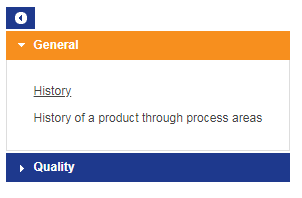
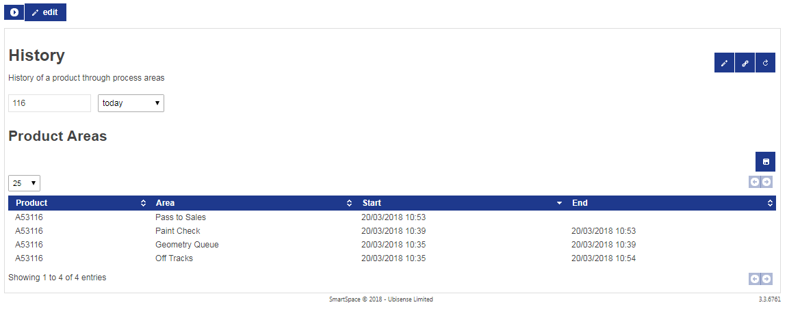
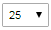

Skip To Main Content

  * placeholder

Filter:

  * All Files

Submit Search

   

You are here:

[Download as
PDF](../../../SmartSpaceDownloads/B7GZWZS4WX9F/UbisenseSmartSpaceReporting.pdf
"link to PDF version of this content")

[Software
Version](../../ComponentandFeatureOverview/FrontMatters\(Online\)/features-
and-versions.htm): 3.2

# Web reports at runtime

SmartSpace reports are browser-based tabular and chart-based reports based on
queries run on the location and property history (see [SmartSpace
Reporting](reporting-developer.htm) for information on loading preconfigured
reports and using Reports engine developer to create your own reports).

To view configured reports, go to the web site, and click on the Reports link
on the top menu bar. If this link is not shown, you are not logged in as a
user with access to any reports. Make sure you click Login.

The set of reports available to your user roles will be displayed.

The reports are grouped by the role for which they are intended. To view
reports in a role, click the title of the role.

To view a report, click the report link. Controls at the top of each report
can be used to restrict the set of results returned.

Buttons

The following buttons are on the top left:

 Click this to show the list of
reports available to you.

 Click this to edit all reports.
You must be an administrator to see this button.

 Click this dropdown to select
the page size to display in a table.

The following buttons are on the right:

 This navigates to a link
directly to the current report with the current parameters as entered.

 This refreshes the data in the
report.

 This saves the current output
of the report division as a file – a text CSV file for a table division, or an
SVG image for a chart.

 These buttons are used to
navigate through multiple pages of results.

 If shown this allows you to
edit the report definition. You must be an administrator to see this button.

## Table Sorting

You can click the header lines in a table to sort the table by that column.
Click again to reverse the order of sorting. Hold down the Shift key and click
to add another column as a secondary sort order.

  * Web reports at runtime
    * Table Sorting

   

* * *

[www.ubisense.net](http://www.ubisense.net/)  
Copyright © 2020, Ubisense Limited 2014 - 2020. All Rights Reserved.

