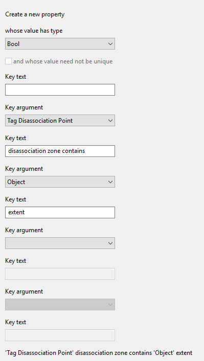
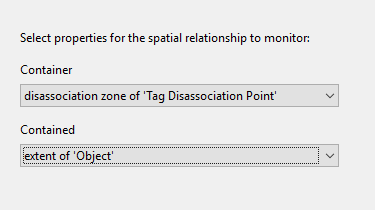
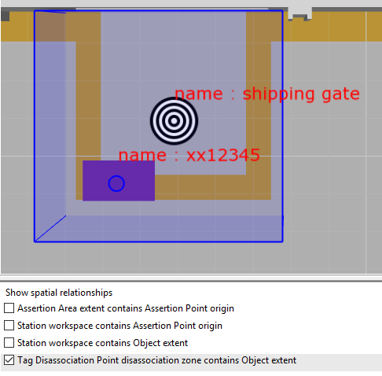
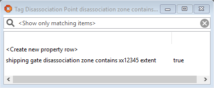

Skip To Main Content

  * placeholder

Filter:

  * All Files

Submit Search

   

You are here:

[Software
Version](../../../ComponentandFeatureOverview/FrontMatters\(Online\)/features-
and-versions.htm): 3.2

# Adding a complex property

When any of the Visibility, Business rules, Reporting or Applications
integration components have been licensed, it is possible to add any number of
properties to define complex relations between types using the Business object
properties feature. These complex properties are created using the SmartSpace
Config application. You can find a description of the workspace for creating
complex properties in [Configure SmartSpace](../../BuildandCreate/smartspace-
config-intro.htm).

Complex properties allow you to link different types together in such a way
that the link defines some new or useful state in the system. They also allow
you to define one-to-many or even many-to-many relations.

In the example below, a complex property is created such that when one type's
extent is contained by another type's extent a new row is added to the
property.

  1. Start by creating a new complex property to define a relationship between the disassociation zone of the Tag Disassociation Point and the extent of the Object type. In the Types and objects workspace, double-click <Create new complex property> and add the following details.

  2. Next you define a containment relation for the two objects. In the Spatial properties workspace, double-click <Add new request> and add the following details.

  3. If you move an object into the disassociation zone you can see the condition being met and the resulting property row being created.

In the Place objects workspace, choose Tag Disassociation Point disassociation
zone contains Object extent from Show spatial relationships so you can see the
relevant spatial extents and see when the relationship is met. Next ensure
there is an instance of the Tag Disassociation Point type placed on the map.
Here there is an object, shipping gate, based on this type. Then place an
instance of an Object type, here xx12345, and ensure it is contained by the
shipping gate (the shipping gate's extent is highlighted in blue).

When an object moves fully into the disassociation zone, a row of data is
added to the complex property. In the Types and objects workspace, drag 'Tag
Disassociation Point' disassociation zone contains 'Object' extent into the
Object browser to see it.

  * Adding a complex property

   

* * *

[www.ubisense.net](http://www.ubisense.net/)  
Copyright © 2019, Ubisense Limited 2014 - 2019. All Rights Reserved.

