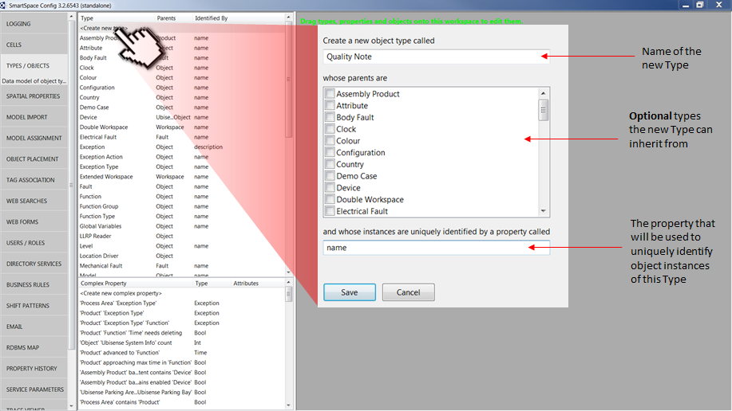

Skip To Main Content

  * placeholder

Filter:

  * All Files

Submit Search

   

You are here:

[Software
Version](../../../ComponentandFeatureOverview/FrontMatters\(Online\)/features-
and-versions.htm): 3.2

# Adding a simple property to a custom type

When any of the Visibility, Business rules, Reporting or Applications
integration components have been licensed, it is possible to add any number of
additional, simple properties to an Object Type using the Business object
properties feature. Types and objects and their properties are created using
the SmartSpace Config application. You can find a description of the workspace
for creating types and objects in [Configure
SmartSpace](../../BuildandCreate/smartspace-config-intro.htm). The
instructions below take you through adding a simple property to a custom type.

An example would be to create a new custom Type called Quality Note with a
property called severity with an integer type.

Start by creating a custom Type called Quality Note:

You can now add a property to the type:

  1. Select Quality Note from the list of types.
  2. Double-click <Create new property>.  

  3. Give the property a name.
  4. Ensure you have selected the Int type from the type dropdown.
  5. Save the change.

If you now select Quality Note in the Types and objects workspace, an
additional row of details is displayed with the severity property followed by
Int.

  * Adding a simple property to a custom type

   

* * *

[www.ubisense.net](http://www.ubisense.net/)  
Copyright © 2019, Ubisense Limited 2014 - 2019. All Rights Reserved.

