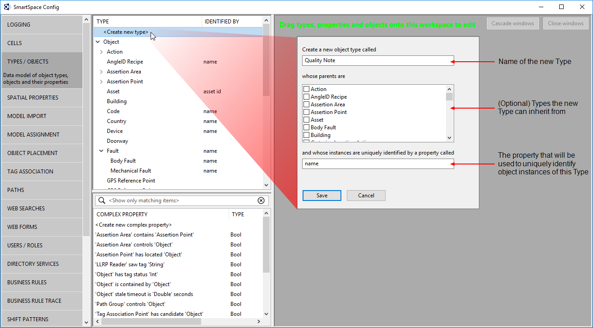
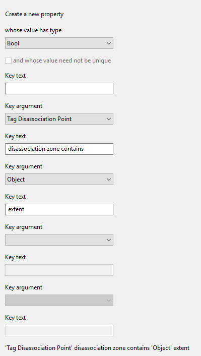
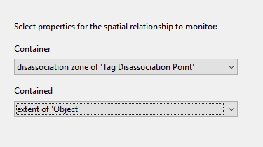
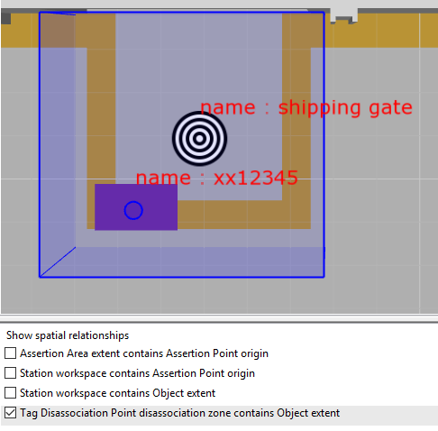
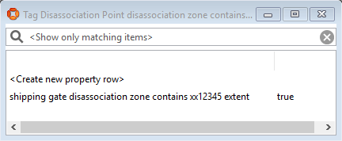

Skip To Main Content

  * placeholder

Filter:

  * All Files

Submit Search

   

You are here:

[Software
Version](../../../ComponentandFeatureOverview/FrontMatters\(Online\)/features-
and-versions.htm): 3.2

# Simple types and attributes

When the Business object properties feature is included in your SmartSpace
license (if you have one or more of: Visibility, Business rules, Reporting),
you can extend [basic types](../../Core/Typeandobject/types-and-objects-
introduction.htm) with a greater selection of properties, called simple
properties.

This makes it possible to add many different property attributes to types so
that they can hold the important characteristics, state and even relations for
a type which allow it to become a true class of object for new user-defined
applications. You can define custom properties to satisfy SmartSpace-specific
application functionality, or to match entities already defined in other
business systems, or both.

In addition to the space property available to all basic types, Business
object properties extends the set of basic types that can be used as object
properties to any of the basic string, logical, time and numeric types,
including string, bool, time, int and double respectively.

Additionally, custom types can be added as properties to types, making it
possible for simple types to reference or address instances of other types in
the data model.

## Key Facts about Simple Types

There are three kinds of property types | 

  * Data storage: String, Int, Double, Bool, Time
  * Spatial relationship monitoring: Space
  * User-defined data: Object

  
---|---  
Users can create new Object types | 

  * Object types contain sets of objects (e.g. Person has Jack, Mary and Pete)
  * Object types can be quite abstract (e.g. Gender has male and female)

  
Object types obey ‘is a’ relations | 

  * If T has a parent type P, then T ‘is a’ P

  
Object types can have name properties | 

  * When defined, a name is used instead of the underlying Object ID to refer to the object
  * Not all types need to have names

  
  
## Example of Custom Types used as Properties

In the example below, three custom types–Colour, Model and Customer–are added
as properties to the Product type.

# Adding a simple property to a custom type

When any of the Visibility, Business rules, Reporting or Applications
integration components have been licensed, it is possible to add any number of
additional, simple properties to an Object Type using the Business object
properties feature. Types and objects and their properties are created using
the SmartSpace Config application. You can find a description of the workspace
for creating types and objects in [Configure
SmartSpace](../../BuildandCreate/smartspace-config-introduction.htm). The
instructions below take you through adding a simple property to a custom type.

An example would be to create a new custom Type called Quality Note with a
property called severity with an integer type.

Start by creating a custom Type called Quality Note:

You can now add a property to the type:

  1. Select Quality Note from the list of types.
  2. Double-click <Create new property>.

  3. Give the property a name.

When adding properties to types, you specify which service manages the
property and hence where its values are stored. There are three choices:

     * the site-level object property data service (the default)
     * the site-level assertion store
     * with the licensing of the Real-time rules engine, the cell-level object property data service

In general, you can accept the default. For further information on SmartSpace
data services and their use in real-time systems, see [Real-time control
components and data flow](../../../ITResources/ITDocs/real-time-rules/real-
time-rules-configuration.htm#_Toc18686577).

  4. Ensure you have selected the Int type from the type dropdown.
  5. Save the change.

If you now select Quality Note in the Types and objects workspace, an
additional row of details is displayed with the severity property followed by
Int.

# Adding a custom type as a property

When any of the Visibility, Business rules, Reporting or Applications
integration components have been licensed, it is possible to add any number of
additional, custom properties to an Object Type using the Business object
properties feature. Types and objects and their properties are created using
the SmartSpace Config application. You can find a description of the workspace
for creating types and objects in [Configure
SmartSpace](../../BuildandCreate/smartspace-config-introduction.htm). The
instructions below take you through creating one custom type for use as a
property of another.

An example would be to create a new custom Type called Quality Note and add it
as a property to a Wing object Type.

Start by creating a custom Type called Quality Note:

Add a selection of Properties to this new Type:

You can now add the Quality Note type as a custom property of the Wing Type:

# Adding a complex property

When any of the Visibility, Business rules, Reporting or Applications
integration components have been licensed, it is possible to add any number of
properties to define complex relations between types using the Business object
properties feature. These complex properties are created using the SmartSpace
Config application. You can find a description of the workspace for creating
complex properties in [Configure SmartSpace](../../BuildandCreate/smartspace-
config-introduction.htm).

Complex properties allow you to link different types together in such a way
that the link defines some new or useful state in the system. They also allow
you to define one-to-many or even many-to-many relations.

In the example below, a complex property is created such that when one type's
extent is contained by another type's extent a new row is added to the
property.

  1. Start by creating a new complex propertyto define a relationship between the disassociation zone of the Tag Disassociation Point and the extent of the Object type. In the Types and objects workspace, double-click <Create new complex property> and add the following details.

  2. Next you define a containment relation for the two objects. In the Spatial properties workspace, double-click <Add new request> and add the following details.

  3. If you move an object into the disassociation zone you can see the condition being met and the resulting property row being created.

In the Place objects workspace, choose Tag Disassociation Point disassociation
zone contains Object extent from Show spatial relationships so you can see the
relevant spatial extents and see when the relationship is met. Next ensure
there is an instance of the Tag Disassociation Point type placed on the map.
Here there is an object, shipping gate, based on this type. Then place an
instance of an Object type, here xx12345, and ensure it is contained by the
shipping gate (the shipping gate's extent is highlighted in blue).

When an object moves fully into the disassociation zone, a row of data is
added to the complex property. In the Types and objects workspace, drag 'Tag
Disassociation Point' disassociation zone contains 'Object' extent into the
Object browser to see it.

  * Simple types and attributes
    * Key Facts about Simple Types
    * Example of Custom Types used as Properties
  * Adding a simple property to a custom type
  * Adding a custom type as a property
  * Adding a complex property

   

* * *

[www.ubisense.net](http://www.ubisense.net/)  
Copyright © 2020, Ubisense Limited 2014 - 2020. All Rights Reserved.

