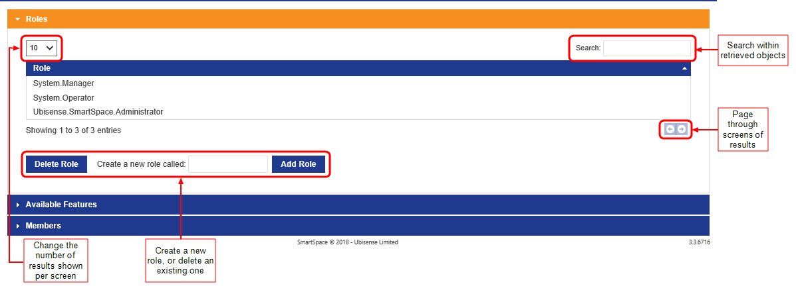
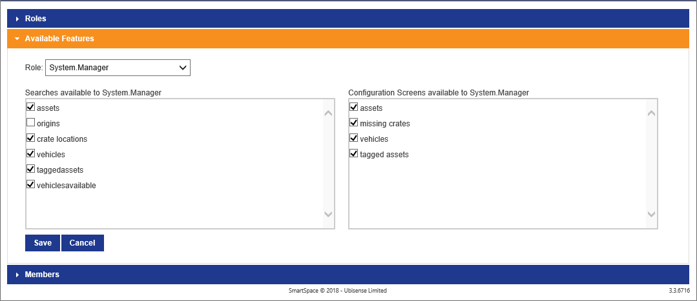
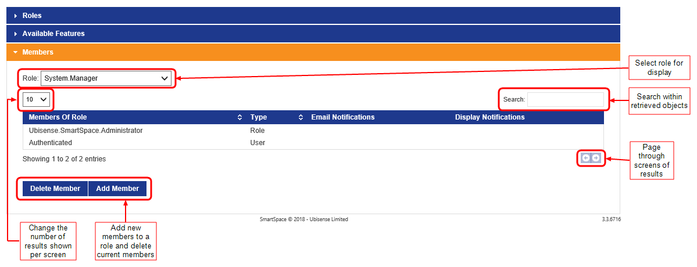
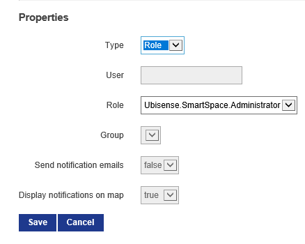

Skip To Main Content

  * placeholder

Filter:

  * All Files

Submit Search

   

You are here:

[Software
Version](../../../ComponentandFeatureOverview/FrontMatters\(Online\)/features-
and-versions.htm): 3.2

# Roles

The Roles screen in the Operations web interface allows you to create and
manage roles, assign searches and screens, and add members to them. For a
detailed explanation of users and roles in SmartSpace, see [Users, Roles, Role
nesting and LDAP groups](../Usersandroles/users-roles-LDAP-in-visibility.htm).

Other aspects of configuring roles–making properties editable, and assigning
views–can only be carried out by using the [Users and roles
workspace](../../BuildandCreate/UsersAndRoles/users-and-roles-
configuration.htm#user-roles) in SmartSpace Config.

Click on Roles to display the screen in SmartSpace Web.

Only members of the System.Manager role can access this screen.

## Managing Roles

In the Roles screen, click on Roles to open a tab where you can view and
manage roles.

A list of roles currently available in SmartSpace is displayed.

To add a new role:

  1. Type a name for the role at Create a new role called.
  2. Click Add Role. The new role is added to the list of existing roles.

To delete a role, select it from the list of roles and click Delete Role. You
will be asked to confirm the deletion.

## Assigning Searches and Web Forms to Roles

Click on Available Features to open a tab where you can make
[searches](../../BuildandCreate/WebMaps/web-searches-configuration.htm) and
[web form](../../BuildandCreate/WebForms/web-forms-configuration.htm)s
previously defined in SmartSpace Config available to roles.

To assign searches and web forms to a role:

  1. Choose the role from the Role dropdown.
  2. Select the searches and configuration screens the role can access.
  3. Click Save.

## Adding Members to Roles

Click on Members to open a tab where you add members to roles and configure
their email notifications.

To add a member to a role:

  1. Choose the role from the Role dropdown.
  2. Click Add Member.

  3. Enter details of the new member in the Properties form.

     * Choose whether to add a new or existing user, an existing role, or a directory service group.
     * Select the user (or add a new one), role or group.
     * When adding a group only, you also specify whether the group receives emails, notifications, or both.  
See How Notifications Work for Users, Roles and Groups for an explanation of
how emails and notifications work for different kinds of role member.

  4. Click Add Member to save the details.

To remove a member from a role, choose the role from the Role dropdown, select
the member to remove, and click Delete Member. You will be asked to confirm
the deletion.

### How Notifications Work for Users, Roles and Groups

The Send notification emails and Display notifications on maps check boxes are
not accessible when you add a user, or another role, to a role. They are only
available when adding a group.

This is the expected behavior.

Notifications are generated when you use the Notify action in the Business
rules engine.

Notify accepts several different inputs:

  * Named user
  * Email address
  * Group name

For the first two, notify generates a web map popup or an email notification
respectively. It’s obvious what is being requested at the rules engine level
because of the type of input.

Groups, however, could contain both users and email addresses, so you have to
tell the system if you want one or both (maps notifications and emails)
explicitly. Otherwise you run the risk of sending alert emails to everyone in
an active directory group when all you wanted was popups on the web map.

## Default Roles in SmartSpace Web

SmartSpace is supplied with the following roles which control access to
different parts of SmartSpace Web:

  * System.Operator: members of the System.Operator role can access the Tag and Battery Status screen and the Sensor Status screen.
  * System.Manager: members of the System.Manager role can access the Roles screen and the Shifts screen.
  * Ubisense.SmartSpace.Administrator: if Reports engine developer is licensed, members of the Ubisense.SmartSpace.Administrator role can view all reports and create and edit new ones. 

These roles are nested: System.Manager is a member of System.Operator; and
Ubisense.SmartSpace.Administrator is a member of System.Manager. This means
that the permissions are inherited so that by default the different roles can
access screens in SmartSpace Web as follows:

|  Report Creation  | HMI Creation  |  Roles  |  Shifts  |  Tags  |  Sensors   
---|---|---|---|---|---|---  
System.Operator  |  |  |  |  |   |    
System.Manager  |  |  |   |   |   |    
Ubisense.SmartSpace.Administrator  |   |   |   |   |   |    
  
  * Roles
    * Managing Roles
    * Assigning Searches and Web Forms to Roles
    * Adding Members to Roles
      * How Notifications Work for Users, Roles and Groups
    * Default Roles in SmartSpace Web

   

* * *

[www.ubisense.net](http://www.ubisense.net/)  
Copyright © 2020, Ubisense Limited 2014 - 2020. All Rights Reserved.

