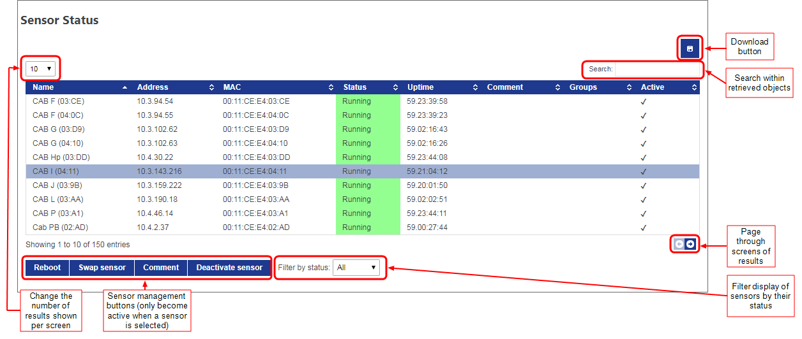

Skip To Main Content

  * placeholder

Filter:

  * All Files

Submit Search

   

You are here:

[Software
Version](../../../ComponentandFeatureOverview/FrontMatters\(Online\)/features-
and-versions.htm): 3.4

# Sensor status

If you have the DIMENSION4 services licensed and installed, the Sensor Status
screen becomes available to display details of sensor statuses. You can also
use this screen to carry out the following sensor managements operations on a
selected sensor:

  * reboot
  * activate or deactivate
  * swap a new sensor for the old one
  * add a comment

Only members of the System.Operator role can access this screen. (For
information on configuring role membership, see [Configuring Roles in
SmartSpace Web](roles-configuration-operations-web-interface.htm) or
[Configuring Roles using SmartSpace
Config](../../BuildandCreate/UsersAndRoles/users-and-roles-
configuration.htm).)

Click on Sensors to display the screen in SmartSpace Web.

Once displayed, you can click the Download button to export the tabulated data
to a file in CSV format. The export includes all data regardless of any
filters you may have applied. Note: Uptime is exported as a value in seconds.

You can sort on one or more columns in the table. Click the heading of the
first column to sort on. Click a second time to reverse the sort order. To
sort on additional columns, hold down Shift and click the relevant headings.

For each sensor, details shown are: name, IP address, MAC address, status,
uptime, any comments that have been added, group, and whether it is active.

Entries in the Status column are displayed on a color-coded background. Status
can be:

  * Running
  * Initializing
  * Unknown
  * No timing signal
  * Rebooting
  * Last seen running
  * Last seen initializing
  * Last seen with no timing signal
  * Last seen rebooting

You can filter sensors by status. Options are:

  * All
  * Running

  * Warning
  * Error

You can also filter the retrieved sensors by typing a search term. For
example, in the screen below, the sensors have been filtered on the search
term "eng".

## Sensor Management

Select a sensor from the table by clicking anywhere in its row of details, and
the sensor management buttons become active. Operations you can perform on a
selected sensor are described in the following sections.

### Rebooting Sensors

You can reboot a sensor by selecting it in the table and clicking Reboot. You
are asked to confirm the operation.

Click Reboot to reboot the sensor.

### Swapping sensors

Swap a new sensor in place of an old one by selecting a sensor from the table
and clicking Swap sensor.

In the Swap sensor dialog, the MAC address of the old sensor is shown. Enter
the MAC address of the replacement sensor and click Swap sensor.

### Adding comments

Add a comment to a sensor by selecting a sensor from the table and clicking
Comment.

Enter the comment and click Save.

### Deactivating/Activating Sensors

Deactivated sensors do not receive UWB data. You may want to deactivate a
sensor if it has been knocked out of alignment and is giving bad data.

Deactivate an active sensor by selecting it in the table and clicking
Deactivate sensor. You are asked to confirm the operation.

Click Deactivate sensor to deactivate the sensor.

You can activate an inactive sensor in a similar way: select it in the table,
click Activate sensor and confirm.

  * Sensor status
    * Sensor Management
      * Rebooting Sensors
      * Swapping sensors
      * Adding comments
      * Deactivating/Activating Sensors

   

* * *

[www.ubisense.net](http://www.ubisense.net/)  
Copyright © 2020, Ubisense Limited 2014 - 2020. All Rights Reserved.

