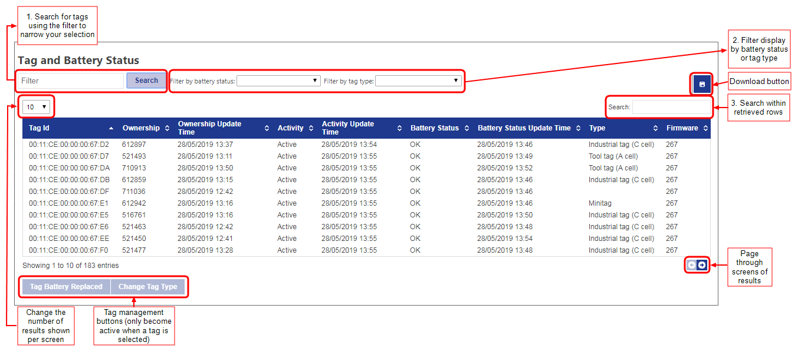
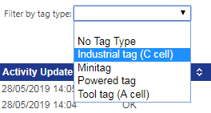

Skip To Main Content

  * placeholder

Filter:

  * All Files

Submit Search

   

You are here:

[Software
Version](../../../ComponentandFeatureOverview/FrontMatters\(Online\)/features-
and-versions.htm): 3.4

# Tag status

Use the Tag and Battery Status screen to display information about tags.
Details shown are:

  * ownership and the last time this was updated
  * activity and the last time activity was updated
  * battery status and the last time this was updated
  * tag type: used to determine the battery capacity of the tag
  * firmware: the software version each tag is running (DIMENSION4 only)

From the Tag and Battery Status screen you can:

  * set or change the tag type of a tag
  * update the status of a tag's battery when the battery has been replaced

Other screens in SmartSpace Web may allow you to [manually associate or
disassociate tags with objects](../Webforms/web-forms-concepts.htm#Tag) and
this can also be done in the [Tag association
workspace](../../BuildandCreate/ManTagAssociation/tag-association-
configuration.htm) in SmartSpace Config. A built-in search allows you to
[display the locations of tags on the web map](../Webmaps/tag-locations-
displaying-web-maps.htm).

Only members of the System.Operator role can access this screen. (For
information on configuring role membership, see [Configuring Roles in
SmartSpace Web](roles-configuration-operations-web-interface.htm) or
[Configuring Roles using SmartSpace
Config](../../BuildandCreate/UsersAndRoles/users-and-roles-
configuration.htm).)

Click on Tags to display the screen in SmartSpace Web.

When you first open the screen, no tag details are displayed. You can:

  * Type all or part of a tag ID and click Search to display one or more tags matching your input (recommended)
  * Click the Search button without entering search criteria to display all rows

We recommend you search for specific tags to reduce loading when there are
tens of thousands of tags to search through.

In the example below, the search term 68:13 has retrieved a single tag:

You can filter tags by their battery status. Options are:

  * All
  * Warning and Failing
  * Failing
  * Replaced — indicates an operator has asserted that the battery has been replaced, but the battery has not yet been replaced or the tag has not yet generated a new battery energy count since it was replaced

Similarly, you can filter by tag type by choosing a tag type from the
dropdown:

You can further filter retrieved tags by typing a search term. For example, in
the screen below, the tags have been filtered to display those whose ownership
is set to "Spare".

You can sort on one or more columns in the table. Click the heading of the
first column to sort on. Click a second time to reverse the sort order. To
sort on additional columns, hold down Shift and click the relevant headings.

Once displayed, you can click the Download button to export the tabulated data
to a file in CSV format. The export includes all data regardless of any
filters you may have applied.

## Tag Management

Select a tag from the table by clicking anywhere in its row of details, and
the tag management buttons become active. Operations you can perform on a
selected tag are described in the following sections.

### Resetting Battery Status

You can reset a tag's battery status, after the battery has been replaced, by
selecting the tag in the table and clicking Tag Battery Replaced. You are
asked to confirm the operation.

The new Battery Status Update Time is displayed in the table.

### Setting Tag Type

You can set or change the tag type of a tag by selecting the tag in the table
and clicking Change Tag Type.

Select the tag type from the dropdown and click Apply.

  * Tag status
    * Tag Management
      * Resetting Battery Status
      * Setting Tag Type

   

* * *

[www.ubisense.net](http://www.ubisense.net/)  
Copyright © 2020, Ubisense Limited 2014 - 2020. All Rights Reserved.

