Skip To Main Content

  * placeholder

Filter:

  * All Files

Submit Search

   

You are here:

[Download as
PDF](../../../../SmartSpaceDownloads/B7GZWZS4WX9F/UbisenseSmartSpaceHMIs.pdf
"link to PDF version of this content")

[Software
Version](../../../ComponentandFeatureOverview/FrontMatters\(Online\)/features-
and-versions.htm): 3.4

#  SmartSpace HMIs

This document is a guide to the configuration and use of Ubisense SmartSpace
HMIs (Human Machine Interfaces), which is part of the
[Visibility](../../../ComponentandFeatureOverview/TopLevelComponents/visibility.htm).
The intended audience includes users who are:

  * Installing HMIs into a SmartSpace system
  * Developing custom HMIs for a SmartSpace system
  * Users of HMIs

# Introduction to HMIs

The HMIs feature allows custom web interfaces to be developed and deployed
within the Ubisense SmartSpace web site. The feature provides administrators
with an editor interface that can be used to implement HMIs that are hosted by
the SmartSpace system. The editor allows interfaces to be tested and
developed, with immediate results displayed. Once an interface is working, it
can be published to a set of SmartSpace roles.

A simple declarative binding API is provided to allow HMI content to be
generated based on web searches defined within SmartSpace. HMIs can interact
with and control the business objects and properties, using the same role-
based authorization as other parts of the SmartSpace platform. This allows
many HMIs to be designed using only attributed HTML. The API includes wrapped
versions of the web map and web reports, so these can be embedded into HMIs as
required, provided they have been licensed.

From version 3.5, queries from the Reporting component can be used to generate
content using data binding in a similar way to web searches, again with role-
based authorizations. This can provide a more flexible approach than using the
built-in report component.

For more advanced uses, CSS and JavaScript can be added to the interfaces.
External assets, such as images and script libraries, can also be hosted in
the SmartSpace web site for use in HMIs. Interfaces can then be exported and
imported, along with any referenced assets.

#### Browser compatibility

SmartSpace Visibility features such as HMIs by default work with most recent
browsers. However, it is up to the developer of individual web interfaces to
ensure that these are comptaible with their users' browsers.

## Requirements

The HMIs feature requires a license for Visibility version 3.4 or higher
(version 3.5 or higher for data-binding with Reporting queries).

If the HMIs are to include reports, then the Reporting component must also be
licensed.

# Installing HMIs

To install the HMIs feature:

  1. Make sure that the SmartSpace platform includes a license for Visibility version 3.4 or higher.
  2. Install the HMIs feature using Service Manager.
  3. Upgrade the SmartSpace web site to the same release version. As an administrator, run the SmartSpaceWeb.msi from the web folder of the software release.

For further information on all aspects of installation, see [SmartSpace
Installation](../../Installation/InstallationWiz.htm).

# Configuring HMIs

There are three stages to building an HMI and making it available to users:

  1. Creating the HMI in the HMI editor, described in Creating a new HMI.
  2. Adding it to roles, described in Roles settings.
  3. Publishing a finished version, described in Publishing an HMI.

## Opening the HMI Editor

In order to be able to define HMIs, you must be logged in to the web site as a
user with role “Ubisense.SmartSpace.Administrator”. In SmartSpace Config use
the USERS / ROLES task to add a suitable user to this role. For further
information on adding users to roles, see [Users and
roles](../../BuildandCreate/UsersAndRoles/users-and-roles-configuration.htm).

Now open a web browser and point it to the SmartSpace web site. You should see
a menu link to HMIs in the top menu bar.

Click this link, and you should see an Edit button, which will take you to the
HMI editor.

## The HMI Editor

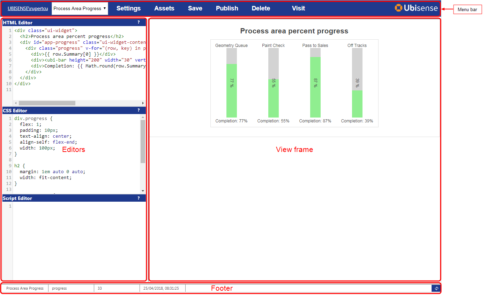

The editor consists of a menu bar, three editor sections, a view frame, and a
footer.

  * The menu bar contains a dropdown to select the HMI to be edited; and buttons for managing settings for the interface, the assets hosted by SmartSpace, and buttons to save, publish and delete the interface. 
  * The editors are for HTML, CSS and JavaScript.

    * Double-click in the title bar of an editor to enlarge it or return it to normal height.
    * Drag the middle separator bar to make the editors wider or narrower.
    * The editors support syntax highlighting and some shortcut keys. Click the ? button to see a quick help:
Key | Action  
---|---  
Shift+Tab |  Auto-indent the current line or selected lines  
Ctrl+Q |  Toggle comment for the current line or selected lines  
Ctrl+Space |  Show completion hints for the current word in context  
Ctrl+F |  Find a string in the editor. Enter the string to search, and press return to show the first match. Use CTRL+G to search for more.  
Ctrl+G |  Find the next instance of the string in the editor  
Ctrl+S |  Save and view the interface - the same as clicking the Save button on the top menu bar  
    * The editors also support undo and redo, and other standard text editing features, using the normal key bindings for your computer (e.g. Ctrl+Z, Ctrl+Y on Windows). 

  * The footer is only shown once a saved HMI has been shown in the view frame, and includes information about the currently viewed version of the HMI: the name, shortcut, version number, when it was saved, whether it is the published version, and a button to refresh the view.

## Creating a new HMI

To create a new HMI:

  1. Choose <new HMI> from the dropdown in the menu bar.  
Alternatively you can copy an existing HMI by selecting it in the dropdown,
then clicking Settings, and then Duplicate this interface.

  2. In the Settings dialog, fill in the name of the HMI, description, and link. 

     * The name and description will be visible to the users when the interface has been published.
     * The link should be a short word or phrase that can be used in the URL to get to the interface once it has been published. It should contain no spaces or punctuation.
     * You can also add a comment for internal notes. This will not be visible to users.
  3. Click Apply to close the settings window, and then click Save to write the interface back to the system, and show the interface in the view frame.

## Saving an HMI

To run an HMI in the view frame, you must save it back to the platform. Either
click Save on the menu bar, or press Ctrl+S. The current HTML, CSS and Script,
along with interface settings, are written as a new version of the interface,
and this version is loaded into the view frame.

Saved interfaces will be executable only by the administrator until they have
been assigned to roles and then published.

The platform keeps the last ten saved versions of each interface, as well as
the currently published version. Use the History tab in the Settings dialog to
access older versions of the interface. See HMI Settings for further
information.

## Errors in the HMI

When the HMI is viewed in the editor, any error encountered will cause an
error window to be shown in red at the bottom of the screen. Click the arrow
button to see a detailed error message.

If the error is in the script, the editor will attempt to convert the line
number to match the line number in the script editor. This will only work if
the DefaultAPI is used. See The HMI API.

You can also use the browser debugger to see more details about any error,
insert breakpoints, and step through code, etc. For many browsers, this is
opened by pressing F12 while viewing the page.

## Reloading an HMI

If you want to reload the current version of an HMI, click the refresh button
in the bottom right of the footer:

This forces the view frame to reload without saving a new version of the
interface. If you have made any changes in the editor that have not been
saved, they will not appear in the view frame.

## HMI Settings

The Settings dialog is opened by clicking the Settings link on the menu bar.
In addition to the interface settings described in Creating a new HMI, there
are tabs for script settings, roles and history.

### Script Settings

Currently there is only one script setting, which is whether to include the
default API for building HMIs. If you need to create a hosted web page that
contains no standard SmartSpace HTML wrapper, JavaScript or CSS, clear this
check box.

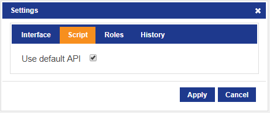

### Roles settings

The Roles settings tab allows you to specify the roles whose users will be
allowed to visit an HMI. To select a single role, click it in the list.

Hold down Ctrl and click to add multiple roles. Hold down Shift and click to
add a consecutive range of roles.

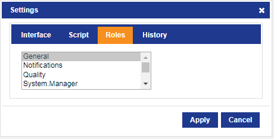

In order for users to both access an HMI and view its contents successfully,
in addition to specifying the role that enables access to an HMI you must also
ensure that any search or query used by the HMI has also been added to the
same role. For further information on assigning roles, see [Users and
roles](../../BuildandCreate/UsersAndRoles/users-and-roles-configuration.htm)
(for web searches) and [Defining Queries](../../Reporting/reporting-
developer.htm#_Toc508032241) (for queries) .

### History settings

The History settings tab allows you to see previous versions of the interface
that have been retained by the SmartSpace platform. In addition to the
currently published interface, the platform retains, by default, ten versions
of each HMI. You can go back to a particular version by clicking the Load
button next to that version. This immediately loads the selected version and
shows it in the view frame. You can then edit the loaded HMI definition, and
click Save to write an updated version, which will be given a new version
number.

For example, with the above HMI, clicking Load next to version 4 will load the
currently published version of the interface. This can be edited and then
saved, which will create a new unpublished version number 34.

## Assets

The assets dialog allows you to upload files such as images, JavaScript
libraries or CSS files so that they are hosted on the SmartSpace web site.
They can then be accessed via a URL, so you can use them in your HMI
definitions.

To manage assets, click the Assets button in the menu bar.

There are two tabs in the dialog. The Use tab allows you to select from
uploaded assets. A preview of the selected asset is shown, and the URL used to
access the asset from within an HMI is also shown.

  * Click Copy URL to copy the URL text to the clipboard.
  * Click the Delete button to remove a selected asset.

Note: There is no attempt made to track references to assets within HMIs, so
deleting an asset that is used in a published HMI version will cause that HMI
to break. Be careful to only delete assets that are no longer required.

The Create tab allows you to upload a file from your computer as a new asset
definition.

Drag the file into the dialog to select it for upload. A name will be
suggested, but can be edited for clarity, and the mime type of the asset will
be deduced. If drag doesn’t work, click the Select file button to show a file
dialog. Click Save to store the asset, then switch to the Use tab to copy the
URL for use in an HMI.

NOTE: Because asset data is stored in the SmartSpace platform, it takes up
disk space both on the server and cached on the web site under IIS control.
The platform cleans up asset data when the asset is deleted. Thus when a large
asset is no longer required it is recommended that it should be removed to
free up disk space. However it is not recommended that you delete assets that
are used in unpublished versions of HMIs that are still retained by the
SmartSpace platform as this will break those versions of the HMIs.

## Publishing an HMI

Once you have tested the functionality of an HMI, and the HMI has been
assigned to a set of roles, you can publish the HMI. Only one version of a
given HMI is published. This is the version of the HMI that is presented to
users when they navigate to the HMI. Only an administrator can view
unpublished versions of an HMI.

To publish an HMI, load the version of the HMI you want to publish, and then
click Publish on the menu bar. The footer will change to indicate that the
version shown is the published version.

If you have not yet assigned any roles to the HMI, then it will not appear
under HMIs in SmartSpace Web.

## Viewing an HMI Version Outside the Editor

To see what the currently loaded version of the HMI will look like outside the
editor, click the View link on the menu bar. You can hold down Ctrl to open in
a new tab, or Shift to open in a new window.

## Exporting and Importing HMIs

There is a command-line tool to export and import HMI definitions to/from
file. To get the tool, run Application Manager, select the DOWNLOADABLES task,
and select Visibility/HMI configuration tool. Click Download.

If you have licensed the Rules engine developer, you can use the BUSINESS
RULES workspace to load HMIs (and any dependent items) that have been
developed in other SmartSpace installations, and you can export HMIs you have
created, for use elsewhere. See the [Module import and
export](../../../ITResources/ITDocs/BusinessRulesExport/business-rules-
export.htm) guide.

### Exporting HMIs

To export HMIs, use the export mode. This writes the definition in JSON
format. Use -h to specify a particular HMI to export by name, otherwise all
defined HMIs will be exported. Use -o to write to a file. If you include -a,
then the tool will look for assets used in the HMIs, and will save the
contents of all used assets to files in the current folder.

    
    
    $ ubisense_hmi_config.exe export -a -h "Andon" -o andon.json
    export interface Andon
      export asset CF052A0A5AC3331A29AB5BC000004F6400000096.asset

### Importing HMIs

The tool can import a saved JSON file containing HMI definitions, and any
referenced asset files. Change directory to the folder containing the .json
file and the .asset files, then use the import mode. To import from a file
rather than stdin, use -i. If the tool detects referenced assets in the
interface, it will attempt to load them from the current directory.

    
    
    $ ubisense_hmi_config.exe import -i andon.json
      import asset CF052A0A5AC3331A29AB5BC000004F6400000096.asset
    import interface Andon

If you import an interface that currently exists in the SmartSpace platform,
the exported version will be restored. However it may be quickly cleaned up if
too many retained versions with higher version numbers have been saved. In
this case, edit the JSON file to increase the version number to a version
higher than the maximum version number already present, then reimport the HMI.

# The HMI API

In this section we describe the default API that is provided to make it easy
to generate HMIs that interact with the SmartSpace business objects and
properties. The API is based around the Vue.js library, and provides a binding
between HTML and the results of SmartSpace web searches and, if the Reporting
component is licensed, queries. The API also provides some built-in Vue
components that are useful for creating HMIs, and wraps the SmartSpace web map
and SmartSpace reports as components.

## Data Binding for Web Searches

Data binding supports the creation of reactive data corresponding to the
results of selected SmartSpace web searches. It allows HTML elements,
including the built-in components, to be instantiated and have their
attributes, properties, and contents bound based on the results of those
searches.

### Declarative Web Searches

The simplest way to access web searches is to use the udm attribute on an
element in your HTML. The udm attribute takes a comma-separated list of data
names and corresponding web searches:

    
    
    

      

        {{ row.Summary[0] }}
      

    

    

As another example with the same search, the following HTML creates a select
dropdown control where the text of each option is the name of the product, and
the value is the product object identifier:

    
    
    

       <select>
          <option disabled value="" >select a product </option>
          <option v-for="(row, key) in products.rows" :value="key">
            {{ row.Summary[0]  }}
          </option>
       </select>
    

    

Note the use of the v-cloak attribute, which hides the contents of the div
until the data has been bound. This prevents the ugly template syntax from
being shown to the user.

### Refreshing Searches

Searches automatically refresh at the same refresh interval as is configured
in the web search (in SmartSpace Config/WEB SEARCHES). They also refresh
immediately after you call setProperty (see Setting Object Properties). If you
need to force a refresh otherwise, the Vue object also includes a
refreshSearches method that forces an update of the results of all bound
searches.

Search details, returned if you have set the selected property on a bound
search, will be refreshed once per second.

## Data Binding for Reporting Queries

Data binding also supports the creation of reactive data corresponding to the
results of selected Reporting queries. It allows HTML elements, including the
built-in components, to be instantiated and have their attributes, properties,
and contents bound based on the results of those queries.

### Declarative Queries

The simplest way to access queries is to use the uquery attribute on an
element in your HTML with the query. The uquery attribute takes a comma-
separated list of data names and corresponding queries:

    
    
    
 },
        To: { Type: 'Time',  Value: <secs since 1/1/1970 UTC> }
      }
    

### Binding Query Results

You can use standard Vue binding to use the data fromqueries within the
contents of the element on which the uquery attribute is set. Typically you
will use:

  * v-for to create an element for each row returned by the query
  * v-bind (or “:”) to bind element attributes
  * the “Mustache” syntax (double curly braces): {{ }} to bind properties into element content
  * v-model to use a two-way binding between data and the value of a control

Vue.js binding is very powerful, and we do not cover all the possibilities
here. See the online documentation of Vue.js template syntax for more details.

For example, assuming there is a “Vehicle in Process Step” query defined, with
results BuildNo and ProcessStep, then the following HTML will result in a
table row for each row containing the build number and the process step:

    
    
    

      

        <table>
          <tr v-for="row in steps.rows" v-if="row.BuildNo">
            <td>{{ row.BuildNo }}</td>
            <td>{{ row.ProcessStep }}</td>
          </tr>
        </table>
      
  
    
 
    

Note the use of the v-cloak attribute, which hides the contents of the div
until the data has been bound. This prevents the ugly template syntax from
being shown to the user.

### Refreshing Queries

Queries automatically refresh if you have specified a refresh interval when
defining the binding (see Manual Vue Construction below). They also refresh if
you change any of the input properties on the bound data name, such as filters
or values. If you need to force a refresh otherwise, the Vue object also
includes a refreshQueries method that forces an update of the results of all
bound queries that are not disabled.

## Using the API from Javascript

### Callbacks

There are two standard callbacks you can use in JavaScript to do things once
the search data has been set up.

The normal method is to use the udm-bound attribute on the same element you
give a udm attribute. This attribute takes a JavaScript function that will be
called when the Vue.js data has been created (but not yet retrieved or
updated). The function receives an argument which is the Vue instance that has
been constructed for the element.

There is also a global function called when all Vue instances have been
constructed and bound. This is UbiHMI.loaded. Set this to a function that
should be called, which takes a single argument that is an array of Vue
instances, one for each element with the udm attribute. For example:

    
    
    UbiHMI.loaded = function (vms)
    {
      // Do something with the instances in array vms
      console.log(vms);
    }
    

Alternatively, for more advanced cases, you can switch to manual Vue
construction (see Manual Vue Construction) which gives full control over
lifecycle and data.

### Using Bound Data in JavaScript

In order to use the bound data in JavaScript, you typically need to receive a
notification when the data values change. You can use one of the callbacks to
register to watch when the bound data changes. For example:

    
    
    

     ...
    

    

Then in JavaScript define the onBound function:

    
    
    function onBound(vm)
    {
      vm.$watch("products.rows",function (newVal, oldVal) {
        // do something whenever rows change
        console.log(newVal);
      });
    }
    

Once you have got hold of the Vue instance, you can directly access the data
on that instance. For example:

    
    
    // Get the current product rows.
    var rows = vm.products.rows;
    // Iterate over them.
    for (var id in rows)
    {
       // Executes once for each product returned by the search,
       // with id as the object identifier.
       if (!rows.hasOwnProperty(id)) continue;
       var cols = rows[id].Summary;
       // do something with the summary columns.
    }
    

### Setting Object Properties

The Vue binding also provides support for setting properties of objects back
into the SmartSpace business objects and properties, just like the web map can
set properties. The properties must be settable by the role under which the
HMI is running. For information on configuring properties as settable see
[Making properties editable by
roles](../../BuildandCreate/UsersAndRoles/users-and-roles-
configuration.htm#Making).

To allow this, each Vue instance has a setProperty method:

    
    
    setProperty: function (obj, prop, val, onSuccess, onFailure)

The arguments are:

  * obj: the object identifier, such as one of the keys from search rows
  * prop: the name of the property to set, including namespaces 
  * val: the value to assign – this must be compatible with the type of the property
  * onSuccess: optional callback when the property has been successfully written back to the SmartSpace platform
  * onFailure: optional callback on failure to set the property value – usually this will be because the wrong property name was given, the object identifier is invalid, or the current user is not a member of a role that can set the property. The function is called with three arguments:
    * operation: ‘set’
    * property: the name of the property being set
    * error: the response from the server

To get the names of properties, including namespaces, you can use:

    
    
    ubisense_udm_exporter.exe –r

This will show the raw names of all properties.

Object identifiers will look something like this:

    
    
    04007zP.Ubn5FP2v000LPm00030:UserDataModel::[Custom]Product

### Error Handling

A global callback is provided for errors encountered when invoking searches,
getting details, or setting properties. To be notified of these errors, set
UbiHMI.error to be a function that takes the following three arguments:

  * error: one of 
    * ‘searches’: could not get the list of searches available to the current role 
    * ‘auth’: a search is not available for the current role 
    * ‘search’: an error was encountered executing a search 
    * ‘details’: an error was encountered getting details for the selected object 
    * ‘set’: an error setting a property value 
  * property: the name of the property if any
  * error: the response from the server if any
    * status: HTTP return code, such as 400
    * data: the data returned by the server, if any

### Manual Vue Construction

For more advanced control of data, methods, watches, etc., you can take
control of constructing the Vue instances yourself, instead of using the
declarative udm or uquery attributes. To make this easy, the API provides a
method to get a Vue “mixin” that provides all the web searchdata binding
functionality. This method is UbiHMI.mixin.

For example, the following uses JQuery document.ready mechanism to create a
Vue once all the DOM has been loaded, and bind to the “Products” search and
“ProductHistory” query:

    
    
    $(function () {
      
       var vm = new Vue({
         // The HTML element for this vue instance.
         el: '#app-progress',
         // Mix in the web search 'Products' as data field products, and the query 'ProductHistory' as data field history with a 60 second refresh interval.
         mixins: [ UbiHMI.mixin({ products: { search: 'Products'}, history: { query: 'ProductHistory', refresh: 60} }) ],
         data: {
     	 // Declare some extra data in addition to products
           size: '',
           message: ''
         },
         methods: { // your methods here }
       });
     ...
     }); 
    

Within the methods of this view class, you will have access to the bound
dynamic data in this.products and this.history.

For backward compatibility with previous syntax, the default binding is a web
search, so the following binds to a single web search called “Products”:

    
    
    ...
         mixins: [ UbiHMI.mixin({ products: 'Products' }) ],
    ...
    

### Current User and Role

The Vue object also includes data bound to the logged in user and the role.

  * vm.user: the user currently viewing the HMI.
  * vm.role: the role under which the HMI was visited, if it was visited via the HMI chooser. This may be undefined if the HMI was visited directly via its shortcut URL, or when the HMI is loaded in the Editor.

For example, the following will print the user and role within an HMI:

    
    
    

      User is {{ user }} 
       
      Role is {{ role }}
    

    

## Built-in Components

The API includes built-in Vue components. All of these must be used inside a
Vue element, so either one with a udm attribute, or one for which you have
constructed a Vue instance manually.

### Indicator

An indicator is a circular lamp that can be set to a given color and turned on
or off, based on bound data.

    
    
          <ubi-indicator size="100" 
                         :hue="row.Summary[3]" 
                         :on="row.Summary[4]">
          </ubi-indicator>
    

The indicator has the following attributes:

Attribute| Type| Default| Description  
---|---|---|---  
on| Boolean| false| The indicator is on when true.  
hue| Number| 120| The hue of the indicator, in HSL color space. For example:

0 = red60 = yellow120 = green180 = cyan240 = blue300 = magenta

  
size| String| 32px| The width and height of the indicator.  
  
### Bar

A bar is a partly filled horizontal or vertical bar, such as a progress
indicator or line, optionally with a label.

    
    
         <ubi-bar width="100" height="30" units="%"
                   :ranges="[{from:80,colour:'#faa'}]"
                   :value="row.Summary[1]">
         </ubi-bar>
    

The bar has the following attributes:

Attribute| Type| Default| Description  
---|---|---|---  
value| Number| 0| The bar position, relative to min and max.  
min| Number| 0| The value corresponding to an empty bar.  
max| Number| 100| The value corresponding to a full bar.  
units| String|  | If set, add a label in the center of the bar with the value followed by this units string.  
width| String| 200px| The width of the bar including background.  
height| String| 40px| The height of the bar including background.  
show-label| Boolean| false| Set this attribute to show a label even if units
is empty. In javascript this is property showLabel.  
ranges| Array| [ ]| Used to set the color of the bar based on the value. This
is an array of ranges, with the first matching range used as the color of the
bar. A range has a color (or colour) and an optional from and to value. For
example, the following are all valid:{from: 20, to: 40, color: ‘blue’}{from:
80, color: ‘#f00’}{colour: ‘yellow’}The latter matches regardless of the
value, so only really makes sense as the last item in ranges.A range matches
if (from <= value < to).  
vertical| Boolean| undefined| Normally the bar displays vertically if the
width is less than the height. This attribute can be used to override the bar
direction regardless of the dimensions.  
  
You can use CSS to style elements of the bar such as the background color,
font size, and whether to draw borders. To style specifically the inner
progress bar, target class “UbiHMI-bar”. For example, to make the top of a
vertical bar a solid white gap:

HTML:

    
    
         <ubi-bar class="bar" width="30" height="100" show-label
                  value="61">
         </ubi-bar>
    

CSS:

    
    
    .bar .UbiHMI-bar {
      border-top: 3px solid white;
    }
    

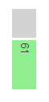

### Gauge

A gauge is a radial or linear control with a needle, scale, and other optional
elements such as labels, numerical values, and a background panel rendering.
The gauge component wraps the canvas gauges library, and supports all the same
options. It has some built-in layouts for easy configuration.

    
    
        <ubi-gauge :value="row.Summary[1]" 
                   width="130" height="130" radial>
        </ubi-gauge>
    

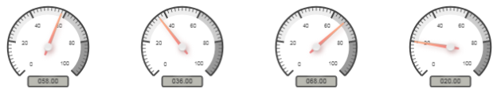

The gauge has the following attributes:

Attribute| Type| Default| Description  
---|---|---|---  
value| Number| 0| The needle position, relative to min and max.  
radial| Boolean| false| True to draw a radial gauge, false for linear.  
width| Number| 200| The width of the gauge in pixels.  
height| Number| 200| The height of the gauge in pixels.  
layout| String| undefined| Which of the built-in layouts to use – see below.  
options| Object| { }| Used to set canvas gauge options directly. This gives
full control of the gauge drawing. See the complete list of configuration
options for canvas gauges online (at time of writing, [https://canvas-
gauges.com/documentation/user-guide/configuration](https://canvas-
gauges.com/documentation/user-guide/configuration))  
  
Note: If you set options maxValue and minValue then you probably also need to
set majorTicks and highlights to match them.

The following layouts are provided:

bar| dial| compass  
---|---|---  
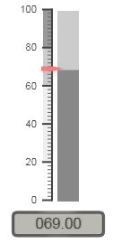| |   
clean| semi| line  
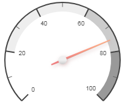| |   
ring|  |   
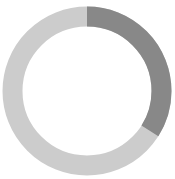|  |   
  
### Map

The map component encapsulates the SmartSpace web map, with control of
displayed elements. It allows the execution of searches, and generates an
event when an object is selected.

    
    
          <ubi-map ref="map" width="100%" height="500px"
                   search="Products" :value="271"
                   @change="selectedObjectsChanged">
          </ubi-map>
    

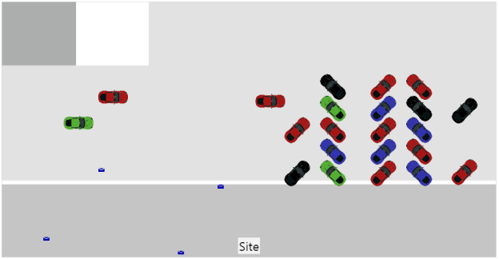

The map has the following attributes:

Attribute| Type| Default| Description  
---|---|---|---  
search| String|  | The name of the search to use.  
value| String|  | The parameter to use for the search input. Only searches with a single input parameter are supported in this release.  
width| String| 100%| The width of the map.  
height| String| 500px| The height of the map.  
details| Boolean| false| If set then show the details panel in the map.  
alerts| Boolean| false| If set then show the alerts panel in the map.  
searches| Boolean| false| If set then show the searches panel, allowing other
searches to be used.  
details-container| String|  | When set to a CSS selector string, the map will render its details panel into the first element matching that string, instead of using an internal panel. Implies details: true.  
alerts-container| String|  | When set to a CSS selector string, the map will render its alerts panel into the first element matching that string, instead of using an internal panel. Implies alerts: true.  
default-view| Object|  | When set to an object, defines the default view to use when no objects are selected. The object format is:{ cx: 
, cy: 
, w: <width>, h: <height>, theta: <rotation in degrees }For example: <ubi-map :default-view=”{cx: 10, cy: 12, w: 20, h:20, theta: 0}”></ubi-map>  
zoom-scale| Number| 6| When an object is selected for an auto-zoom search, the
map zooms in to the object. This scale determines how close the map zooms,
with smaller numbers meaning closer zooms.  
  
The Change Event

The map emits the “change” event when the user selects an object, either by
running a search that returns a single object, or by clicking on one object
from those returned by a search. This is a Vue event so doesn’t “bubble” up
the DOM from the map, and must be handled with v‑on:change or @change on the
map component. The event argument is the selected object id, and the event is
also passed the map Vue component as a second argument. When the object is
deselected, the event is called with the object id undefined.

### Report

The report component allows a SmartSpace web report to be embedded in an HMI.
The report parameters and filters can be set, and an event is generated when a
returned row is clicked.

    
    
          <ubi-report ref="report" class="reportClass" 
                      report="History" no-header
                      :filters="{ProductProcessHistory:{
                               ProductName:search,from:'one_week'}}"
                      @change="selectedObjectsChanged">
          </ubi-report>
    

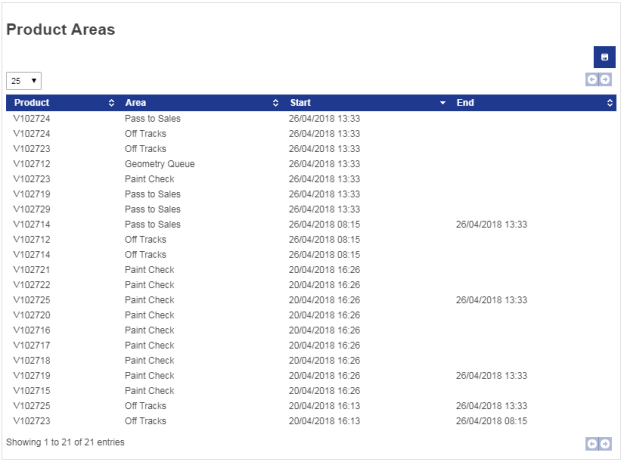

The report has the following attributes:

Attribute| Type| Default| Description  
---|---|---|---  
report| String|  | The name of the report to execute.  
values| Object| {}| The parameters to apply when executing the report. See
below.  
filters| Object| {}| The filters to apply when executing the report. See
below.  
width| String| 100%| The width of the map.  
height| String| 500px| The height of the map.  
no-header| Boolean| false| If set then hide the header of the report,
including the title, description, and parameter/filter controls.  
  
#### Parameters and Filters

The parameters and filters are specified using an object passed as the values
and filters attributes.

For parameters, the values object is used. The object can have one property
for each parameter of the report. The value of each property is an object {
Type: T, Value: V }. For example:

    
    
    <ubi-report values=”{'Date':{Type:'Time',Value:1523664000000}}”>

or in JavaScript:

    
    
    vm.values = {'Date':{Type:'Time',Value:1523664000000}};

The types supported are:

  * String: Value is just a string
  * Date: Value is the number of seconds UTC since 1st Jan 1970
  * Double: Value is a number
  * Bool: Value is true or false

For filters, the filters attribute is used. The keys of the object are source
query names used in generating the report. The value for each source is
another object with keys corresponding to the column names of that source, and
values specifying the filter values. For example:

    
    
    <ubi-report filters="{ProductProcessHistory:{
                           ProductName:'V12817',from:'one_week'}}”>
    

For string columns, the value is just a substring. For date columns, the
filter value can be one of the predefined date range strings, or a custom date
range object.

The predefined date range strings are:

this_year| this_quarter| this_month| this_week| today| last_year  
---|---|---|---|---|---  
last_quarter| last_month| last_week| yesterday| forever| two_years  
one_year| one_quarter| one_month| one_week| one_day|  
  
A custom date range looks like this:

    
    
      { 
        From: { Type: 'Time',  Value: <sec since 1/1/1970 UTC> },
        To: { Type: 'Time',  Value: <secs since 1/1/1970 UTC> }
      }
    

The Change Event

The report emits the “change” event when the user clicks a result row in a
report table. This is a Vue event so doesn’t “bubble” up the DOM from the map,
and must be handled with “v‑on:change” or “@change” on the map component.

The event has two arguments – the data for the clicked row, and the report Vue
component. The first argument is the row data, and includes all the results
from the query used for the table, including results that were not bound to a
table column. Thus it may be useful to include the relevant objects in the
query results even if they are not displayed to the user as raw identifiers,
so that the event handler can easily retrieve the object id for use elsewhere
in the HMI when a row is clicked.

As of this release there is no event generated when a report chart is clicked.

## API Examples

In this section we will show some simple examples of HMI definitions, and walk
through what is happening in each line.

### Simple Text Example

HTML:

This simple example uses only HTML.

    
    
    

      

        {{ row.Summary[0] }} is in step {{ row.Summary[1].Name }}
      

    

    

| The “Products” search is used, and for each resulting row, we create a div
containing the product name, and the name of the step the product is in. Note
that the second result of the search is an object type, so it has an Id and a
Name field – here we use the Name.  
---|---  
  
display code for copying

    
    
    

      

        {{ row.Summary[0] }} is in step {{ row.Summary[1].Name }}
      

    

    

The result looks like this:

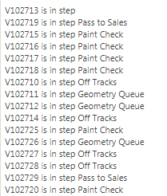

### Various Progress Controls

HTML:

The HTML uses the “Process Progress” web search, which returns an area name, a
progress in percent, the color of an indicator, and whether the indicator
should be on or off.

    
    
    

      <h2>Process area percent progress:</h2>
      

        

      

| We use v-for to create a div for each area returned which we cloak until
bound.  
---|---  
      
    
          
{{ row.Summary[0] }}

          

            <ubi-gauge :value="row.Summary[1]" layout="clean">
            </ubi-gauge>
          

          
Completion: {{ row.Summary[1] }}%

          <ubi-indicator size="50px" 
                         :hue="row.Summary[3]" 
                         :on="row.Summary[4]">
          </ubi-indicator>
          <ubi-bar class="bar" width="30" :height="100" show-label
                   :ranges="[{from:80,colour:'#faa'}]"
                   :value="row.Summary[1]">
          </ubi-bar>
        

      

    

    

| Inside each div we insert:

  * The process area name as text
  * A gauge bound to the progress percent using the built-in “clean” layout
  * A text version of the progress percent
  * An indicator based on the hue and on/off value
  * A simple bar also based on the progress percent

We also give these elements classes which will be used to lay out and style
the HMI in the style sheet.  
  
display code for copying

    
    
    

      <h2>Process area percent progress:</h2>
      

        

          
{{ row.Summary[0] }}

          

            <ubi-gauge :value="row.Summary[1]" layout="clean">
            </ubi-gauge>
          

          
Completion: {{ row.Summary[1] }}%

          <ubi-indicator size="50px" 
                         :hue="row.Summary[3]" 
                         :on="row.Summary[4]">
          </ubi-indicator>
          <ubi-bar class="bar" width="30" :height="100" show-label
                   :ranges="[{from:80,colour:'#faa'}]"
                   :value="row.Summary[1]">
          </ubi-bar>
        

      

    

    

CSS:

    
    
    .outer {
      margin: 10px;
      font-size: 1.2em;
    }
    
    .outer > * {
      margin: 10px;
    }
    
    

| We style the outer div and the main Vue div to add some margin around the
elements.  
---|---  
      
    
    #app-progress {
      display: flex;
      flex-direction: row;
      flex-wrap: wrap;
    }

|  We use the flex layout method (display: flex) to lay out the process area
divs in a row, and use flex-wrap: wrap to make the row wrap to another row if
the display is not wide enough.  
      
    
    .progress {
      text-align: center;
      width: 230px;
    }
    
    .progress > * {
      margin: 10px;
    }
    
    

| Within each process area “.progress” div, we set a width, and also align
text with the center of the div.  
      
    
    .area-label {
      font-weight: bold;
    }
    
    

| We set the area label to use bold font.  
      
    
    .bar .UbiHMI-bar {
      border-top: 3px solid white;
    }
    

| We style the top margin of the bar component’s internal bar to be a white
border, giving a gap between the bar and background.  
  
display code for copying

    
    
    .outer {
      margin: 10px;
      font-size: 1.2em;
    }
    
    .outer > * {
      margin: 10px;
    }
    
    #app-progress {
      display: flex;
      flex-direction: row;
      flex-wrap: wrap;
    }
    
    .progress {
      text-align: center;
      width: 230px;
    }
    
    .progress > * {
      margin: 10px;
    }
    
    .area-label {
      font-weight: bold;
    }
    
    .bar .UbiHMI-bar {
      border-top: 3px solid white;
    }
    

The result looks like this:

### Report, Map and Details

This example shows a manual Vue creation, with a report, a map and a details
table. We use extra data and the v-model support in Vue, along with event
handlers, to hook them together.

HTML:

    
    
    

      

    
    

| We create a div for the app and cloak it.  
---|---  
      
    
        <input id="searchName" 
               placeholder="Search for a product" 
               v-model.lazy="search">

|  Inside, we have a text input with a model bound using the lazy modifier to
the data “search”. The lazy modifier means that the model is only going to be
set when the user presses Return or Tab or otherwise moves focus away from the
input control.  
      
    
    
        

          <ubi-report ref="report" class="reportClass" 
                      report="History" no-header
                      :filters="{ProductProcessHistory:{
                         ProductName:search,from:'one_week'}}"
                      @change="selectedObjectChanged">
          </ubi-report>
          

| We create a row container, and in it put a report using the “History” report
with a filter bound to use the data “search” as the ProductName, and to use a
fixed duration of one week. Change events are handled by the method
selectedObjectChanged.  
      
    
          

            <ubi-map class="map" ref="map" height="400" width="400"
                     search="Products" :value="selectedName">
            </ubi-map>
    
            

              <h2>Details</h2>
              <table>
                <tr v-for="row in products.details"
                    :data-title="row.Title">
                  <td> {{ row.Title }} </td>
                  <td> {{ convertValue(row)  }} </td>
                </tr>
              </table> 
            

          

        

      
  
    
 
    

| We then add a new div containing a map running the “Products” search with
value bound to date “selectedName”. The div also contains a table with a row
for each detailed result in the products web search. The rows show the title
of the row, and use a converter function “convertValue” to turn the row value
into a suitable string.  
  
display code for copying

    
    
    

      

    
        <input id="searchName" 
               placeholder="Search for a product" 
               v-model.lazy="search">
    
        

          <ubi-report ref="report" class="reportClass" 
                      report="History" no-header
                      :filters="{ProductProcessHistory:{
                         ProductName:search,from:'one_week'}}"
                      @change="selectedObjectChanged">
          </ubi-report>
          

            <ubi-map class="map" ref="map" height="400" width="400"
                     search="Products" :value="selectedName">
            </ubi-map>
    
            

              <h2>Details</h2>
              <table>
                <tr v-for="row in products.details"
                    :data-title="row.Title">
                  <td> {{ row.Title }} </td>
                  <td> {{ convertValue(row)  }} </td>
                </tr>
              </table> 
            

          

        

      
  
    
 
    

Script:

    
    
    $(function () {
     

| The script uses the jquery document.ready shortcut $(function () { … }) to
execute the contents when the DOM has been fully loaded, so all the class
libraries and APIs are available.  
---|---  
      
    
      var vm = new Vue({
        el: '#app-report',
        mixins: [ UbiHMI.mixin({ products: "Products" }) ],
        data: { search: '', selectedName: '' },

| A Vue object is created and attached to the app-report element. We use the
UbiHMI.mixin to generate a web search data binding for the “Products” web
search, as data “products”. We then add the two extra data properties used in
the HTML: “search” and “selectedName”.  
      
    
        methods: {
          selectedObjectChanged: function (selected, vm)
          {
            var s = undefined;
            if (selected) {
                s = selected.Product;
                this.selectedName = selected.ProductName;
            }
            

| We implement the method selectedObjectChanged that handles the change event
in the report. If the selected row data is defined, we get the result
“Product” which is the project object identifier in this report’s query. We
also set the selectedName data property to be the “ProductName” result from
the query. This causes the map to execute its search using this product name.  
      
    
            this.products.selected = s;
          }
        }
      });  
    });
    
    

| We then set products.selected to be the object identifier that was clicked.
This causes the products detail search to be executed, which in turn will
populate the details table.  
      
    
    function convertValue(v)
    {
      if (v.hasOwnProperty('String'))
        return v.String;
      else if (v.hasOwnProperty('Number')) 
        return (v.Number === null) ? '' : new Number(v.Number);
      else if (v.hasOwnProperty('Boolean'))
        return v.Boolean ? '✔': '✘';
      else if (v.hasOwnProperty('Date'))
        return v.Date ? (new Date(v.Date)).toLocaleString() : '';
      else
        return "-";
    }
    

| Finally we implement the convertValue function used in the details table.
Here we decode the type of each detail result and return something appropriate
to render to a string in the table.  
  
display code for copying

    
    
    $(function () {
     
      var vm = new Vue({
        el: '#app-report',
        mixins: [ UbiHMI.mixin({ products: "Products" }) ],
        data: { search: '', selectedName: '' },
        methods: {
          selectedObjectChanged: function (selected, vm)
          {
            var s = undefined;
            if (selected) {
                s = selected.Product;
                this.selectedName = selected.ProductName;
            }
            this.products.selected = s;
          }
        }
      });  
    });
    
    
    
    function convertValue(v)
    {
      if (v.hasOwnProperty('String'))
        return v.String;
      else if (v.hasOwnProperty('Number')) 
        return (v.Number === null) ? '' : new Number(v.Number);
      else if (v.hasOwnProperty('Boolean'))
        return v.Boolean ? '✔': '✘';
      else if (v.hasOwnProperty('Date'))
        return v.Date ? (new Date(v.Date)).toLocaleString() : '';
      else
        return "-";
    }
    

The result is a reactive report that can be searched from the input box, and
when a row is selected the corresponding product is shown in the map, and its
details displayed below.

### Styling Bars

This example shows some advanced styling for bars using CSS.

    
    
    

      

        
{{ row.Summary[0] }}

        <ubi-bar class="bar" width="200" height="30" show-label
                 :ranges="[{from:80,colour:'#b44'}, {colour:'#4b4'}]"
                 :value="row.Summary[1]">
        </ubi-bar>
      

    

    

| We create some ubi-bars based on a web search, give them a class “bar”, and
set them to use darker colors than normal.  
---|---  
      
    
    .bar {
      border-radius: 0px 5px 5px 0px;
      padding: 3px 3px 3px 0;
      box-shadow: 3px 3px 5px gray;
      background: #bbb;
      color: white;
    }
    
    .bar .UbiHMI-bar {  
      border-radius: 0px 5px 5px 0px;  
    }
    

| Then we use the following style to give a rounded right corner, add some
shadow, padding, and make the text label white to stand out against the darker
colors. Note the CSS for borders and padding supports separate values for “top
right bottom left”.  
  
display code for copying

    
    
    

      

        
{{ row.Summary[0] }}

        <ubi-bar class="bar" width="200" height="30" show-label
                 :ranges="[{from:80,colour:'#b44'}, {colour:'#4b4'}]"
                 :value="row.Summary[1]">
        </ubi-bar>
      

    

    
    
    
    .bar {
      border-radius: 0px 5px 5px 0px;
      padding: 3px 3px 3px 0;
      box-shadow: 3px 3px 5px gray;
      background: #bbb;
      color: white;
    }
    
    .bar .UbiHMI-bar {  
      border-radius: 0px 5px 5px 0px;  
    }
    

The result looks like this:

### Progress Rings

The ring layout of the ubi-gauge provides a very clean and simple indicator of
progress. The following example shows some layout options, including how to
place a simple label over the middle of the gauge, and how to bind the color
of the ring depending on the value. The HTML looks like this:

    
    
    

      

        
{{ row.Summary[0] }}

        

          <ubi-gauge class="dial" width="200" height="200" radial 
                     layout="ring"
                     :options="{ colorBarProgress: (row.Summary[1]<80 ? 'green': 'red')}"
                     :value="row.Summary[1]">
          </ubi-gauge>
          
{{ row.Summary[1] }}
      
        

      

    

    

| Here we use the colorBarProgress option from canvas gauges library to set
the bar color to green if the value is less the 80, and red otherwise. We wrap
the gauge and the progress label in a single div, as we intend to put the
label on top of the gauge using CSS.  
---|---  
  
display code for copying

    
    
    

      

        
{{ row.Summary[0] }}

        

          <ubi-gauge class="dial" width="200" height="200" radial 
                     layout="ring"
                     :options="{ colorBarProgress: (row.Summary[1]<80 ? 'green': 'red')}"
                     :value="row.Summary[1]">
          </ubi-gauge>
          
{{ row.Summary[1] }}
      
        

      

    

    

The CSS is relatively complex:

    
    
    .app {
      display: flex;
      flex-wrap: wrap;
      background: #f5f2f0;
      justify-content: center;
      padding: 10px;
    }
    

| The outer application div is displayed using the flex layout so that the
arrangement wraps according to available screen width. The content of each row
is justified by centering. Some padding is added around the screen edges, and
a subtle gray is used to make the progress panels themselves stand out.  
---|---  
      
    
    .progress
    {
      background: white;
      margin: 15px;
      padding: 10px;
      box-shadow: 2px 2px 3px grey;  
    }
    

| The progress panel background is white, and some space is added around and
inside to avoid the layout appearing too cramped. A narrow box shadow is added
so they stand out from the background.  
      
    
    .area-label {
      font-size: 2em;
      text-align: center;
    }
    

| The area label uses a large font and is centered within the progress panel.  
      
    
    .progress-label {
      position: relative;
      font-size: 2.8em;
      width: 5em; 
      text-align: center; 
      margin: 0 auto;
      line-height: 0;
      top: -100px;
    }
    

| The progress label uses relative positioning, so it is placed relative to
the previous object (the end of the gauge). We give it a width and specify
that the text should be center aligned in that width. We then give it an
automatic left margin, which moves it into the center of its parent div
horizontally. To place it vertically, we set a line-height of zero, and offset
the top by half the height of the previous gauge component. This causes the
vertical center of the text to be on the vertical center of the gauge.  
  
display code for copying

    
    
    .app {
      display: flex;
      flex-wrap: wrap;
      background: #f5f2f0;
      justify-content: center;
      padding: 10px;
    }
    
    
    
    .progress
    {
      background: white;
      margin: 15px;
      padding: 10px;
      box-shadow: 2px 2px 3px grey;  
    }
    
    
    
    .area-label {
      font-size: 2em;
      text-align: center;
    }
    
    
    
    .progress-label {
      position: relative;
      font-size: 2.8em;
      width: 5em; 
      text-align: center; 
      margin: 0 auto;
      line-height: 0;
      top: -100px;
    }
    

The result looks like this:

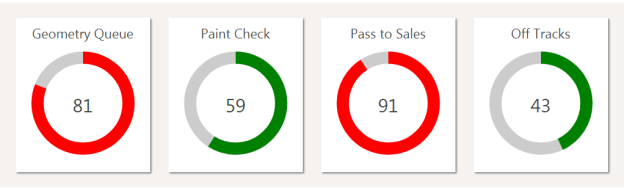

If the width of the browser is not enough to show four progress panels across,
it wraps and centers like this:

## JavaScript Libraries

The default API includes the following JavaScript libraries. The versions
selected may not be the most recent, but are known to work across the set of
modern browsers supported by the rest of SmartSpace Web. Currently this is
Internet Explorer 9 and above, Chrome 26 and above, IOS 6 and above, Android
4.1 and above.

The versions of these libraries are subject to upgrade with subsequent
releases of SmartSpace.

  * Vue.js: 2.5.13
  * Vue-resource.js: 1.3.5
  * jquery: 1.11
  * jquery-ui: 1.0.4
  * datatables: 1.9.4

  * SmartSpace HMIs
  * Introduction to HMIs
    * Requirements
  * Installing HMIs
  * Configuring HMIs
    * Opening the HMI Editor
    * The HMI Editor
    * Creating a new HMI
    * Saving an HMI
    * Errors in the HMI
    * Reloading an HMI
    * HMI Settings
      * Script Settings
      * Roles settings
      * History settings
    * Assets
    * Publishing an HMI
    * Viewing an HMI Version Outside the Editor
    * Exporting and Importing HMIs
      * Exporting HMIs
      * Importing HMIs
  * The HMI API
    * Data Binding for Web Searches
      * Declarative Web Searches
      * Binding Web Search Results
      * Refreshing Searches
    * Data Binding for Reporting Queries
      * Declarative Queries
      * Binding Query Results
      * Refreshing Queries
    * Using the API from Javascript
      * Callbacks
      * Using Bound Data in JavaScript
      * Setting Object Properties
      * Error Handling
      * Manual Vue Construction
      * Current User and Role
    * Built-in Components
      * Indicator
      * Bar
      * Gauge
      * Map
      * Report
    * API Examples
      * Simple Text Example
      * Various Progress Controls
      * Report, Map and Details
      * Styling Bars
      * Progress Rings
    * JavaScript Libraries

   

* * *

[www.ubisense.net](http://www.ubisense.net/)  
Copyright © 2020, Ubisense Limited 2014 - 2020. All Rights Reserved.

