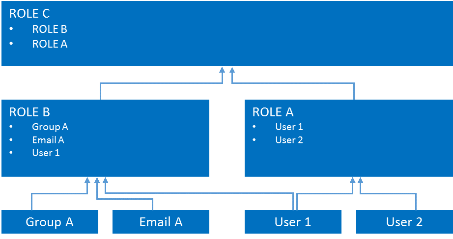

Skip To Main Content

  * placeholder

Filter:

  * All Files

Submit Search

   

You are here:

[Software
Version](../../../ComponentandFeatureOverview/FrontMatters\(Online\)/features-
and-versions.htm): 3.2

# Users, Roles, Role nesting and LDAP groups

SmartSpace roles are much like directory service groups: they are named
containers for collections of users, email addresses, user-groups and, in
SmartSpace, other roles as well. SmartSpace roles also support multi-level
nesting so it is straightforward to create specialized collections of users
and user-groups where one role can inherit quite a complex set of users,
groups and emails from the set of roles lower down in the tree.

Roles fulfill access control to a number of different access control functions
for a SmartSpace application. Depending on the roles a particular user has
access to:

  * They determine who has access to different web-based features
    1. What preconfigured searches a user can see
    2. What properties a user can edit
    3. What Web Forms a user can see
  * When Business rules are licensed, they determine which notifications (that appear on the web map) a user is allowed to receive. When a role is “notified” of an event, either a notification message is forwarded to the web map and/or an email is sent (if there are any email addresses included in the role (and its parents)).

Some further practical examples of how users and roles can be configured in
practice.

  * Assign an email address to a Role. If a notification is sent to a Role and any email addresses are assigned to that Role then an email notification will be sent to the Role.
  * Assign a Role to another Role. Say we have two Roles: Supervisors and Operators. If Supervisors is a member of Operators then:
    1. If a user is assigned the Supervisors role then they also inherit the Operators role.
    2. If a notification is sent to the Operators role then it is also sent to the Supervisors role and all its members.   
Note the inverse is not true: a member of Operators is not member of
Supervisors and a notification sent to Supervisors is not sent to Operators.

  * Assign a directory service group to a Role (without or without email notifications). If a user is a member of the group, or one of its child groups, then the user inherits the Role. If a notification is sent to the Role then all members of the group receive the notification and, if email notifications are enabled, all users receive an email.
  * A single notification in a single event handler can result in a mix of emails and web map notifications depending on the role configuration. It is also possible to notify a single email address directly in an Event Handler.

## Default Roles in SmartSpace

SmartSpace is supplied with the following roles which control access to
different parts of SmartSpace Web:

  * System.Operator: members of the System.Operator role can access the Tag and Battery Status screen and the Sensor Status screen.
  * System.Manager: members of the System.Manager role can access the Roles screen and the Shifts screen.
  * Ubisense.SmartSpace.Administrator: if Reports engine developer is licensed, members of the Ubisense.SmartSpace.Administrator role can view all reports and create and edit new ones. 

These roles are nested: System.Manager is a member of System.Operator; and
Ubisense.SmartSpace.Administrator is a member of System.Manager. This means
that the permissions are inherited so that by default the different roles can
access screens in SmartSpace Web as follows:

|  Report Creation  | HMI Creation  |  Roles  |  Shifts  |  Tags  |  Sensors   
---|---|---|---|---|---|---  
System.Operator  |  |  |  |  |   |    
System.Manager  |  |  |   |   |   |    
Ubisense.SmartSpace.Administrator  |   |   |   |   |   |    
  
  * Users, Roles, Role nesting and LDAP groups
    * Default Roles in SmartSpace

   

* * *

[www.ubisense.net](http://www.ubisense.net/)  
Copyright © 2020, Ubisense Limited 2014 - 2020. All Rights Reserved.

