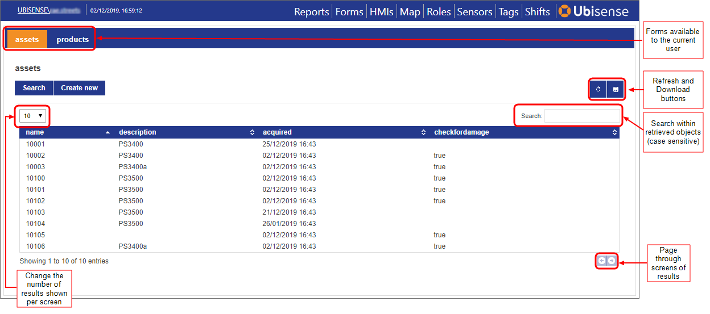
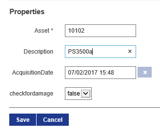

Skip To Main Content

  * placeholder

Filter:

  * All Files

Submit Search

   

You are here:

[Software
Version](../../../ComponentandFeatureOverview/FrontMatters\(Online\)/features-
and-versions.htm): 3.2

# Configuring Web forms

## Searches and Web Forms

The data displayed in a web form or "screen" is retrieved by a search in the
same way as it is for web maps (described in [ Searches and Web
maps](../Webmaps/web-maps-introduction.htm)). Hence, the first part of
creating a web form is choosing or creating an appropriate search. Detailed
information about configuring searches is available in [Web
searches](../../BuildandCreate/WebMaps/web-searches-configuration.htm).

Not all options in the Web searches workspace are relevant to Web forms.

When configuring searches for use in forms, you specify an object (the subject
of the search) and properties for display in a table. Additionally, you choose
which properties are displayed, and optionally edited, when an object is
selected in the table.

When you create a search for use with a web form, you must also ensure that
the search has been added to the roles who will be using the web form. Also,
if you want users to edit properties on the screen, you must make them
"settable". Use the Users and roles workspace to assign searches to roles and
to make properties editable. See [Access Control
Management](../../BuildandCreate/UsersAndRoles/users-and-roles-
configuration.htm#Access).

If you have licensed the Rules engine developer, you can use the BUSINESS
RULES workspace to load screens (and any dependent items, such as the search a
screen is based on) that have been developed in other SmartSpace
installations, and you can export screens you have created, for use elsewhere.
See the [Module import and
export](../../../ITResources/ITDocs/BusinessRulesExport/business-rules-
export.htm) guide.

## Defining Screens

When you have chosen your search, create the screen using the Web forms
workspace. Here you can give the screen a name, assign the search, and
determine how users interact with it. Once created, you can refine the basic
configuration as discussed in the sections below. See [Configuration options
for Web forms](../../BuildandCreate/WebForms/web-forms-
configuration.htm#Configur) for how to define these options for your screen.

To include your screen on the Configuration screen in SmartSpace Web, you must
assign it to the roles who require access to it. See [Assigning a screen to a
role](../../BuildandCreate/WebForms/web-forms-configuration.htm#Assignin).

### Tag association/disassociation

One of the key features of web forms is to allow manual association and
disassociation of tags and objects. This is configured by selecting the tag
association mode when defining the form.

There are four possible choices of tag association for a web form:

  * Not Allowed: No tag association fields will be available in the form. This is the default.
  * Allowed: When a row is selected, or Create new is clicked, so that the form is displayed, there will be a section “Tag Association” containing tag id and position fields. The user may leave the tag id as the default, in which case no tag will be associated with the object.
  * Compulsory: As Allowed, but if the user leaves the tag id as the default and clicks Save, then the form will display the error Some compulsory values not entered.
  * Disassociation: The form is used to disassociate tags from objects. The Save button becomes Disassociate. See Buttons in Web forms for how to configure a form to disassociate a tag and also delete an object.

For examples of configuring forms for the manual association and diassociation
of tags, see [Creating forms for manual tag association and
disassociation](tag-association-disassociation-web-forms.htm)

#### Default Tag Types

When a web form is used for tag association, it allows the input of a tag
type. The default tag type to assign can be set using the tag_default_type
configuration parameter, which is set to the name of one of the
DIMENSION4-supported tag types: Industrial tag (C cell), Minitag, Powered tag,
Tool tag (A cell). Manual input of tag types can be turned off with the web
form option Hide tag types. See [Configuration options for Web
forms](../../BuildandCreate/WebForms/web-forms-configuration.htm#Configur) for
further information. If a default type is configured, and Hide tag types has
been set, the default type will be used automatically.

#### Default Prefix for Tag IDs

The configuration parameter tag_default_prefix is set to 00:11:CE:00: by
default. When creating a new tag association, the tag id field is prefilled
with this prefix. This allows the user to fill in the rest of the tag id, if
manually entering it. If the tag id is scanned using a barcode reader, the
prefix is automatically ignored, so the correct tag id will be assigned
without having to clear the prefix before scanning.

### Data input in Web forms

You can configure web forms to allow users to edit the properties of existing
objects or to add completely new instances of objects. Properties must have
been made settable for the role(s) who will carry out data input and must have
been added to the details view of the search on which the form is based.
Additionally, properties can be made mandatory, and specific formats can be
enforced for object names (see [Configuring input
constraints](../../BuildandCreate/WebForms/web-forms-
configuration.htm#Constraints)).

One important use of the mandatory setting is to prevent the creation of
objects with no names. To ensure that any objects that are created or edited
in a web form have a value entered for the property that is the object's name,
it is advisable to make that name property mandatory.

### Buttons in Web forms

Web forms can also be configured to include custom buttons that set properties
of existing objects. The buttons are linked to a Bool valued property of the
object, and when clicked, set the value to true for the selected object.
Business rules, or integration code, can then perform some action based on
that Bool property being set for the object. See [Adding buttons to a
screen](../../BuildandCreate/WebForms/web-forms-configuration.htm#Adding) for
further information.

#### Manually deleting objects

One built-in Boolean property of objects that can be set using a button is the
“delete pending flag”. Creating a button based on this property is the
recommended way to allow certain web site users to manually delete objects
from the system. The “delete pending flag” follows the correct sequence of
actions by first disassociating any tag from the object, then deleting the
object from the data model, so it avoids any race condition where the object
could receive a location after it has been removed. If additional clean up
actions are required before deleting the object, then another Boolean property
should be used along with business rules/integration code to do the clean-up
and then set the delete pending flag to finally remove the object.

### Colors in Web forms

Web forms can be configured to use object properties to set the color of parts
of the result list. To do this, there must be a string valued property of the
object type that contains valid HTML5 color strings. See [Defining colors for
a screen](../../BuildandCreate/WebForms/web-forms-configuration.htm#Defining)
for how to configure colors in web forms.

# Web forms at runtime

SmartSpace web forms are browser-based tables each displaying data based on a
predefined search (described in [Web
searches](../../BuildandCreate/WebMaps/web-searches-configuration.htm)).

Each form is accessed via a tab at the top of the Configuration screen in
SmartSpace Web. Only forms available to your role(s) will be shown (configured
in the [Web forms workspace](../../BuildandCreate/WebForms/web-forms-
configuration.htm#The)).

In order to display object data, you must belong to a role which is authorized
to run the search associated with the form (configured in the [Users and roles
workspace](../../BuildandCreate/UsersAndRoles/users-and-roles-
configuration.htm#user-roles)). If For searches that do not run automatically,
click the Search button to run the search. Once displayed, data updates
dynamically. Click the Refresh button to refresh the data manually. Click the
Download button to export the tabulated data to a file in CSV format.

You can sort on one or more columns in the table. Click the heading of the
first column to sort on. Click a second time to reverse the sort order. To
sort on additional columns, hold down Shift and click the relevant headings.

Clicking on an object's details causes additional information about the
object's properties to be displayed below the table. If your role permits, you
can edit the object's properties here. Click Save to update the data model
with your changes.

New objects can also be added to the data model, again if your role permits
this: click on Create new to open a blank form for data entry. Properties
marked with an asterisk (*) are mandatory. Any rules constraining the format
of object names will be enforced.

When inputting or amending dates, click the date input box to display the date
and time dropdown:

Here you can:

  * Select the date from the calendar, and set the time using the sliders
  * Type a date and time directly (not available in mobile device mode):

    * Use / to separate parts of the date and : to separate hours and minutes
    * Time is in 24-hour format
    * Seconds are permitted if the details format (in WEB SEARCHES in SmartSpace Config) has seconds precision.

  * Click Now to select the current date and time

Click Done to save the changes.

There may also be custom buttons on the form (see [Adding buttons to a
screen](../../BuildandCreate/WebForms/web-forms-configuration.htm#Adding) for
how to add buttons). Click on the button to trigger the custom event
associated with it.

  * Configuring Web forms
    * Searches and Web Forms
    * Defining Screens
      * Tag association/disassociation
      * Data input in Web forms
      * Buttons in Web forms
      * Colors in Web forms
  * Web forms at runtime

   

* * *

[www.ubisense.net](http://www.ubisense.net/)  
Copyright © 2020, Ubisense Limited 2014 - 2020. All Rights Reserved.

