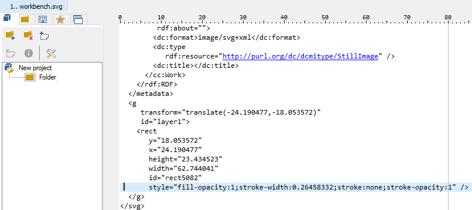

Skip To Main Content

  * placeholder

Filter:

  * All Files

Submit Search

   

You are here:

[Software
Version](../../../ComponentandFeatureOverview/FrontMatters\(Online\)/features-
and-versions.htm): 3.2

# Dynamic color in object representations on the web map

By using suitably configured reps, and types with a color property, you can
display objects on the web map with different colors associated with different
object instances. The key to achieving this is to create a "fillable" graphic
that can be associated with a type and custom representation mode in a search.
To change colors of the reps, the map sets the 'fill' style at the top level
of the SVG to a different color for each object rendered. This fill style is
then inherited by elements within the SVG that do not have their own fill
style set. So to make this work you need an SVG for which the key elements,
and their parents, have no fill specified.

You can also make objects' colors editable directly on the web map. However,
this configuration is most powerful when it is possible to make changes to
objects' colors based on their status: this can be done using the Business
rules engine, if licensed, or by external integration.

The following section gives an example of how to assign dynamic color
properties to objects.

  1. To display objects with configurable colors, you need appropriately formatted vector graphics (.SVG) created using software such as Inkscape or Illustrator. The example below uses Inkscape. If you use a different editor, such as Illustrator, the process will be different: refer to the relevant user documentation for the software you are using. For an example of creating a fillable SVG in Illustrator, see [Generating a color-editable SVG](../../../ITResources/ITDocs/Graphics/ColorEditableSVGs/color-editable-SVG-creation.htm).

To make the image fillable:

     * Select it and in the Fill and Stroke dialog, ensure the graphic has its fill set to undefined (click the  button).
     * Choose Resize Page to Selection from the Edit menu to crop the page.
     * Save the image in Plain SVG format.

The example below shows workbench.svg prepared for use as a fillable graphic.

  2. You can check the settings by opening the SVG in an editor such as PSPad. For example:

The style on the rect element does not specify a fill color, and neither do
any of its parent elements.

  3. In SmartSpace Config, import the graphic using the MODEL IMPORT task, scale it and set the origin. For example:

  4. In SmartSpace Config, use the TYPES / OBJECTS task to add a color property to a type. Select the type and then double-click <Create new property>. In the dialog, enter color for the property's name and make its type String. Add some objects of this type and give them colors using one of the following formats:

     * A named color supported by all browsers. There are many web references for this list of colors, for example: <https://www.w3schools.com/colors/colors_names.asp>.
     * A hex color, such as “#FF0000”, where the bytes are red, green, blue.
     * A transparent color using the form “rgba(128,0,233,0.5)”. Here the first three parts are red, green and blue components in the range 0-255, and the last part is a floating point transparency (alpha) in the range 0-1, where 1 is a solid color, and 0 is completely transparent.

In the example below, the Workbench type has a color property, and several
instances of the type with their individual colors have been added:

  5. In SmartSpace Config, use the MODEL ASSIGNMENT task to assign the fillable rep to the type and give it a representation mode. Double-click <Add new type rep>, choose the type and rep and enter a name for the custom rep mode. In the example below, the Workbench type is chosen and the workbench model is assigned to it along with the colored rep mode:

  6. In SmartSpace Config, use the WEB SEARCHES task to add the rep mode and the color field to a search:

     * In the Representation modes section of the workspace, double-click <Add mode>, choose the rep mode you created in the MODEL ASSIGNMENT task and click Add.
     * Drag the color property you want to display into the Representations section of the workspace.

In the example below, a search has been created based on the color of the
workbench, the custom rep mode colored has been added to the list of modes and
the property color of <Workbench> has been added to the representations.

  7. In SmartSpace Web, when the search is run, each located object is filled with the color defined for it. For example:

  * Dynamic color in object representations on the web map

   

* * *

[www.ubisense.net](http://www.ubisense.net/)  
Copyright © 2020, Ubisense Limited 2014 - 2020. All Rights Reserved.

