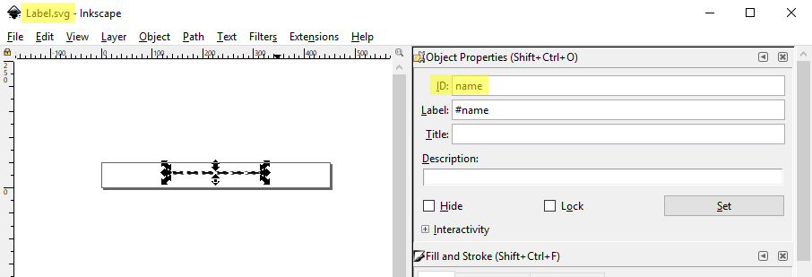

Skip To Main Content

  * placeholder

Filter:

  * All Files

Submit Search

   

You are here:

# Adding a label to the representation of an object

By using suitably configured reps and types, you can display objects on the
web map with a label associated with each object instance that contains a
value taken from a simple property of the object type. The key to achieving
this is to ensure the Title field for the object's representation in the
search configuration matches the ID of the field in the .SVG file used to
provide the "fillable" label. For example, here the Label.svg file has an ID
name which has been associated with a rep in the WEB SEARCHES task:

Some care should be taken when adding labels to SVGs due to how SmartSpace
handles their display on the web map.

When SVGs with labels are used as representations, SmartSpace attempts to keep
the text the right way up when it displays objects using this rep on the web
map. This may mean that the rep is rotated differently to the associated
object. For example when an object with an SVG with a label is rotated by 180
degrees, the rep gets rotated by 360 degrees to prevent label text displaying
upside down. This flipping of the rep's orientation may cause unexpected
results with asymmetric reps.

If reps of this type are used as background maps, this behavior may be
especially confusing for users as part of their frame of reference may
suddenly rotate. Because of this, it is recommended not to add text labels in
SVGs of background maps. Instead, if labels are required, create them as
separate background objects relative to the background map.

The following example shows how to add labels to identify objects on the web
map.

  1. To add a label with configurable text, you need to create an appropriately formatted vector graphic (.SVG) with a field to fill in, using software such as Inkscape or Illustrator. The example below uses Inkscape. If you use a different editor, such as Illustrator, the process will be different: refer to the relevant user documentation for the software you are using. For an example of creating a fillable SVG in Illustrator, see [Generating a color-editable SVG](../../../ITResources/ITDocs/Graphics/ColorEditableSVGs/color-editable-SVG-creation.htm).

In the example below, the graphic has the following properties:

     * a 'text' element to fill in whose ID is name.
     * the filename Label.svg

  2. In SmartSpace Config, import the graphic using the MODEL IMPORT task, and scale it. Set the origin of the rep to give you the offset you want from the object it will be labeling.
  3. In SmartSpace Config, use the MODEL ASSIGNMENT task to assign the rep to a type and enter a custom rep mode. Double-click <Add new type rep> and in the Representations assigned to types dialog, select a type and a mode, and type the name of the custom rep mode.

In the example below, the rep Label.svg has been assigned to the Production
Order type and has been given the custom rep mode label.

  4. In SmartSpace Config, use the WEB SEARCHES task to add the rep mode and the fillable field to your search:

     * In the Representation modes section of the workspace, double-click <Add mode>, choose the rep mode you created in the MODEL ASSIGNMENT task and click Add.
     * Drag the simple property you want to display into the Representations section of the workspace. Set the Title to the ID of the SVG field you want to fill by slowly double-clicking in the Title column beside the property and typing the name of the field.

In the example below, the custom rep mode label has been added to the list of
modes and the property name of <ProductionOrder> has been added to the
representations and its title has been set to name.

  5. In SmartSpace Web, when the search is run, the label by each object is filled with the value of the simple property. Here each Production Order object on the map is identified by its name:

  * Adding a label to the representation of an object

   

* * *

[www.ubisense.net](http://www.ubisense.net/)  
Copyright © 2020, Ubisense Limited 2014 - 2020. All Rights Reserved.

