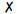
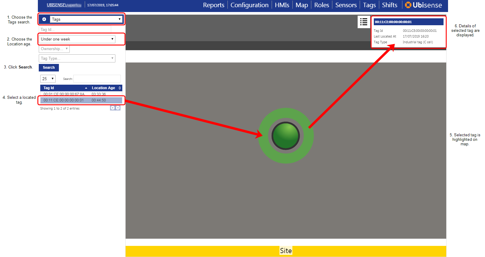

Skip To Main Content

  * placeholder

Filter:

  * All Files

Submit Search

   

You are here:

[Software
Version](../../../ComponentandFeatureOverview/FrontMatters\(Online\)/features-
and-versions.htm): 3.5

# Displaying tag locations on the web map

Use the "Tags" search to display the locations of tags on the web map.

This search is built into SmartSpace and cannot be modified in SmartSpace
Config other than to be [added to
roles](../../BuildandCreate/UsersAndRoles/users-and-roles-
configuration.htm#Adding3) and to have its priority set. Additionally the
search does not run automatically: in the web map you must click Search after
specifying the required parameters. Thereafter, the search refreshes every 60
seconds and the details window refreshes every second.

You can refine the search by specifying a tag ID, tag type, location age, and
ownership.

To display tag locations:

  1. In the Map screen in SmartSpace Web, choose Tags from the list of searches.

If you cannot see the Tags search in the list, it may not have been assigned
to your role.

  2. Choose the Location age.

This can be:

     * Under one minute to display tags located within the last minute
     * Under one hour to display tags located within the last hour
     * Under one day to display tags located within the last day
     * Under one week to display tags located within the last week

Leave unset for all tags.

  3. You can further refine the search by specifying:

     * Tag Id

Type a complete or partial ID of the tag(s) to be displayed.

     * Ownership

From the dropdown, choose:

       *  for assigned tags only
       *  for unassigned tags

Leave unset for all tags.

     * Tag type

This can be one of the tag types defined for your system, or No tag type to
display tags for which a tag type has not been defined. Leave unset for all
tags.

  4. Click Search and the web map displays. Located tags are listed ion the left-hand side of the screen and you can display the following details for a selected tag: tag ID, last located date/time, the assigned owner of the tag (if there is one), and tag type (if set).

   

* * *

[www.ubisense.net](http://www.ubisense.net/)  
Copyright © 2020, Ubisense Limited 2014 - 2020. All Rights Reserved.

