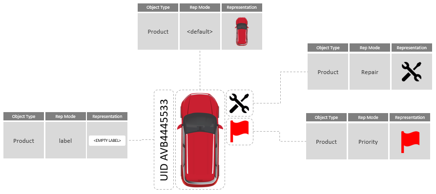
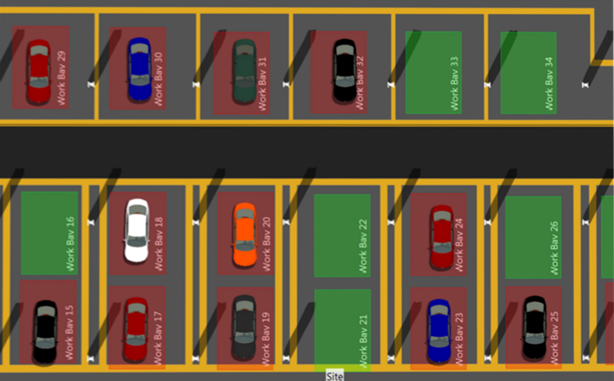
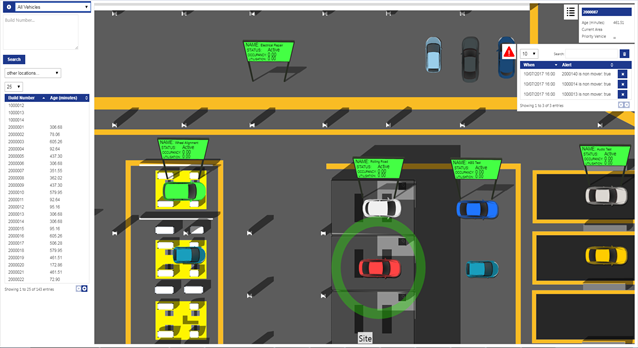
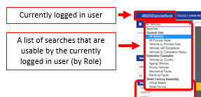
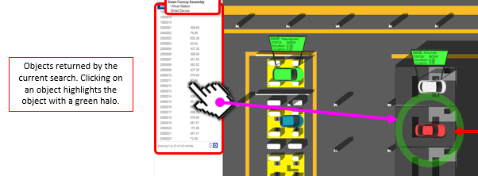
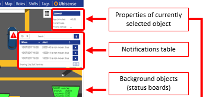

Skip To Main Content

  * placeholder

Filter:

  * All Files

Submit Search

   

You are here:

[Software
Version](../../../ComponentandFeatureOverview/FrontMatters\(Online\)/features-
and-versions.htm): 3.2

#  Searches and Web maps

## Searching by Property

A “search” in SmartSpace is a configured query that uses a single property to
retrieve a set of objects. These are returned in a table, along with selected
other property values of each object. This result table can then be presented
to users in different ways, including displaying the objects on a web map or
tabulating them in a [web form](../Webforms/web-forms-concepts.htm).

Some examples of searching by property include:

  1. Retrieving all objects of a particular type by their unique “name” property
  2. Retrieving all objects of a particular type based on a string property called “country code”
  3. Retrieving all objects of a particular type based on an integer property that’s being used as a counter

In addition, the search can include an optional filter specified by the user
to restrict the results returned. This allows you to filter the results using
a property that is common to all of the objects in the set. For example:

  * Filtering the result set for example B by a common string property, such as a category value  
In this way, users can choose to retrieve only objects that have the values
[DE, USA, UK] but ignore objects that have the values [JP, FR, SP].

  * Filtering the result set for example C by integer values of the property  
An example would be to retrieve only objects who have their counter value = 5.

Any property can be used as the basis for a search, and if a complex property
is used, multiple filters can be defined based on the property columns, to
help filter the results further.

The key facts for remember about these “searches” are:

  * They are predefined in structure
  * They are based on a single type 
  * Their results can be presented in different visualization forms

Detailed information about configuring searches is available in [Configuring
web searches](../../BuildandCreate/WebMaps/web-searches-
configuration.htm#Configur).

## Applying Representation Modes to Objects on the web map

To be able to display the objects returned by a search filter in the
SmartSpace web map, the web map must be told which representations to use for
the objects. You apply representations to the objects in a result set by
choosing one (or several) representation modes which have previously been
allocated to objects of that type (see [Adding a representation to a
type](../../BuildandCreate/SiteVisualization/assignreps/model-
assignment.htm#Adding)). This has the effect of overlaying the origin of the
representation referenced by the representation mode onto the origin of the
object in the web map. A single object can have multiple representation modes
included for any particular search as shown below:

For examples of using representation modes to add labels, see [Adding a label
to the representation of an object](labels-for-representations-web-maps.htm).

The use of representation modes is most useful when it is possible to assign
them to and remove them from objects based on their status, which requires the
Business rules engine to be licensed.

## Foreground and Background Searches

Search filters allow you to retrieve a single set of objects based on
properties of that class of object. But what if you wanted to display more
than one object type on the web map at once? To this end, SmartSpace supports
the concept of foreground and background searches, which allow the primary
search (called the foreground search) to call other searches (called
background searches) in order to display different sets of objects alongside
the objects returned in the primary search.

An example might be a foreground search for objects of type Product and a
background search for objects of type Workstation. This would allow you to
visualize where all the products are, and also see which workstations are
currently occupied or available, as shown above.

### Foreground and background representation modes

When a search filter is expected to be used as both a foreground and a
background search, as described above, it can be useful to switch between
different representations depending on how the search was run. An example
would be a foreground search that retrieves and renders all objects with a
particular property value (say a Boolean property set to true) onto the web
map. Then, because knowing the location of objects of the same type that
didn't meet the criteria provides a useful decision-making context, you might
also want to see them rendered on the map as well. How would you distinguish
between the object returned in the primary search versus objects returned in
the secondary (background search)?

In this case SmartSpace has two built-in representation modes called
foreground and background. If both foreground and background rep modes are
added to a single search definition, the foreground rep mode is displayed when
the search is run as a foreground search and, similarly, the background rep
mode is displayed when the search is run as a background search. In this way
it is possible to use a different representation for objects depending on
which mode the search is run in, and visually distinguish between sets of
objects displayed on the map.

## Views

When a search filter is used to display located objects in the web map, an
additional spatial parameter must be configured which provides a “spatial
window” for objects returned by the search. The effect of adding this window
is that objects that don’t fall inside the window (by virtue of their
location) are removed from the result set and not displayed on the map. This
windowing capability is the result of configuring one or more “Views” for the
site. Views are based on the cellular structure of the platform, so can be the
whole site, or specific parts of the site. This makes it possible to segment a
site into viewable areas which can be assigned to different user roles or
departments, for example returning cars in the "Rework" area for the rework
team.

# Web maps at runtime

The SmartSpaceweb map is a browser-based rendering of a customer site
including a background site representation with one (or many) object types
overlaid. You can move around the map using your mouse or touch screen to pan
and zoom and select objects to view or even edit their properties.

The objects displayed in the web map are those returned by some predefined
search, as described in  Searches and Web maps. You can select or change
searches using a drop-down menu at the top left of the map screen. You only
see searches which are part of the roles of which you are a member.

When you select and run a search, the objects that match the search are listed
in a results view on the left-hand side of the screen. The results view
includes columns for properties relevant to the search (these are
configurable: see [Configuring web searches](../../BuildandCreate/WebMaps/web-
searches-configuration.htm#Configur)). Click on any object in the results view
and the map view pans and zooms to the location of the object and a circular
green halo highlights it.

Clicking on the object’s representation, or double clicking in the result
list, pops up a properties window at the top right of the web map. This window
displays more details about the selected object. The properties shown are
configurable (see [Configuring web searches](../../BuildandCreate/WebMaps/web-
searches-configuration.htm#Configur)) and additionally can be made editable to
support user input.

When inputting or amending dates, click the date to display the date and time
dropdown:

Here you can:

  * Select the date from the calendar, and set the time using the sliders
  * Type a date and time directly (not available in mobile device mode):

    * Use / to separate parts of the date and : to separate hours and minutes
    * Time is in 24-hour format
    * Seconds are permitted if the details format (in WEB SEARCHES in SmartSpace Config) has seconds precision.

  * Click Now to select the current date and time

Click Done to save the changes.

When the Business rules engine is licensed, it is also possible to generate
notification events. These are automatically pushed to the web map and appear
in a list below the object properties window. You can click on individual
notifications which (if configured to do so) will cause the map view to jump
to the location of the object that generated the event. You can acknowledge
and clear notifications individually, or all together using a Clear All
button.

## Passing parameters to Web maps

You can display a web map using a given configured search so that it
immediately searches for an object, or multiple objects, for immediate display
without the need for further interaction. This can be achieved by specifying
the object and search in an extended URL.

You can only use a search which is authorized by your role(s), and the web map
will warn you if a requested search is not available.

### Parameter Specification

Parameters are specified by adding an "anchor" part to the normal web map URL.
This is the part of the URL after a '#'.

The anchor text must contain a JSON structure, encoded using the standard URL
encoding specified in RFC 3986. The structure has the following form:

    
    
    {"Search":"search name","Role":"role name","Values":["param1",...]}
    

  * The search name is the untranslated name of the search (i.e. the name in the default language).

  * The role is an optional argument. When a user has a given search assigned for more than one role, this can be used to run the search as one of those roles.

  * The values are entered into each search parameter in the order given.

  * If a parameter is a selection, the value given should be the text of the selection required.
  * If a parameter is a date, the value should be given in the format for the locale of the browser.

For example, a search called Vehicles is executed with the parameter
VIN20132372 as follows:

    
    
    {"Search":"Vehicles","Values":["VIN20132372"]}
    

This is encoded to produce the following string:

    
    
    %7B%22Search%22%3A%22Vehicles%22%2C%22Values%22%3A%5B%22VIN20132372%22%5D%7D
    

So if the SmartSpace web site is `http://smartspace.internal/SmartSpace`, then
the URL to execute this search is:

    
    
    http://smartspace.internal/SmartSpace/IF#%7B%22Search%22%3A%22Vehicles%22%2C%22Values%22%3A%5B%22VIN20132372%22%5D%7D
    

### Search Execution

When a search returns only a single row as a result, that row is selected and
the resulting object zoomed if it has a location.

If the parameter is incorrectly formed, a warning is generated.

### Alternative URL Encoding

Some online tools generate URI encoded strings that use "+" as the encoded
form of a space. These formats may not be correctly decoded by the web map, so
if your search or role has a space in its name, and it doesn't seem to be
working, check that the encoded string doesn't have "+" in place of each
space. The correct form uses "%20" to encode a space.

For example: if the search name was "Vehicles with faults" and the string
looks like this, then it is wrong:

    
    
    %7B%22Search%22%3A%22Vehicles+with+faults%22%2C%22Values%22%3A%5B%22VIN20132372%22%5D%7D
    

The correct form would be:

    
    
    %7B%22Search%22%3A%22Vehicles%20with%20faults%22%2C%22Values%22%3A%5B%22VIN20132372%22%5D%7D
    

  * Searches and Web maps
    * Searching by Property
    * Applying Representation Modes to Objects on the web map
    * Foreground and Background Searches
      * Foreground and background representation modes
    * Views
  * Web maps at runtime
    * Passing parameters to Web maps
      * Parameter Specification
      * Search Execution
      * Alternative URL Encoding

   

* * *

[www.ubisense.net](http://www.ubisense.net/)  
Copyright © 2020, Ubisense Limited 2014 - 2020. All Rights Reserved.

