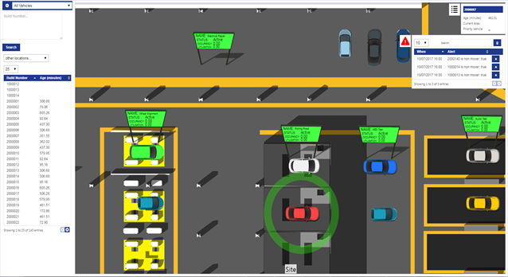
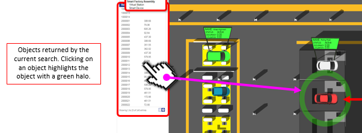

Skip To Main Content

  * placeholder

Filter:

  * All Files

Submit Search

   

You are here:

[Software
Version](../../../ComponentandFeatureOverview/FrontMatters\(Online\)/features-
and-versions.htm): 3.2

# Web maps at runtime

The SmartSpace web map is a browser-based rendering of a customer site
including a background site representation with one (or many) object types
overlaid. You can move around the map using your mouse or touch screen to pan
and zoom and select objects to view or even edit their properties.

The objects displayed in the web map are those returned by some predefined
search, as described in [ Searches and Web maps](web-maps-introduction.htm).
You can select or change searches using a drop-down menu at the top left of
the map screen. You only see searches which are part of the roles of which you
are a member.

When you select and run a search, the objects that match the search are listed
in a results view on the left-hand side of the screen. The results view
includes columns for properties relevant to the search (these are
configurable: see [Configuring web searches](../../BuildandCreate/WebMaps/web-
searches-configuration.htm#Configur)). Click on any object in the results view
and the map view pans and zooms to the location of the object and a circular
green halo highlights it.

Clicking on the object’s representation, or double clicking in the result
list, pops up a properties window at the top right of the web map. This window
displays more details about the selected object. The properties shown are
configurable (see [Configuring web searches](../../BuildandCreate/WebMaps/web-
searches-configuration.htm#Configur)) and additionally can be made editable to
support user input.

When inputting or amending dates, click the date to display the date and time
dropdown:

Here you can:

  * Select the date from the calendar, and set the time using the sliders
  * Type a date and time directly (not available in mobile device mode):

    * Use / to separate parts of the date and : to separate hours and minutes
    * Time is in 24-hour format
  * Click Now to select the current date and time

Click Done to save the changes.

When the Business rules engine is licensed, it is also possible to generate
notification events. These are automatically pushed to the web map and appear
in a list below the object properties window. You can click on individual
notifications which (if configured to do so) will cause the map view to jump
to the location of the object that generated the event. You can acknowledge
and clear notifications individually, or all together using a Clear All
button.

## Passing parameters to Web maps

You can display a web map using a given configured search so that it
immediately searches for an object, or multiple objects, for immediate display
without the need for further interaction. This can be achieved by specifying
the object and search in an extended URL.

You can only use a search which is authorized by your role(s), and the web map
will warn you if a requested search is not available.

### Parameter Specification

Parameters are specified by adding an "anchor" part to the normal web map URL.
This is the part of the URL after a '#'.

The anchor text must contain a JSON structure, encoded using the standard URL
encoding specified in RFC 3986. The structure has the following form:

    
    
    {"Search":"search name","Role":"role name","Values":["param1",...]}
    

  * The search name is the untranslated name of the search (i.e. the name in the default language).

  * The role is an optional argument. When a user has a given search assigned for more than one role, this can be used to run the search as one of those roles.

  * The values are entered into each search parameter in the order given.

  * If a parameter is a selection, the value given should be the text of the selection required.
  * If a parameter is a date, the value should be given in the format for the locale of the browser.

For example, a search called Vehicles is executed with the parameter
VIN20132372 as follows:

    
    
    {"Search":"Vehicles","Values":["VIN20132372"]}
    

This is encoded to produce the following string:

    
    
    %7B%22Search%22%3A%22Vehicles%22%2C%22Values%22%3A%5B%22VIN20132372%22%5D%7D
    

So if the SmartSpace web site is `http://smartspace.internal/SmartSpace`, then
the URL to execute this search is:

    
    
    http://smartspace.internal/SmartSpace/IF#%7B%22Search%22%3A%22Vehicles%22%2C%22Values%22%3A%5B%22VIN20132372%22%5D%7D
    

### Search Execution

When a search returns only a single row as a result, that row is selected and
the resulting object zoomed if it has a location.

If the parameter is incorrectly formed, a warning is generated.

### Alternative URL Encoding

Some online tools generate URI encoded strings that use "+" as the encoded
form of a space. These formats may not be correctly decoded by the web map, so
if your search or role has a space in its name, and it doesn't seem to be
working, check that the encoded string doesn't have "+" in place of each
space. The correct form uses "%20" to encode a space.

For example: if the search name was "Vehicles with faults" and the string
looks like this, then it is wrong:

    
    
    %7B%22Search%22%3A%22Vehicles+with+faults%22%2C%22Values%22%3A%5B%22VIN20132372%22%5D%7D
    

The correct form would be:

    
    
    %7B%22Search%22%3A%22Vehicles%20with%20faults%22%2C%22Values%22%3A%5B%22VIN20132372%22%5D%7D
    

   

* * *

[www.ubisense.net](http://www.ubisense.net/)  
Copyright © 2019, Ubisense Limited 2014 - 2019. All Rights Reserved.

