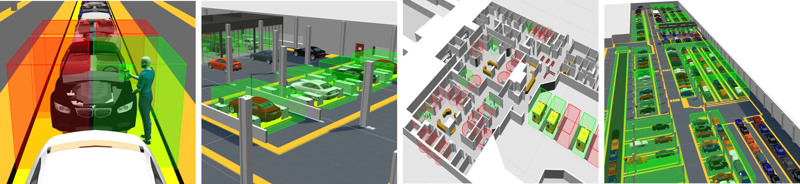

# Spatial relationship definition

Define and monitor physical relationships between real-world objects via the
interaction of their spatial properties

## Summary

Object types can be assigned one or many spatial properties (3D spaces) in
order to represent important geometric characteristics of the object. These
could be fixed spaces around a set of workstations or 3D zones which move with
the object wherever it goes, i.e. when the location of the object changes the
location of the space changes with it.

Spatial relationships indicate the containment relationship between pairs of
spaces. When the spaces of two different objects come together so that the 3D
extent of one space completely encloses the 3D extent of the other, this
fully-enclosed state between the two objects causes their containment
relationship to become "true". When the objects move such that the 3D extents
of the spaces no longer intersect at all, the containment relationship becomes
"false". This "positive-containment, negative-overlap" behavior allows
containment relationships to be stable when objects move about right on the
edge of containment, avoiding multiple triggering of behavior.

Where an application has chosen to subscribe to events from a particular
spatial relation, containment events provide the application with a very
reliable, real-time handshake between two objects which can be used to drive
connected systems and processes. Spatial relations turn locations (most of
which are not interesting to business systems) into software-defined
identifications, triggered by the spatial interactions between objects. These
significant changes in state will only be triggered by a small fraction of
sensed object locations.

## Spatial Property Editor

SmartSpace provides an easy-to-use configuration client for defining the 3D
geometries of the spaces owned by types and objects. This is a drag-and-drop
interface which allows the user to define simple polygons around objects using
mouse clicks.

## Spatial Relationship Editor

The SmartSpace configuration client exposes an interface for defining which
containment relations are actually of interest for the application. There may
well be many possible containment permutations that are not actually of
interest the application being configured, so it is necessary to explicitly
request monitoring of the relationship between two spatial properties.

## Spatial Monitoring at Runtime

At runtime the spatial relations that have been defined and the interaction
events that are detected are available as real-time events for consumption by
higher-level components (such as [Business
rules](../../TopLevelComponents/business-rules.htm)) or to be forwarded to
external systems through one of the SmartSpace integration APIs or interfaces.

The spatial monitoring feature of SmartSpace is important as it acts as a
filter between the noisy, very high bandwidth, low latency location data being
generated by underlying sensor systems and the slower response, lower
bandwidth information systems SmartSpace connects to. By turning high volumes
of real-time location events into a few reliable and actionable business- and
context-specific events, spatial monitoring converts sensed location data into
a form that business systems can use.
