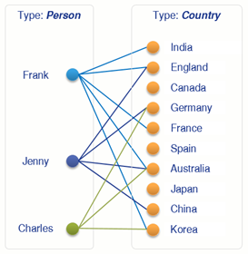
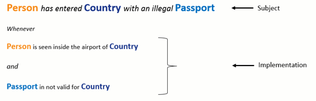
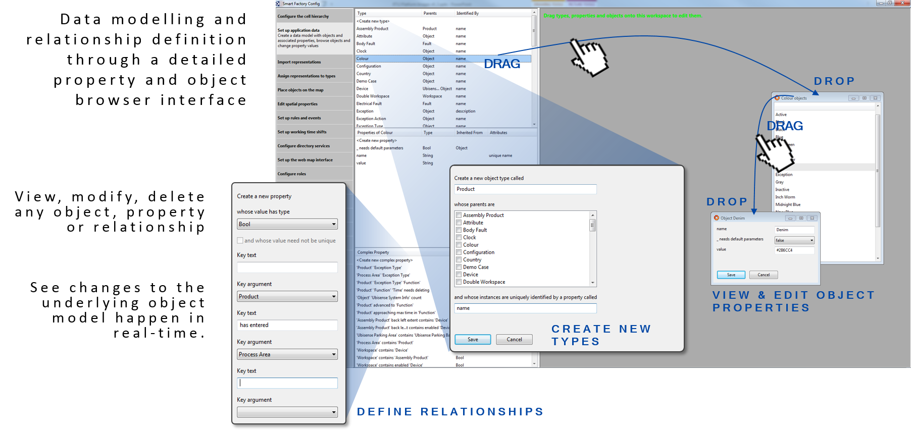

## Business object properties

Define data models to support context-aware business applications, tightly
integrated with location data

### Summary

Business object properties provides the following capabilities:

* User-extensible definition of functional and relational properties of types
* Creation and deletion of properties
* Query, creation, update and deletion of property assertions
* Query, creation, editing and deletion of 3D spatial properties of objects and spatial relationships between objects

SmartSpace allows the definition of relationships between objects by using
either Simple Properties or Complex Properties.

### Simple Properties

SmartSpace enables developers to flexibly create the types necessary to define
a new application data model. User-defined types are created with appropriate
properties, which can be any of the basic numeric or string types as well as
user-defined types already defined in the data model. In SmartSpace, these are
called Simple Properties.

Types which represent real-world objects can include one or more Space
Properties, which are the geometric extents (zones) defined around the object
that move and interact with the spaces of other object types in the data model
when objects are given a location.

Additionally, multiple inheritance is fully supported, so that new types can
be created from a combination of parent types which own the properties
required.

### Complex Properties

By using Simple Properties, one-to-one and many-to-one relations between
objects can be specified. Complex Properties allow the inclusion of joins
between types so that one-to-many or even many-to-many relations can be
defined. This is really valuable when it becomes necessary to store or operate
on sets of data, or some conditional fact must be asserted based on the state
of multiple objects in the data model.

Where a relation between types is a fact, whether it is either true or false,
the relation must be qualified by some underlying logic. This relation must be
asserted either by an integrated third-party business system or through the
SmartSpace Business rules engine (whose logic is implemented using the Rules
engine developer).

## User Interfaces

The [Type and object definition](../Core/type-and-object-definition.htm)
feature includes a full development and object explorer thick-client GUI,
which provides a drag-and-drop interface for creating new types, instantiating
new objects, and interrogating and editing object properties and states.

## Business Rules Engine